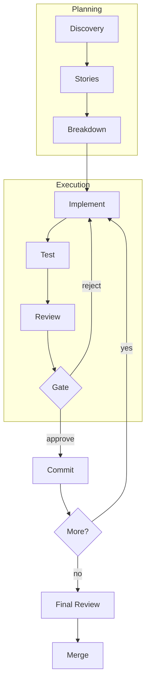

# HASHD - Human-Agent Synchronized Handoff Development

(حشد = Arabic for "crowd")

Hashd coordinates a fleet of AI coding agents working in parallel across
the full development lifecycle - planning, implementing, testing, and
reviewing. Code context graphs, structured quality gates, and configurable
autonomy keep accuracy high and minimize token burn as throughput scales.

10x token burn reduction in code exploration. 10x developer throughput.
15%+ accuracy improvement through better context management.

```bash
curl -fsSL https://raw.githubusercontent.com/codr1/hashd-code/main/install.sh | bash
```

- [QUICKSTART.md](docs/QUICKSTART.md) - Installation, first project setup, basic workflows
- [AGENT_MANAGEMENT.md](docs/AGENT_MANAGEMENT.md) - Agent switching, auth configuration, prompt overrides
- [WF.md](docs/WF.md) - Full lifecycle documentation, state machines, merge behavior



## Overview

Hashd orchestrates the entire development lifecycle:

| Phase | Agent | What Happens |
|-------|-------|--------------|
| **Plan** | Claude (PM) | Analyzes REQS.md, proposes stories, generates acceptance criteria |
| **Breakdown** | Claude (Architect) | Decomposes stories into micro-commits with implementation guidance |
| **Implement** | Configurable | Writes code in isolated worktree |
| **Test** | Automated | Runs test suite, validates artifacts |
| **Review** | Claude (Staff Engineer) | Structured review with approve/block/request-changes |
| **QA Gate** | Validation | Confirms test + review artifacts before commit |
| **Human UAT** | You | Approve, reject with feedback, or reset entirely |
| **Merge Gate** | Claude + Tests | Full suite + rebase check; AI generates fixes if needed |
| **Final Review** | Claude | Holistic branch review before merge |

Gate behavior is configurable per autonomy mode. The clarification queue can block workstreams until answered, and every run produces auditable artifacts in `runs/`.

## Human-in-the-Loop

- **Pair Programmer Chat** - Call in an AI architect anytime with `wf chat` or press `C` in the TUI; full story, diff, and log context with persistent conversation history. Chat can propose story edits (criteria, title, problem, non-goals) and run read-only commands -- each action requires y/n confirmation
- **Clarification Queue** - Agents raise questions; workstream blocks until you answer (`wf clarify`)
- **Approve/Reject/Reset** - Accept changes, iterate with feedback, or discard entirely
- **Interactive TUI** - `wf watch` for real-time monitoring of workstreams and stories with keyboard shortcuts
- **Telegram Bot** - Full mobile workflow management: inspect, execute, gate, plan, and search (see [Telegram Bot](#telegram-bot))
- **Three interfaces** - CLI for power users and LLMs, TUI for terminal productivity, Telegram for mobile
- **Desktop Notifications** - Get alerted when workstreams need attention
- **Parallel Workstreams** - Run multiple features simultaneously in isolated worktrees
- **Conflict Detection** - `wf conflicts` warns about overlapping file changes

## Full Lineage Tracing

Every piece of AI-generated code in hashd is traceable back to the requirement that motivated it. The run transcript links each agent conversation -- prompts sent, responses received, review decisions -- to the git commit it produced. Workstreams carry a machine-readable `STORY_ID` linking them to their originating story.

Point at any file and reconstruct its full history: which commits shaped it, which stories drove those commits, what the AI reviewers said, what the humans decided, and what clarifications were resolved along the way. The git commit graph is the backbone; hashd's structured artifacts provide the context.

Every agent -- from planning through review, breakdown, fix generation, and conflict resolution -- receives the project description as system context, so it understands *what the system is for* before reasoning about it.

```
file -> git log -> commit message (COMMIT-XX-NNN)
  -> workstream -> STORY_ID -> story
    -> transcript, reviews, clarifications, human decisions
```


## Context Graph

LLM agents spend the majority of their context window *discovering* what static analysis already knows. Empirical measurements across production codebases show that agentic exploration (iterative grep/read cycles) consumes 54-70% of the available context window for orientation alone, leaving a fraction for the actual task.

The Context Graph eliminates this cost by pre-computing structural and relational knowledge about the codebase and project history.

**Layer 1: Structural analysis.** AST parsing extracts a deterministic map of the codebase -- modules, classes, functions, and their signatures -- with zero LLM calls. Every symbol is verified to exist; every relationship is a real reference, not a retrieval approximation. This is *grounding* in the formal sense: constraining generation with verified facts.

**Layer 2: Dependency edges.** Import graphs, call sites, and type references promote the structural tree into a full graph. When an agent needs to modify a function, the graph answers "what depends on this?" in constant time rather than O(n) tool-call rounds.

**Layer 3: Project knowledge.** Full-text search over project artifacts -- stories, review decisions, clarifications, conversation history -- connects code nodes to the business decisions that motivated them. The graph becomes heterogeneous: code structure and project intent in a single queryable system.

**The result:** Agents that receive a Context Graph summary use 4-6% of the context window for structural awareness -- a 10-15x reduction compared to agentic exploration. Fewer tool calls, shorter prompts, more grounded output, lower cost per operation.


## Shell Completion

Install shell completion for your shell:

```bash
# Zsh
wf --completion zsh >> ~/.zshrc

# Fish
wf --completion fish > ~/.config/fish/completions/wf.fish
```

Examples:
```bash
wf r<TAB>                    # -> wf run
wf run o<TAB>                # -> wf run open_play_rules
wf run STORY-<TAB>           # -> wf run STORY-0001
wf show <TAB>                # Shows both stories and workstreams
```

## Parallel Workstreams

Hashd supports running multiple workstreams simultaneously. Each workstream gets its own git worktree and lock file, allowing true parallel development:

```bash
# Terminal 1
wf run feature_auth --loop

# Terminal 2 (at the same time)
wf run feature_api --loop

# Terminal 3
wf run bugfix_123 --loop
```

A warning is shown when more than 3 workstreams are running concurrently (to avoid API rate limits).

## Desktop Notifications

Hashd sends desktop notifications when workstreams need attention:

| Event | Urgency | When |
|-------|---------|------|
| Ready for review | normal | Human approval needed |
| Blocked | critical | Clarification needed or other blocker |
| Complete | low | All micro-commits done |
| Failed | critical | Stage failure |

Works with any freedesktop-compliant notification daemon (mako, dunst, GNOME, KDE).

Requires `notify-send` to be installed:
```bash
# Debian/Ubuntu
sudo apt install libnotify-bin

# Arch
sudo pacman -S libnotify
```

## Workstream Context

Set a current workstream to avoid typing it repeatedly:

```bash
wf use my_feature        # Set current workstream
wf run --loop            # Operates on my_feature
wf approve               # Still my_feature
wf show                  # Still my_feature

wf use                   # Show current workstream
wf use --clear           # Clear current workstream
```

When a workstream context is set, you can still override it explicitly:

```bash
wf use my_feature
wf show other_feature  # Operates on other_feature, context unchanged
```

## Pair Programming Chat

`wf chat` opens an AI pair programmer with persistent conversation history. Use `@` syntax to inject context:

```bash
wf chat                    # Auto-detect context from current directory
wf chat STORY-0001         # Explicit story context
wf chat my-workstream      # Explicit workstream context
wf chat --history          # View past conversation as markdown
```

**Available @ artifacts:**

| Artifact | Description |
|----------|-------------|
| `@diff` | Current git diff |
| `@log` | Latest stage log |
| `@review` | Review feedback |
| `@story` | Story details + criteria |
| `@timeline` | Story/workstream timeline |
| `@file:path` | Specific file content |
| `@clq` | Clarification history |
| `@reqs` | REQS.md content |
| `@spec` | SPEC.md content |
| `@commits` | Commit history |
| `@stories` | List of project stories |
| `@workstreams` | List of active workstreams |
| `@STORY-xxxx` | Cross-reference another story |
| `@BUG-xxxx` | Cross-reference a bug |

In TUI mode, press `C` from any screen to open chat. Type `@` to see autocomplete.

**Actionable chat:** When chatting in a story context, the AI can propose edits to story artifacts (acceptance criteria, title, problem statement, non-goals) and run safe read-only `wf` commands. Each proposed action appears in a confirmation bar -- press `y` to apply or `n` to skip. Actions are logged to the story transcript.

## Directives

Directives are curated rules that guide AI implementation. They exist at three levels:

```
~/.config/wf/directives.md        # Global user preferences
{repo}/directives.md              # Project rules
workstreams/{id}/directives.md    # Workstream-specific (rare)
```

**Why `directives.md` not `AGENTS.md`?** We want hashd to control when directives are passed to agents, not have agents auto-read them. This ensures agents only see these rules when we explicitly include them in prompts.

### Example directives.md

```markdown
# Project Directives

- No backward compatibility. We have zero users.
- Use sync.Once pattern for handler initialization
- Follow existing templ component patterns in internal/templates
- HTMX handlers should set HX-Trigger for related component updates
```

### Commands

```bash
wf directives                       # View global directives
wf directives all                   # View all (global + project)
wf directives all -w <ws>           # View all including workstream
wf directives project               # View project only
wf directives workstream <ws>       # View workstream's only

wf directives edit                  # Edit global in $EDITOR
wf directives edit project          # Edit project in $EDITOR
wf directives edit workstream <ws>  # Edit workstream's in $EDITOR

wf directives ai-edit               # AI-assisted edit of global
wf directives ai-edit project       # AI-assisted edit of project
wf directives ai-edit workstream <ws>  # AI-assisted edit of workstream's
```

Directives are automatically included in implementation prompts.

## Commands

### Core Commands

| Command | Description |
|---------|-------------|
| `wf plan` | Plan stories from REQS.md (saves suggestions) |
| `wf plan list` | View current suggestions |
| `wf plan new <id_or_name>` | Create story from suggestion (by number or name match) |
| `wf plan story "title"` | Quick feature story (skips REQS discovery) |
| `wf plan bug "title"` | Quick bug fix (skips REQS discovery, conditional SPEC update) |
| `wf plan clone STORY-xxx` | Clone a locked story to edit |
| `wf plan edit STORY-xxx` | Edit existing story (if unlocked) |
| `wf run <id> [name]` | Run workstream or create from story |
| `wf list` | List all stories and workstreams |
| `wf show <id>` | Show story or workstream details |
| `wf approve <id>` | Accept story or approve workstream gate |
| `wf pr <ws>` | Create PR/MR on forge (for external review) |
| `wf pr feedback <ws>` | View PR/MR review comments |
| `wf merge <ws> [--pr]` | Merge to main (--pr: via forge PR instead of direct merge) |
| `wf close <id>` | Close story or workstream (abandon) |
| `wf watch [id]` | Interactive TUI (dashboard, or detail for workstream/STORY-xxxx) |

### Watch UI Keybindings

The `wf watch` TUI adapts keybindings to workstream status:

| Status | Key Actions |
|--------|-------------|
| `awaiting_human_review` | `[a]` approve, `[r]` reject, `[R]` reset |
| `complete` | `[P]` create PR, `[m]` merge, `[e]` edit microcommit |
| `pr_open` / `pr_approved` | `[r]` reject (pre-fills PR feedback), `[o]` open PR, `[a]` merge |

In PR states, `[r]` opens a modal pre-filled with forge feedback for editing.

**Diff mode** (`[d]` to enter): `[s]` side-by-side, `[b]` blame/lineage, `[h]` hunk selection, `[space]` select hunk, `[f]` fullscreen, `Enter` lineage detail (in blame).

### Telegram Bot

The Telegram bot covers the full workflow from mobile. Send `/` for the button menu or type commands directly:

| Category | Commands |
|----------|----------|
| **Inspect** | `/status`, `/list`, `/show <id>`, `/log <id>` |
| **Execute** | `/run <id>`, `/review <id>` |
| **Gate** | `/approve <id>`, `/reject <id> [feedback]` |
| **Lifecycle** | `/merge <id>`, `/close <id>`, `/pr <id>` |
| **Plan** | `/plan`, `/story <title>`, `/bug <title>`, `/answer [id]` |
| **Utility** | `/search <query>`, `/use [id|clear]`, `/project [name]` |

**Setup:**

1. Create a bot via [@BotFather](https://t.me/BotFather) (`/newbot`), copy the token:
   ```bash
   wf telegram bot <YOUR_TOKEN>
   ```
2. Get your user ID from [@userinfobot](https://t.me/userinfobot), then allow it and set as chat target:
   ```bash
   wf telegram allow <YOUR_USER_ID>
   wf telegram chat-id <YOUR_USER_ID>
   ```
3. Start the bot:
   ```bash
   wf telegram start
   ```

The bot also auto-starts when you run `wf run` or `wf watch`.

### Supporting Commands

| Command | Description |
|---------|-------------|
| `wf use [id]` | Set/show current workstream context |
| `wf run [id] --loop` | Run until blocked or complete |
| `wf run [id] --yes` | Skip confirmation prompts |
| `wf run [id] --verbose` | Show implement/review exchange |
| `wf log [id]` | Show workstream timeline |
| `wf review [id]` | Final AI review before merge |
| `wf lineage <target>` | Trace code lineage (file, SHA, or STORY/BUG ID) |
| `wf lineage export <sha\|STORY-xxxx\|BUG-xxxx> --attestation-format slsa\|in-toto` | Export attestation JSON for a tracked commit or story |
| `wf lineage verify` | Validate commit hash chain integrity |
| `wf reject [id] -f "..."` | Reject with feedback (context-aware) |
| `wf reject [id] --reset` | Discard changes, start fresh (human gate only) |
| `wf diff [id]` | Show workstream diff |
| `wf skip [id]` | Mark commit as done without changes |
| `wf reset [id]` | Reset workstream to start fresh |
| `wf refresh [id]` | Refresh touched files |
| `wf conflicts [id]` | Check for file conflicts |
| `wf archive work` | List archived workstreams |
| `wf archive stories` | List archived stories |
| `wf open <id>` | Resurrect archived workstream |
| `wf clarify` | Manage clarification requests |
| `wf directives` | View/edit project directives |
| `wf workstream add-commit <ws> "title"` | Add AI-generated micro-commit to plan |
| `wf workstream edit-commit <ws> <id>` | Edit a micro-commit's title/description |
| `wf workstream feedback <ws> "text"` | Add feedback to workstream |
| `wf workstream remove <ws>` | Remove orphaned workstream |
| `wf plan retry STORY-xxx` | Retry failed planning run |
| `wf plan resurrect STORY-xxx` | Resurrect abandoned story |

### Project Commands

| Command | Description |
|---------|-------------|
| `wf project add <path>` | Register a new project (runs interactive setup) |
| `wf project add <path> --no-interview` | Quick register without interactive setup |
| `wf project list` | List registered projects |
| `wf project use <name>` | Set active project context |
| `wf project show` | Show current project configuration |
| `wf project interview` | Reconfigure project (build/test commands, merge mode, autonomy) |
| `wf project remove <name>` | Remove a project |
| `wf project config set <key> <value>` | Set config value |
| `wf project describe` | Show current project description |
| `wf project describe --suggest` | AI-generate a description suggestion |

### Observability Commands

| Command | Description |
|---------|-------------|
| `wf system-log` | View system event log |
| `wf prompts list` | List prompt templates |
| `wf prompts show <name>` | Show prompt content |
| `wf prompts edit <name>` | Edit prompt override |
| `wf agents` | Show installed AI agents and stage assignments |
| `wf doctor` | Validate setup and diagnose issues |
| `wf restart` | Restart infrastructure (Prefect, ZMQ, messengers) |
| `wf search <query>` | Full-text search across stories, events, reviews, chat |

### Smart ID Routing

Commands automatically route based on ID prefix:
- `STORY-xxx` - Routes to story commands (e.g., `wf show STORY-0001`)
- `lowercase_id` - Routes to workstream commands (e.g., `wf show my_feature`)

Commands marked with `[id]` use the current workstream context if no ID is provided.

When reopening archived workstreams, `wf open` analyzes staleness by comparing file changes on the branch vs main. It shows a severity score (LOW/MODERATE/HIGH/CRITICAL) and prompts for confirmation if conflicts are likely.

## Lifecycle

Stories flow: `drafting` -> `draft` -> `accepted` -> `implementing` -> `implemented` (also: `draft_failed`, `editing`, `abandoned`)

Workstreams loop: `breakdown` -> `implement` -> `test` -> `review` -> `human_review` -> `commit` (repeat for each micro-commit)

See **[WF.md](docs/WF.md)** for detailed lifecycle documentation.

## Context-Aware Reject

The `wf reject` command adapts its behavior based on workstream state:

### During Human Review Gate

When status is `awaiting_human_review` (mid-micro-commit):

```bash
wf reject my_feature -f "Fix the null check"    # Iterate with feedback
wf reject my_feature --reset                     # Discard, start fresh
```

This writes a rejection file and continues the run loop.

### After All Commits Complete

When all micro-commits are done (pre-merge):

```bash
wf reject my_feature                             # Uses final review concerns
wf reject my_feature -f "Also fix the tests"     # Add guidance
```

This:
1. Parses the final review for concerns (## Concerns section)
2. Generates a fix micro-commit (COMMIT-*-FIX-001)
3. Appends it to the plan
4. Sets status back to `active`

### After PR Created

When a PR exists:

```bash
wf pr feedback my_feature                        # View PR comments
wf reject my_feature -f "Fix the null check"     # Create fix commit
```

For PR states (`pr_open`, `pr_approved`):
- `-f` flag is **required** (no auto-fetch)
- Use `wf pr feedback` to view comments first
- In `wf watch`, the `[r]` modal pre-fills with PR feedback for editing

## Workflow Execution

Hashd uses [Prefect](https://www.prefect.io/) for workflow orchestration. The Prefect server and worker are started automatically when needed:

```bash
# Run a workstream (Prefect starts automatically)
wf run my_feature  # Submits to Prefect, returns immediately

# Monitor progress
wf watch my_feature  # Interactive TUI
wf show my_feature   # Status snapshot
```

The `wf run` command submits work to the Prefect worker and returns immediately. Use `wf watch` or `wf show` to monitor execution.

### Automatic Retries

Prefect automatically retries transient failures:

| Stage | Retries | Delay | Handles |
|-------|---------|-------|---------|
| implement | 2 | 10s | Agent timeouts, API errors |
| test | 2 | 5s | Subprocess timeouts |
| review | 1 | 30s | Claude rate limits |
| qa_gate | 1 | 5s | Validation errors |
| update_state | 2 | 5s | Git push failures |

## Requirements

See **[QUICKSTART.md](docs/QUICKSTART.md)** for full installation instructions including platform-specific commands.

- Python 3.11+, Node.js 18+, Git
- A forge CLI for your host: [gh](https://cli.github.com/) (GitHub), [glab](https://gitlab.com/gitlab-org/cli) (GitLab), [bkt](https://github.com/avivsinai/bitbucket-cli) (Bitbucket), or [tea](https://about.gitea.com/products/tea) (Gitea)
- [delta (git-delta)](https://github.com/dandavison/delta) - for syntax-highlighted diffs
- At least one AI coding agent (see [Agent Configuration](#agent-configuration))
- A project with tests (Makefile, package.json, Taskfile, etc.)

Run `wf doctor` to check your setup.

### Forge Support

HashD supports PR workflows on GitHub, GitLab, Bitbucket, and Gitea. `wf doctor`
checks the CLI and authentication for the configured or auto-detected forge:

| Forge | CLI | Auth command | Notes |
| --- | --- | --- | --- |
| GitHub | `gh` | `gh auth login` | Auto-detected from `github.com` remotes |
| GitLab | `glab` | `glab auth login` | Auto-detected from `gitlab.com` remotes |
| Bitbucket | `bkt` | `bkt auth login` | Auto-detected from `bitbucket.org` remotes |
| Gitea | `tea` | `tea login add --url <gitea-url> --token <token>` | Auto-detected from `gitea.com`; self-hosted instances should set `forge: gitea` |

Bitbucket setup uses the `bkt` CLI. Repository creation uses `bkt repo create`
and relies on the active `bkt` context for Bitbucket Data Center project or
Bitbucket Cloud workspace defaults. For Cloud, passing `workspace/repo` to
`wf project add --create --host bitbucket --name ...` maps to `--workspace`.

Gitea support uses the `tea` CLI and mirrors the same HashD PR workflow used by
the other forges: create, find existing, inspect status, fetch feedback, close,
and merge PRs.

Gitea caveats:

- Self-hosted Gitea cannot be reliably auto-detected from arbitrary remote
  domains. Set `forge: gitea` in `config.yaml`.
- `wf doctor` validates `tea` with `tea --version` and `tea login list
  --output json`; configure a login first with `tea login add`.
- CI/check status is not reported by the Tea pull detail/list output HashD uses.
  Rely on Gitea branch protection or a future explicit status integration to
  enforce checks before merge.
- Review decision is inferred from Gitea pull reviews. `APPROVED`,
  `CHANGES_REQUESTED`, and `REVIEW_REQUIRED` are normalized for HashD, but
  exact review policy enforcement remains Gitea-side.
- Gitea instances do not share one universal noreply email format, so HashD
  does not synthesize one.


## Configuration

All project configuration lives in a single `config.yaml` per project. Generated by `wf project add` or `wf project interview`. You can also edit it manually. See `config.sample.yaml` for all available settings with documentation.

### config.yaml

```yaml
# --- Project Identity ---
name: "myproject"
repo_path: "/path/to/repo"
default_branch: "main"
reqs_path: "REQS.md"

# --- Build & Test ---
test_cmd: "make test"
build_cmd: ""
merge_gate_test_cmd: "make test"
test_timeout: 300
merge_mode: "local"              # "local" or "pr"
forge: ""                        # auto-detected from remote; "github", "bitbucket", "gitlab", "gitea"

# --- Autonomy ---
autonomy: "gatekeeper"          # "supervised", "gatekeeper", or "autonomous"

# --- Optional Overrides ---
# workflow:
#   max_review_attempts: 5
# stages:
#   implement:
#     timeout: 2400
```

Run `wf doctor --show-defaults` to see all available settings and their default values.
Run `wf doctor --reset-to-defaults` to strip overrides and restore defaults.

### Multi-Repo Projects

hashd supports projects that span multiple git repositories (e.g., a Go backend + React frontend in separate repos). The principle: **project-level planning, repo-level execution**.

**Directory layout:**

```
platform/              # project root (git repo, may be local-only)
  REQS.md              # requirements live here
  backend/             # sub-repo (its own git history + remote)
    SPEC.md
    go.mod
  frontend/            # sub-repo (its own git history + remote)
    SPEC.md
    package.json
```

**Setup:** `wf project add /path/to/platform` auto-detects sub-repos and prompts for multi-repo setup. Use `--no-interview` for fully automatic detection. Each sub-repo gets its own test command, build command, merge mode, and default branch.

**Config:** The `repos` section in config.yaml defines sub-repos. See `config.sample.yaml` for the full format:

```yaml
repos:
  - name: backend
    path: ./backend
    description: "Go API server"
    test_cmd: "go test ./..."
    merge_mode: pr
  - name: frontend
    path: ./frontend
    description: "React SPA"
    test_cmd: "npm test"
    merge_mode: local
```

**How it works:**
- During planning, stories are automatically routed to the correct repo based on content
- Each workstream targets one repo -- worktrees, branches, and merges happen in that repo
- REQS.md stays at the project root; SPEC.md is per-repo
- `wf run`, `wf merge`, `wf watch` all work the same -- they resolve the target repo automatically

### Build and Test Execution

When you run `wf project add` or `wf project interview`, the CLI detects your build system (Makefile, Taskfile, package.json, etc.) and prompts you to confirm or customize the commands:

```
Detected: Taskfile
  Test command: task test
  Build command: task build

Test command [task test]:
Build command (optional, press Enter to skip) [task build]:
Merge gate test command [task test]:
```

The orchestrator runs exactly what you configure:

1. **BUILD_CMD** (if set) - runs before tests
2. **TEST_CMD** - runs the test suite

#### Projects with Code Generation

If your project uses code generation (sqlc, templ, protobuf, OpenAPI, etc.), your build and test commands must trigger generation first. Wire generation as a dependency in your build system:

**Taskfile:**
```yaml
tasks:
  generate:
    cmds:
      - sqlc generate
      - templ generate

  build:
    deps: [generate]
    cmds:
      - go build ./...

  test:
    deps: [generate]
    cmds:
      - go test ./...
```
Then enter `task build` and `task test` when prompted.

**Makefile:**
```makefile
.PHONY: generate build test

generate:
	sqlc generate
	templ generate

build: generate
	go build ./...

test: generate
	go test ./...
```
Then enter `make build` and `make test` when prompted.

**npm (package.json):**
```json
{
  "scripts": {
    "generate": "openapi-generator generate -i spec.yaml -o src/api",
    "prebuild": "npm run generate",
    "build": "tsc",
    "pretest": "npm run generate",
    "test": "jest"
  }
}
```
Then enter `npm run build` and `npm test` when prompted.

The key is ensuring generated code exists before compilation, whether it's a fresh worktree or an existing checkout.

### Autonomy Modes

Autonomy is configured per-project via `wf project interview` or directly in `config.yaml`:

| Mode | Behavior |
|------|----------|
| **supervised** | Human approves at each gate |
| **gatekeeper** (default) | Auto-continue if AI confidence >= 90%, human approves at merge |
| **autonomous** | Auto-continue commits + auto-merge if thresholds met |

Override per-run: `wf run --supervised`, `wf run --gatekeeper`, or `wf run --autonomous`

```yaml
# In config.yaml
autonomy: "gatekeeper"
modes:
  gatekeeper:
    commit_threshold: 0.85   # Override default 0.90
```

## Merge Behavior

### Automatic Conflict Resolution

When using the PR workflow (`wf merge --pr` or `merge_mode: pr`), PRs may become conflicting if main moves ahead. The merge command handles this automatically:

1. Fetches latest main
2. Attempts rebase of the PR branch
3. Force-pushes rebased branch (using `--force-with-lease`)
4. Re-checks PR status

If rebase fails due to merge conflicts, blocks for human resolution with instructions.

### Risks and Mitigations

| Risk | Mitigation |
|------|------------|
| Force push loses work | `--force-with-lease` prevents overwriting if branch changed |
| Infinite rebase loop | Max 3 attempts before blocking for human |
| Forge API timing | 2s delay after push; worst case run `wf merge` again |
| Review bypass | Checks for `REVIEW_REQUIRED` status from forge |

### Review Requirements

The merge respects the forge's configured review requirements:

- **APPROVED** - Merge proceeds
- **PENDING/None** - Merge proceeds (assumes no review required)
- **CHANGES_REQUESTED** - Blocks; use `wf reject` to generate fix commit from PR feedback
- **REVIEW_REQUIRED** - Blocks until required reviews complete

### Check Requirements

- **success** - Merge proceeds
- **pending** - Merge proceeds (for slow bots like CodeRabbit)
- **failure** - Blocks until checks pass

<!-- TODO: Reassess pending check behavior. Currently allows merge with pending checks
     to avoid blocking on slow bots (CodeRabbit). Consider:
     - Configurable list of ignorable checks
     - Timeout-based promotion of pending to success
     - Separate "required" vs "optional" check categories
-->

## Agent Configuration

Hashd supports seven CLI coding agents. Any agent can be assigned to any workflow stage, as long as it supports the stage's required invocation shape.

### Supported Agents

| Agent | Binary | Status | Shapes | Install | Auth |
|-------|--------|--------|--------|---------|------|
| **Claude Code** | `claude` | active | print, json, edit, review, review_resume, implement, implement_resume | `npm i -g @anthropic-ai/claude-code` | Anthropic API key |
| **Codex** | `codex` | active | implement, implement_resume | `npm i -g @openai/codex` | OpenAI API key |
| **GitHub Copilot** | `copilot` | available | print, json, edit, review, review_resume, implement, implement_resume | `npm i -g @github/copilot` | GitHub Copilot subscription |
| **Gemini CLI** | `gemini` | available | print, json, edit, review, review_resume, implement, implement_resume | `npm i -g @google/gemini-cli` | Google account (free) |
| **OpenCode** | `opencode` | available | print, json, implement | `go install github.com/opencode-ai/opencode@latest` | Depends on model |
| **Kimi Code** | `kimi` | available | print, json, edit, implement | `uv tool install kimi-cli` | Moonshot (~$19/mo) |
| **Qwen Code** | `qwen` | available | print, json, edit, review, implement | `npm i -g @qwen-code/qwen-code` | Qwen OAuth (free) |

**Status:** `active` = tested and verified. `available` = config defined, not yet verified (assign with `--force`).

### Quick Setup

By default, **Claude** handles planning/review and **Codex** handles implementation.

```bash
wf agents                                # See installed agents and stage assignments
wf project config set coder claude       # Use Claude for everything
wf project config set planner gemini     # All non-implement stages
wf project config set stage.review gemini  # Single stage override
```

### Stage Reference

| Phase | Stage | Default Agent | Shape |
|-------|-------|---------------|-------|
| Planning | `pm_discovery` | claude | print |
| Planning | `pm_refine` | claude | print |
| Planning | `pm_edit` | claude | print |
| Planning | `pm_annotate` | claude | edit |
| Planning | `pm_describe` | claude | print |
| Implementation | `breakdown` | claude | json |
| Implementation | `implement` | codex | implement |
| Implementation | `implement_resume` | codex | implement_resume |
| Review | `review` | claude | review |
| Review | `review_resume` | claude | review_resume |
| Review | `fix_generation` | claude | json |
| Review | `plan_add` | claude | json |
| Completion | `final_review` | claude | json |
| Completion | `pm_spec` | claude | json |
| Completion | `pm_docs` | claude | edit |

### Template Variables

Command templates support these variables:

| Variable | Description | Used In |
|----------|-------------|---------|
| `{prompt}` | The prompt text | All stages |
| `{worktree}` | Path to git worktree | `implement`, `implement_resume` |
| `{session_id}` | Session UUID for resuming | `implement_resume` |

If `{prompt}` is in the command template, it's passed as a CLI argument. Otherwise, the prompt is passed via stdin (useful for multi-line prompts).

### Missing Tool Detection

If a required tool isn't installed, hashd will fail early with a clear error:

```
ERROR: Required tool 'codex' is not installed.

Stages that need it: implement, implement_resume

To fix this, either:
  1. Install codex: npm i -g @openai/codex
  2. Add stage overrides to config.yaml in your project directory:
     ...
```

See **[AGENT_MANAGEMENT.md](docs/AGENT_MANAGEMENT.md)** for agent switching, prompt management, and per-project overrides.

## Local-Only Mode

Hashd works without a git remote configured. When no `origin` remote exists:

- Rebase checks are skipped (no fetch/rebase against remote main)
- Conflict detection against remote is skipped
- PR features are unavailable
- Workstreams complete locally after tests pass

This is useful for:
- Local experimentation before pushing
- Air-gapped development environments
- Learning hashd without setting up a remote

To enable full features later:
```bash
git remote add origin <url>
```

## Connectors

Connectors are hashd's plugin system for external integrations. They're auto-discovered at startup -- drop a module in `orchestrator/connectors/`, it works. Remove it, everything else keeps working. Core never references a specific connector.


### Included connectors

| Connector | What it does | Docs |
|---|---|---|
| **GitHub Sync** | Sync stories with GitHub Issues -- pull, push, auto-sync via labels | [docs](docs/CONNECTORS.md#github-sync) |
| **Jira Sync** | Sync stories with Jira issues -- pull, push, status tracking | [docs](orchestrator/connectors/jira_sync/README.md) |
| **Figma** | Import and reference Figma designs -- `@figma:frame` in stories, ACs, chat | [docs](docs/CONNECTORS.md#figma) |

### Third-party connectors

None yet. If you build a connector for Linear, Shortcut, or another tool, open a PR or publish it as a pip package with an `hashd.connectors` entry point.

## Troubleshooting

See **[docs/TROUBLESHOOTING.md](docs/TROUBLESHOOTING.md)** for common issues:
baseline test failures, stale flows, worktree cleanup, and missing tools.

## License

BSL 1.1 (Business Source License)

See [LICENSE](LICENSE.md) for details.
