# Hashd Workflow - Complete Flow

## Architecture Overview

Hashd uses **Temporal** for workflow orchestration with these components:

| Component | Purpose |
|-----------|---------|
| **temporald sidecar** | Runs the pinned temporal-server that coordinates workflows and persists their state |
| **In-server worker** | hashd-server hosts the Temporal SDK worker that executes workflows and activities |
| **Workflow-ID singletons** | One workflow per unit of work (`run:{project}:{ws}`, `plan:{project}:{story}`, `merge:{project}:{ws}`, ...); a duplicate dispatch fails instead of double-running |
| **Human-gate signal** | Parks the run workflow for human input; `hashd approve` / `hashd reject` resume it |

Workflows run asynchronously. `hashd run` dispatches the run workflow and returns immediately.
Monitor via `hashd watch` (TUI) or `hashd show`.

For the canonical model of how a workstream's runtime position is described — stage, status, substage, operator verbs, and recovery from crashes — see **Workstream State Model** below.

### Repo Ownership

The server owns each project's repository at a canonical in-tree path
(`<ops>/repos/<name>`): `hashd project add` on a local path creates a **symlink**
to the operator's repo, while a remote add (`--clone`/`--bundle`/`--create`)
produces a server-side **clone**. Every agent run and git operation resolves
through this canonical path, so the CLI never needs to know a repo's real
location — the same reason repo-scoped agent flows (`repo edit --suggest`) pass a
repo **name**, not a client-computed path, and work identically in local and
team mode.

`hashd project remove` unlinks the server's own symlink but **preserves** a
pre-existing clone or ingested repo — it never deletes the operator's actual
working tree. (`repo_origin` on the project config records `linked` / `ingested`
/ `adopted` so remove knows what it may and may not delete.)

---

## Server Security Model

hashd-server runs in one of two **deployment modes**. In **solo** mode (the
default) it is single-user: transparent for same-machine workflows, fails closed
when exposed to a network. In **team** mode every REST request must carry a
bearer token -- even on loopback -- because the token is how the client says
which user is calling.

Mode is a durable setting: `hashd config set deployment_mode team` (or `solo`),
then restart the server. It is read once at startup from the `deployment_mode`
system-config key; unset/unknown resolves to solo, so existing installs are never
silently changed. How the mode is *chosen* lives behind one resolver, so a
license key or a separate build could set it later without touching enforcement.

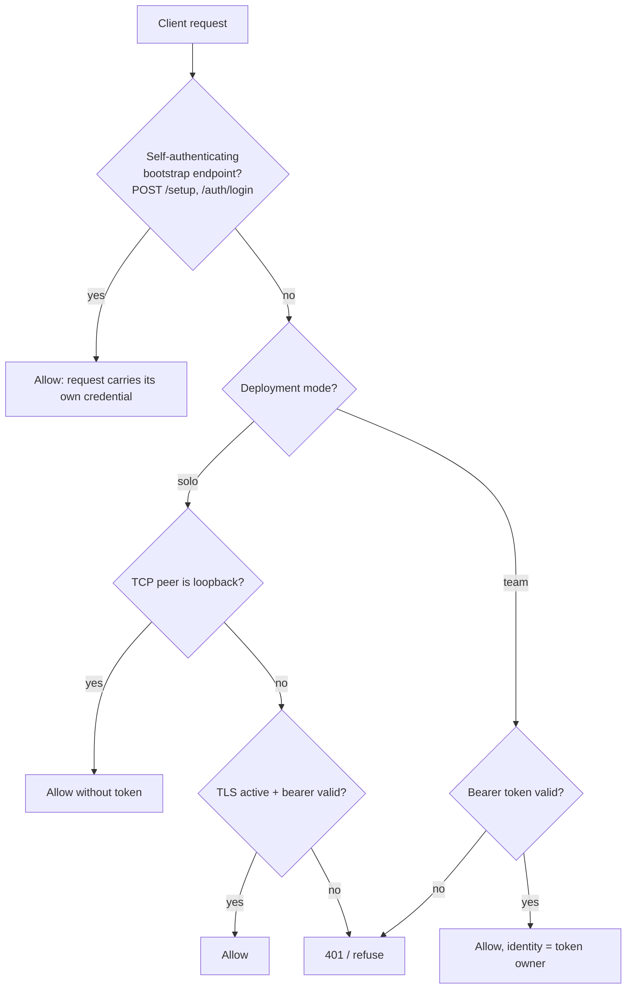

Rules:

- **Solo mode (default):** loopback clients are exempt from auth. Local `hashd`
  (`wf` alias) and SSH/WireGuard tunnel users keep the transparent experience
  because hashd-server stays bound to `127.0.0.1:1337`.
- **Team mode:** there is no loopback exemption -- every request needs a valid
  bearer token. A user-scoped token (minted by `hashd login`) resolves to its
  owning user (`auth_tokens.user_id`) as the request's identity; an unowned
  host-minted `auth create` token still authenticates the request but attaches no
  user identity. Host-local admin provisioning still runs in-process (no REST),
  and the bootstrap endpoints below stay reachable, so the first admin can always
  get a token without already having one.
- **Identity is required to start.** hashd-server fails closed when no user is
  configured -- rather than inventing an identity it exits with a Diagnostic
  pointing at `hashd admin user add`. The installer (`setup.sh` / the curl
  installer) creates the owner from your git identity before starting the server,
  so a normal install or upgrade never hits this. The first user created on a
  fresh server is the **owner** (active, keyless, role `owner`): in solo mode the
  default identity every action is attributed to, in team mode the bootstrap admin
  who sets a password to log in. `hashd status` shows the resolved identity, mode,
  and health.
- **Attribution.** Core work items (`workstreams`, `stories`, `suggestions`) carry
  a `user_id`. The id refers to the ops-dir `users` table -- a cross-database,
  app-enforced reference (no FK; `users` is empty in project DBs). On every start
  the server attributes any unowned work item to the owner (`WHERE user_id IS
  NULL`, idempotent), so existing rows and rows created since the last start both
  land on the owner. Per-user create-time attribution (stamping the acting user
  instead of the owner) is a later step.
- **Owner-guard (team mode only).** In team mode, only a work item's owner may
  mutate it: every state-changing story/workstream endpoint (run, merge, close,
  reset, approve, transitions, AC edits, feedback, answer, ...) checks the acting
  user against the item's `user_id` and returns a 403 naming the owner when they
  differ. An **unassigned** item is open -- anyone may act, which is how an
  unclaimed item gets picked up -- and `assign`/`unassign` are deliberately
  ungated so ownership stays open-grab (any reassignment is allowed and logged).
  Two other classes are exempt by design: internal callers (startup resume,
  plan-split dispatch), which carry no operator identity, and automated
  agent-telemetry writes (code-tool-call recording, PR review-finding
  reconciliation), which are machine writes rather than operator actions.
  **Solo mode never enforces this**, so the single-user experience is unchanged.
  `hashd list` and `hashd show` display the owner handle (`@name`) in team mode;
  in solo mode the owner column stays blank.
- Off-loopback clients require both TLS and a bearer token. On `0.0.0.0`,
  `:1337`, a public IP, or any other non-loopback bind, hashd-server serves
  TLS automatically. If `--tls-cert-file` and `--tls-key-file` are not set, it
  creates a persistent self-signed cert at `<ops>/tls/server.crt` and key at
  `<ops>/tls/server.key`.
- Bearer tokens are multi-token personal access tokens. Create them from the
  server host with `hashd auth create --description <name>`, list metadata with
  `hashd auth list`, and revoke one with `hashd auth delete <id>`. The plaintext token
  is shown only once; the database stores only its SHA-256 hash.
- A small allowlist of **bootstrap endpoints** is exempt from the bearer-token
  requirement even off-loopback, because they are how a client obtains a
  credential in the first place and each carries its own credential in the
  request: `POST /setup` (redeem a one-time setup key to set a password) and
  `POST /auth/login` (exchange HTTP Basic `email:password` for a token). The
  handlers enforce that credential themselves; the middleware only skips the
  bearer check for them.
- Login tokens are **user-scoped**: `POST /auth/login` stamps `auth_tokens.user_id`
  with the authenticated user, so a login-minted token is attributable to a
  person. `hashd auth create` tokens stay unowned (host-local admin tokens).
  `hashd login <email>` reads the password without echoing it, exchanges it for a
  token, and stores that token in the client config like a paired `auth create`
  token. A failed login costs the same bcrypt work whether or not the email
  exists, so it does not leak which emails are registered.
- When the generated self-signed cert is active, new tokens include the served
  certificate fingerprint: `hashd_<fingerprint>.<secret>`. Clients pin that
  fingerprint instead of needing a CA file. With a BYO/CA certificate, tokens
  stay `hashd_<secret>`.
- Regenerating `<ops>/tls/server.crt` changes the fingerprint. Re-issue tokens
  after replacing or deleting the generated cert so remote clients can re-pair.
- Auth decisions use the raw TCP peer address. `X-Forwarded-For` and other proxy
  headers do not grant loopback exemption.

Direct internet exposure can use hashd-server's generated TLS listener:

```bash
hashd-server --ops-dir ~/.hashd --listen 0.0.0.0:1337
hashd auth create --description laptop
```

Or provide your own certificate:

```bash
hashd-server --ops-dir ~/.hashd \
  --listen 0.0.0.0:1337 \
  --tls-cert-file /etc/letsencrypt/live/hashd.example.com/fullchain.pem \
  --tls-key-file /etc/letsencrypt/live/hashd.example.com/privkey.pem
```

Tunnel access should keep the server loopback-bound and skip tokens entirely:

```bash
hashd-server --ops-dir ~/.hashd --listen 127.0.0.1:1337
ssh -L 1337:127.0.0.1:1337 user@server
```

Do not terminate TLS at a reverse proxy that connects to hashd-server over
loopback and expect hashd-server auth to protect the backend. From hashd's point
of view that connection is loopback, so the loopback exemption applies. Prefer
hashd-terminated TLS for direct binds, or an SSH/WireGuard tunnel.

---

## Modes

| Mode | Flag | Description |
|------|------|-------------|
| **supervised** | `--supervised` | Always pause at commits and merge |
| **gatekeeper** | `--gatekeeper` | Auto-continue commits if confident, human approves merge (default) |
| **autonomous** | `--autonomous` | Auto-continue commits, self-heal final-review concerns, and merge (unattended) |

The modes differ only at the gates. Autonomous adds three auto-continuations over
gatekeeper: the per-commit qa-gate, the merge confirmation, and the final-review
self-heal loop (see Phase 3 → *Autonomous self-heal loop*). It still parks to a human
on unresolved failures — the block moves later, it does not disappear.

Mode is set per-project via `hashd project interview` or `config.yaml`.
Override per-run: `hashd run --supervised`, `hashd run --gatekeeper`, or `hashd run --autonomous`

### Confidence Scoring

AI reviews include a confidence score (0.0-1.0) that influences auto-continue decisions:

| Range | Meaning |
|-------|---------|
| 0.9-1.0 | Highly confident - solid code, well-tested patterns |
| 0.7-0.9 | Confident - standard implementation, minor concerns |
| 0.5-0.7 | Moderate - some uncertainty, review recommended |
| 0.0-0.5 | Low - significant concerns, human review required |

---

## Agent Tool Permissions

Agent permissions are declared by stage shape, not by individual agent command
templates. The source of truth is
`server/internal/config/defaults.yaml:shape_capabilities`, mirrored into
`packages/hashd-client/src/hashd_client/defaults.yaml` by `task -d server generate:defaults`; both
copies must stay in sync. The runners translate that shape intent into each
agent's CLI flags when assembling the command.

### Shape Capabilities

| Shape | Writes? | Bash | Intent |
|---|---:|---|---|
| `print` | no | none | Read context and produce free-form text for planning and discovery. |
| `json` | no | none | Read context and produce structured output. |
| `edit` | yes | none | Edit a bounded artifact such as REQS annotations or docs. |
| `review` | no | inspect | Inspect the tree and run read-oriented shell commands such as `git diff`, `git status`, `git log`, `go list`, or `task --list`; do not modify files. |
| `review_resume` | no | inspect | Same as `review`, continuing a prior review session. |
| `implement` | yes | full | Implement code in an isolated worktree and run the project build/test tooling. |
| `implement_resume` | yes | full | Same as `implement`, continuing a prior implementation session. |

`bash: inspect` means shell access is allowed for inspection because many CLIs
do not expose a read-only shell. The stage still has `writes: false`; the agent
must not edit files, and downstream gates validate the result.

### Stage Shapes

The Go map `server/internal/agents/runner.go:stageShapeMap`, Python mirror
`packages/hashd-client/src/hashd_client/agents_check.py:STAGE_SHAPE`, and fixture
`tests/fixtures/agents/stage_shape.json` define which shape each stage uses.
Those three stay in lockstep through the existing stage-shape contract tests.

Default stage commands in `defaults.yaml:stages` and per-agent templates for
stage-backed shapes in `defaults.yaml:agents.*.shapes` are structural templates
only: binary, model/output format, resume session, worktree, and stdin
placeholders. Permission flags are derived from the shape capabilities at
command assembly time. The `chat` and `chat_resume` templates are the remaining
interactive exceptions: they intentionally carry explicit tool restrictions
because they are not stage-backed agent-run shapes.

### Per-Agent Enforcement

| Agent | Derived enforcement |
|---|---|
| Claude Code | `writes:false` denies write tools; `bash:none` also denies shell and other side-effect tools. `writes:true` uses edit or full-permission mode based on `bash`. |
| Codex | `writes:false` sets Codex's read-only sandbox through a config override that works for both start and resume; `writes:true` uses workspace-write or full implementation modes. |
| Gemini | `writes:false` maps to plan approval mode; write-capable shapes use auto-edit or yolo based on `bash`. |
| Qwen | `writes:false` maps to plan approval mode; write-capable shapes use auto-edit or yolo based on `bash`. |
| Copilot | `writes:false` excludes write, and also excludes shell for `bash:none`; implementation uses yolo. |
| OpenCode | No native read-only knob is declared. `writes:false` is best-effort and unsafe for read-only-critical stages until the agent has an enforceable mode. |
| Kimi | No native read-only knob is declared. `writes:false` is best-effort and unsafe for read-only-critical stages until the agent has an enforceable mode. |

This is deliberately honest: the permission intent is uniform, but enforcement
depends on what the selected agent can express. Agents without a read-only knob
must not be treated as equivalent to enforced read-only agents.

### Internal Wrapper Coverage

`hashd internal agent-run` supports the stages that use the generic agent-run
bridge: `adjudicate`, `concern_triage`, `final_review`, `fix_generation`,
`freeform` (alias for `final_review`), `implement`, `implement_resume`,
`plan_add`, `pm_annotate`, `pm_breakdown` (alias for `breakdown`),
`pm_describe`, `pm_discovery`, `pm_docs`, `pm_edit`, `pm_refine`, `pm_route`,
`pm_spec`, `review`, and `review_resume`.

Dedicated internal wrappers handle `detect`, `tech_tree`, `plan_split`, and the
review-stage scaffold where the stage needs extra loaded context or special
parsing before or after the agent call.

---

## Agent Contract

What a CLI must implement to be a hashd agent, and how hashd invokes it for
fresh and resumed work. The registry (`server/internal/config/defaults.yaml
agents:`) declares each agent's conformance; `agents.RunStageWithOptions`
assembles every invocation from the stage's shape template plus the
capability-derived permission flags (see Agent Tool Permissions above).

### Required capabilities

| # | Capability | Registry surface | Why |
|---|---|---|---|
| C1 | Non-interactive prompt intake on **stdin** | `{prompt}` is a stdin sentinel, never argv; agents with no bare-stdin mode declare `prompt_stdin_sentinel` (codex `-`) or `prompt_value_flags` (`-p`/`--prompt`) | Prompts exceed argv limits and must not leak into `ps` |
| C2 | Machine-parseable output for structured stages | shape templates carry the agent's JSON/stream flags (`--output-format json`, `--json`, ...) | Verdicts, results, and session ids are parsed, never scraped |
| C3 | **Session identity**: emit a session id in machine-readable output | per-agent extractor in `server/internal/agents/session_id.go` (codex JSONL events, gemini/qwen `session_id` keys, opencode `sessionID`, copilot `session.start`, kimi stderr hint) | Resume is impossible without capturing the id |
| C4 | **Session resume**: an invocation that continues the same conversation from that id | `_resume` shape templates with `{session_id}` (claude/gemini/kimi/qwen/copilot `--resume`, codex `exec resume` / app-server `thread/resume`, opencode `--session`) | Dirty-tree continuity on retry, and the token payoff: a resumed turn sends only the new instruction instead of re-sending the full prompt |
| C5 | Distinguishable missing-session errors | `sessionResumePatterns` in `server/internal/agents/classifier.go` (`session_not_found` classification) | A dead session must fall back to a fresh run, not retry-loop |
| C6 | Permission flags mappable to `shape_capabilities` | per-agent flag translators in `runner.go` (`--dangerously-skip-permissions`, `sandbox_mode=...`, `--approval-mode ...`); agents without a read-only mode are best-effort and documented as such | Shape intent (writes/bash) is enforced per agent |
| C7 | Auth verification verb | `verify_auth` (`claude auth status`, `codex login status`, ...); omit rather than guess when the CLI has no reliable verb | Preflight without inspecting private credential files |

An agent missing C3/C4 still works for every one-shot stage; it simply never
takes a `_resume` path (each retry re-sends the full prompt). An agent missing
C6's read-only mode may only be trusted with write-shaped stages.

### Invocation placeholders

| Placeholder | Meaning | Guard |
|---|---|---|
| `{prompt}` | stdin sentinel (legacy spelling; prompt always rides stdin) | rewritten at assembly |
| `{session_id}` | the resume id | command fails fast if the template needs it and the value is empty |
| `{worktree}` | implement cwd flag (codex `-C {worktree}`) | |
| `{model}` / `{effort}` | rendered through the agent's `model_template` / `effort_template` | dropped when the agent declares no template |

### Fresh vs resumed invocations by stage

Reference shapes shown for the default agent (claude); every agent substitutes
its own template for the same shape. "Resume trigger" is who decides to take
the `_resume` path.

| Stage | Fresh invocation (claude) | Resumed invocation (claude) | Resume trigger | Session store |
|---|---|---|---|---|
| implement | `claude --output-format stream-json --verbose -p` (stdin: full commit prompt + branch diff; the session id rides the first stream event and is persisted durably before any work) | `claude --resume {session_id} --output-format stream-json --verbose -p` (stdin: review feedback only) | driver: saved session + review history, not a FIX cycle (`runflow/implementdriver.go`) | `workstreams.codex_session_id` (durable) |
| review / final_review | `claude --output-format json -p` | `claude --resume {session_id} --output-format json -p` (stdin: retry/redraft delta) | in-package semantic-retry and format-redraft loops (`stages/review/retry.go`) | in-process (same stage run) |
| fix_from_review | `claude --print` (stdin: concerns -> FIX instruction) | via `fix_from_review_resume` | selfheal loop when the final-review session is still live (`runflow/selfheal.go`) | in-process handoff from final_review |
| tech_tree | dedicated wrapper, print shape | `tech_tree_resume` | discovery flow hands its session forward in-flow | in-flow (dies with the flow) |
| chat | stream-json + tool allowlist | `chat_resume` | server: `chat_sessions` row exists | `chat_sessions.agent_session_id` (durable) |
| pm_refine / pm_edit | `claude --print --output-format json` (stdin: SPEC+REQS+story) | `claude --resume {session_id} --print --output-format json` (stdin: retry feedback only) | validation retries in the planner loop resume the rejected attempt's session; agent failures rerun fresh | loop state (session threads through the workflow) |
| pm_discovery | `claude --print` (stdin: SPEC+REQS+backlog) | none (session feeds tech_tree only) | -- | in-flow |
| pm_docs | edit shape (stdin: SPEC section + full diff) | none today | -- | none |
| detect / plan_split / breakdown / adjudicate / concern_triage / fix_generation / plan_add / pm_route / pm_describe | one-shot shapes | none (fresh rerun is the contract) | -- | none |

### Resume decision ladder

Every `_resume` path degrades safely; a resume is an optimization, never a
correctness dependency:

```text
retry needed
   |
   v
saved session id? --no--> fresh invocation (full prompt)
   |yes
   v
_resume invocation (--resume {session_id}, delta prompt)
   |
   +-- success -----------------> continue
   +-- session_not_found -------> ONE fresh fallback (full prompt)
   +-- api_rejection ----------> park (no retry)
   +-- context_exhausted ------> clear saved session, park/fresh per stage
```

`session_not_found` is a first-class classification: the runner tags it only
on resume attempts, it is never retried as transient, and each caller falls
back cold exactly once (implement, fix_from_review, tech_tree, review, chat
all implement this convention).

### Agent retry ladder & backoff

One ladder owns transient retries: `runStageAttempts` in
`server/internal/agents/retry.go`, inside a single `RunStageWithOptions`
call. Stage-level loops (the review semantic retry) retry only semantic
failures -- schema mismatch, format redrafts -- and treat a transient or
upstream exhaustion from the inner ladder as terminal for the stage, so the
two ladders never multiply.

The backoff mirrors the Anthropic SDK transport that Claude Code ships:
delays of `min(0.5 * 2^n, 8)` seconds scaled by a one-sided random factor in
`[0.75, 1.0)` (jitter only ever shortens the wait), default budget 8
attempts. A server-supplied `Retry-After` (`retry-after-ms` wins over
`retry-after`, seconds-float or HTTP-date) is honored verbatim upward,
clamped only by a 300s sanity cap -- the one deliberate deviation from the
reference, so a broken header cannot wedge a stage until its StartToClose. An
`x-should-retry` marker overrides classification in both directions. A
deadline guard stops the ladder when the remaining activity deadline cannot
fit the wait plus another attempt. Overrides: `stages.<name>.retries` per
stage, `HASHD_AGENT_RETRY_MAX_ATTEMPTS` / `_BASE_SECONDS` / `_MAX_SECONDS`
globally.

The upstream-capacity family (HTTP 429/503/529, `overloaded_error`,
`rate_limit_error`) classifies as `upstream_overloaded` -- retryable on the
same ladder, but carrying the parsed HTTP status and Retry-After so failure
surfaces say "the upstream API is having an incident, not your code" with
real numbers. Each retry wait is announced as an `agent_retry` event (durable
row + bus frame) with attempt/budget/status/wait, every subprocess attempt
streams to its own log file (`<stage>.log`, `<stage>.attempt2.log`, ...), and
an upstream exhaustion fails the run with `failure_kind:
"upstream_overloaded"` on the run row, the `run_failed` event, and
`current_errors` -- which the CLI Diagnostic, TUI status panel, and web story
page all render as a distinct calm treatment.

### Session persistence rules

- A session id that must survive process death is persisted **durably** and
  read back by whatever re-enters the stage (`workstreams.codex_session_id`,
  `chat_sessions`). In-process handoffs (final_review -> fix_from_review,
  discovery -> tech_tree) die with the run by design.
- Saved sessions are cleared when their context is spent: micro-commit done
  (commit stage), `context_exhausted`, operator reset, chat clear.
- Claude's sessionful shapes (print/edit/implement) emit stream-json so the
  session id rides the FIRST event; the runner's OnSessionID hook persists it
  durably before the agent does any work, on both engine paths. The agent-run
  envelope carries session ids for every agent.

---

## Phase 1: Planning

### Three Paths to Stories

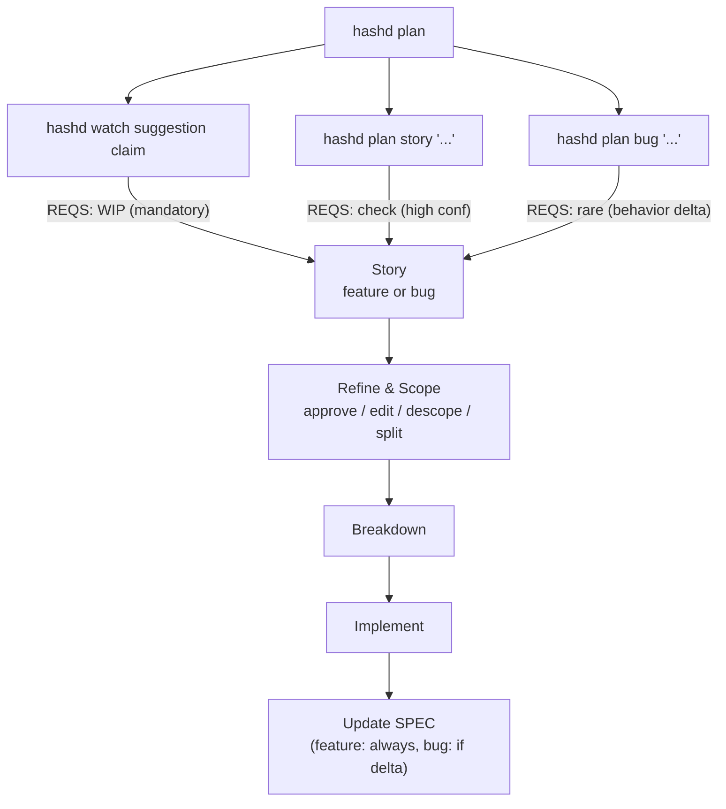

### Full Flow (from REQS)

```
[Human] Start with requirements
        - Write REQS.md (dirty requirements)
        - Or have existing feature requests

[Human/AI] Discover stories
        $ hashd plan                     # Two-phase: discovery + tech tree
        $ hashd plan list                # View suggestions

[Human] Pick a suggestion
        $ hashd watch                    # Open the plan screen
        # Press 1-9 to claim a suggestion into planning

        Creates STORY-xxxx, marks REQS as WIP
```

### Tech Tree (auto-chained after discovery)

`hashd plan` runs two phases. Phase 1 (discovery) produces actionable suggestions safe to start against current `main` — the same numbered list operators already know. Phase 2 (tech tree planner) auto-chains immediately after, projecting the near-future structure: tech tree suggestions that depend on in-flight stories or actionable suggestions.

**Two distinct planning surfaces, one operator command:**

| Surface | What it produces | Operator can act? | Crosses agent boundary? |
|---|---|---|---|
| Main planner (phase 1) | Actionable Suggestions, numbered `[1]`, `[2]` | Yes — `accept` creates a Story | Yes — Suggestions become Stories that agents consume |
| Tech tree planner (phase 2) | Tech tree suggestions, displayed by title only | No — view-only inspection | No — never reaches any implementer/reviewer/breakdown agent |

The main planner stays conservative: never surfaces work that depends on in-flight stories (their code isn't on `main`; an implementer would build against a foundation that doesn't yet exist). The tech tree planner is where that projected visibility lives.

**Lifecycle:**

```text
[Human] $ hashd plan
         |
         v
  Clear all suggestion content (main + tech tree)
         |
         v
  Phase 1: discovery
         |  status: "Discovering..."
         v
  Actionable suggestions populate at top of panel
         |
         v
  Phase 2: tech tree (auto-chained)
         |  status: "Computing tech tree..."
         v
  Projected dependents fill in under suggestions and in-flight stories
         |
         v
  Done
```

**Cancellation:** new `hashd plan` while phase 2 in flight cancels phase 2 cleanly, clears the panel, and restarts at phase 1. Phase 2 cannot be cancelled in isolation — it's an extension of the same planning command.

**Storage:** Suggestions persist in the `suggestions` table (cleared on next `hashd plan`). Tech tree suggestions live in server-side in-memory storage (also cleared on next `hashd plan`). Neither survives across planning cycles; both are regenerated fresh each cycle.

**Session reuse:** the tech tree agent reuses the discovery agent's session via the existing session-resume primitive (same mechanism used by `review_resume`). Avoids reloading project context twice.

**Visualization:** see `DAS_PLAN.md > Story Dependencies, Thin Slicing, and the Tech Tree` for the full TUI rendering spec — unified tree panel, gradient dimming by level, multi-parent `*` marker, `t` toggle, level cap with `... (N more)` collapse.

**Agent boundary invariant:** tech tree output never reaches any agent. Implementer, reviewer, breakdown, planning-edit, refinement — none receive tech tree content in prompts, context, or any other input. The boundary is enforced by a test fixture; adding tech tree data to any agent input is a test failure.

### Quick Flow (skip REQS discovery)

```
[Human] Create story directly
        $ hashd plan story "add logout button"              # Feature
        $ hashd plan bug "fix null pointer" -f context.md   # Bug

        -f is smart: file path reads file, else uses as text

        Feature: checks REQS for overlap (high confidence)
        Bug: skips REQS annotation, conditional SPEC update
```

### Story Refinement

```
[Human] Review and accept story
        $ hashd show STORY-xxxx
        $ hashd approve STORY-xxxx     # draft -> accepted

[Human] Edit story if needed
        $ hashd story edit STORY-xxxx [-f "feedback"]

[Human] Set context (optional)
        $ hashd use <workstream_id>

                              |
                              v
```

### Questions and Answers

Hashd has two distinct question/answer lifecycles with different operator UX. Both share the same storage table (`clarifications`), discriminated by which entity owns the row: `story_id` set (story-planning) or `workstream_id` set (workstream-runtime).

**Vocabulary:**
- **Clarification** / **CLQ** — generic database term, any row in the `clarifications` table.
- **Story open questions** — operator-facing term for story-scoped CLQs. Bundled emission, bundled answer.
- **Workstream CLQs** — operator-facing term for workstream-scoped CLQs. Multi-emit, bundled answer via `hashd answer <workstream-id> "..."`.

**Note on shipped vs intended state.** Sections below describe the intended architecture. Items flagged `(intended; ships with PR X)` are not yet operational — see `docs/PLANNING_REDESIGN_PLAN.md` for the implementation status. Items without a flag describe current behavior.

#### Story-planning questions

Created by the **planning agent** during story drafting (or re-drafting via edit). When the planner identifies ambiguity in REQS that it can't resolve on its own, it emits questions as part of its output.

| Aspect | Detail |
|---|---|
| Created by | Planning agent (during suggestion-backed planning or `hashd story edit`) |
| Stored in | `clarifications` table, `story_id` set, `workstream_id` null |
| Emission shape | Bundle — planner emits all open questions at once in its structured output |
| Operator UX | Bundle answer — operator reads all pending story open questions for the story, submits one combined answer string covering all of them |
| Operator answers via | `hashd answer STORY-XXX "Q1: ..., Q2: ..."` (TUI: `a` key on story detail) |
| Trigger on submit | All pending story open questions for the story flip to `answered` with the bundled answer text. Edit-flow auto-dispatches with the bundle as feedback. |
| Consumed by | Edit-flow's planner invocation (re-drafts the story with the bundled answers as context) |
| Loop | Planner may emit new questions if answers were incomplete. Old answered story open questions are preserved as historical context. Loop continues until the planner is satisfied or the operator gives up. |

**Why bundle.** Operator typically reads all questions together, decides them together, submits one combined answer. The planner consumes the bundle as a single feedback string. Per-question status tracking is operationally meaningless because the planner doesn't see them individually anyway.

#### Workstream-runtime questions (CLQs)

Created by the **implement-stage agent** during workstream execution. When codex/claude needs operator input mid-task to proceed (e.g., "which approach should I take for X?"), it emits one or more clarification requests and the workstream blocks.

| Aspect | Detail |
|---|---|
| Created by | Implement-stage agent (during `hashd run` execution) |
| Stored in | `clarifications` table, `workstream_id` set |
| Emission shape *(intended; ships with PR B)* | Multi-emit — agent's protocol allows emitting one or many CLQs in a single turn (`clarifications_needed: [...]`) when it identifies several ambiguities up front |
| Emission shape *(today)* | Single-emit — agent emits one CLQ per turn (`clarification_needed: {...}`) and the workstream blocks |
| Operator UX | Bundle answer — operator reads every pending CLQ for the workstream, submits one combined answer string. The CLQ-NNN ids exist for storage and audit but are intentionally hidden from the operator surface. |
| Operator answers via | `hashd answer <workstream-id> "..."` (TUI: `c` key on workstream detail) |
| Trigger on submit | Every pending CLQ on the workstream flips to `answered` with the bundled answer text and the next agent run auto-dispatches (start_impl from `active`, resume_impl from `awaiting_human_review`). |
| Consumed by | The implement-stage prompt context on the next workstream run picks up the answered CLQs as part of the implement prompt |
| Loop | Implement agent emits new workstream CLQs as further ambiguities surface across runs. Each CLQ persists independently in storage; operators always see them grouped by workstream. |

**Why bundle (operator side).** Even though storage tracks CLQs individually, operators answer them together most of the time — partial-state ("answered some, dispatched, then more arrived") was a regular source of confusion. The single bundle answer + auto-dispatch keeps the lifecycle one operator action wide.

#### Why the same storage, different operationally

| | Story-planning | Workstream-runtime |
|---|---|---|
| Discriminator | `story_id` set, `workstream_id` null | `workstream_id` set |
| Submit trigger | Bundle answer dispatches edit-flow | Bundle answer dispatches workstream run (start_impl or resume_impl) |
| Re-emit on next round | Planner emits replacement bundle; old answered CLQs preserved as context | Implement emits new CLQs as needed |
| Operator surface | TUI 'a' (story_detail) → bundle modal | TUI 'c' (workstream_detail) → bundle modal |
| CLI surface | `hashd answer STORY-X "..."` | `hashd answer <workstream-id> "..."` |

The single entry point `hashd answer` routes by ID prefix (`STORY-`/`BUG-` →
story path, anything else → workstream path). The two paths share an
operator UX (bundle answer + auto-dispatch) and a failure model (dispatch
first, flip second), differing only in which agent run they kick off.

### Story Scope Management

Stories created from dense REQS paragraphs often expand into many acceptance criteria.
Three operations let you tighten scope without losing work:

**Descope** -- "not now, maybe later." Moves a criterion to a descoped list.
During implementation, agents see descoped criteria as negative requirements (DO NOT implement).
At merge time, descoped criteria are written back to REQS.md with provenance so the
requirement survives the WIP marker deletion.

```
hashd story descope-ac STORY-0054 5           # Move criterion #5 to descoped
hashd story rescope-ac STORY-0054 1           # Bring descoped #1 back to AC
hashd show STORY-0054                         # Shows both lists
```

**Split** -- "this story is too large." There are two modes:

- Agent proposal mode asks the `plan_split` stage to propose a narrowed parent
  story plus dependent sub-stories. The proposal lands as a `breakdown_proposal`
  clarification; approve it with `hashd answer STORY-xxxx "yes"` or ask for a
  revision with `hashd answer STORY-xxxx "yes, but ..."` before anything is applied.
- Deterministic indices mode preserves the existing surgical workflow: selected
  acceptance criteria are extracted into one new `draft` sibling story and
  applied directly.

```bash
hashd story split STORY-0054
hashd story split STORY-0054 --feedback "split out recurring events"
hashd story split STORY-0054 3,5,7 -t "Referral Reward Configuration"
hashd story split STORY-0054 3,5,7 -t "Referral Reward Configuration" -y
# Creates STORY-0055 with criteria 3, 5, 7 removed from STORY-0054
```

Agent-created split sub-stories start in `pending` when they depend on the
parent or another sibling. When every dependency reaches `implemented`, the
server transitions each pending sub-story to `drafting` and dispatches planning
so it redrafts against the current codebase.

**Chat** -- all scope operations are also available via pair programmer chat:

```
~~~action
{"op": "descope_criterion", "index": 4}
~~~

~~~action
{"op": "split_story", "criteria": [3, 5, 7], "title": "Referral Reward Config"}
~~~
```

#### Descoped Criteria Lifecycle

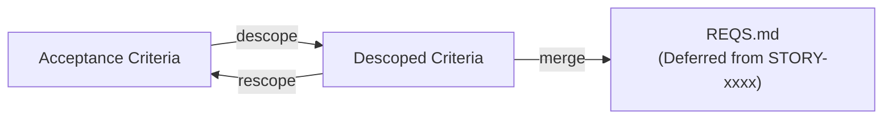

- Descoped criteria are stored on the story record (SQLite JSON blob).
- Every operation is reversible until merge. `rescope-ac` brings criteria back.
- At merge time, `_archive_workstream()` calls `append_descoped_to_reqs()` after
  WIP marker deletion, adding a "Deferred from STORY-xxxx" section to REQS.md.
- The deferred REQS items are picked up by the next `hashd plan` discovery run.
- During implementation, descoped criteria are injected into agent prompts as
  negative requirements ("DO NOT implement").

#### TUI Scope Operations

In the Story Detail screen, acceptance criteria and descoped criteria appear in a
single list. Descoped items render at reduced opacity with a `DESCOPED:` prefix.
Keybindings change based on which type is selected:

| Selection | Key | Action |
|-----------|-----|--------|
| Active criterion | `D` | Descope (with confirmation) |
| Active criterion | `e` | Edit |
| Active criterion | `d` | Delete |
| Descoped criterion | `r` | Rescope (immediate) |

---

## Artifact Edit Locks (REQS / SPEC)

REQS.md and SPEC.md have independent per-project edit locks so a human editor and
the automated PM writers never mutate the same document at once. Each lock is a
workflow-ID singleton (`reqs-lock:{project}` / `spec-lock:{project}`) --
`ArtifactLockWorkflow` -- the same primitive family as `pm:{project}` and
`mergelock:{project}`. Whoever's holder currently runs under that ID holds the
lock; the lock's state (holder, FIFO queue, lease) is durable across restarts.

Waiting is **event-driven, never polled**. Two acquire paths feed one FIFO queue:

- **Clients** (TUI editor, CLI) acquire via a blocking Update -- it parks in the
  workflow until granted, then returns a lease token. The TUI drives a **10-min
  idle lease** reset on keystrokes (2-min warning, then drop-to-read-only); the
  CLI is identity-keyed (the holder is the calling user, no token threaded).
- **Automated writers** (planning, story-edit, docs) acquire via a signal and
  are **signaled back** on grant, so a waiting plan costs O(1) history, not one
  event per poll. Planning/edit take `reqs-lock` **inside** their pm section (pm
  stays the automated-vs-automated mutex; the artifact lock is purely the human
  boundary); docs takes `spec-lock` for its run. A 2-min heartbeat holds the
  lease; release is explicit, and the writer's body deadline + lease are the
  crash backstop.

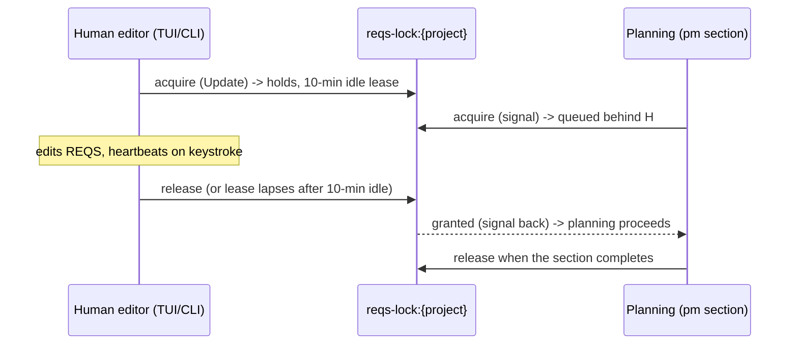

**Save guard:** a write is rejected if its token / caller-identity no longer
holds the lock (a lapsed lease). A write while an **automated** writer holds the
lock is always rejected (its edit must not interleave); while another **human**
holds it, a tokenless write falls back to the base-SHA CAS. **Break-glass steal**
exists server-side but is unpublished (no CLI verb, no TUI key) and refuses to
steal from a system process -- yanking a live planning run would corrupt its
in-flight REQS write. When Temporal is absent the whole mechanism degrades to
CAS-only writes.

---

## Phase 2: Implementation

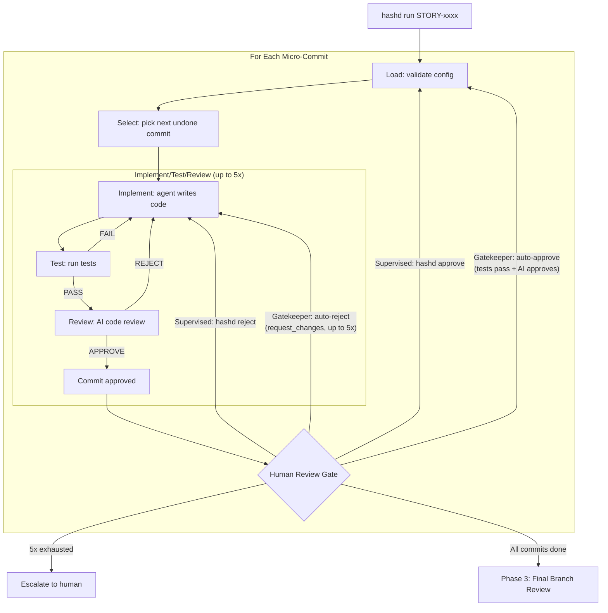

---

## Phase 3: Final Branch Review

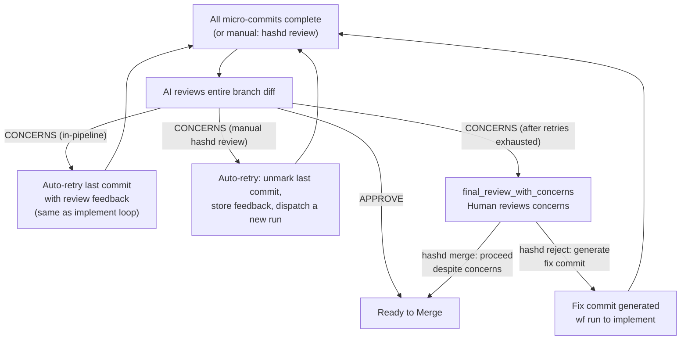

### Autonomous self-heal loop

In **autonomous** mode a final-review `CONCERNS` verdict does not park to a human on
the first pass. It feeds a bounded auto-fix loop: the reviewer's concerns are turned
into a FIX commit, the implement loop resolves it, and final review runs again — until
`APPROVE` or the loop gives up and parks. Gatekeeper and supervised are unchanged:
they park at `final_review_with_concerns` on the first `CONCERNS`, exactly as before.

This is the whole-branch analog of the per-commit qa-gate auto-continue that
autonomous mode already does. The standing rule "autonomous still blocks on real
failures" holds — the block moves from *first concern* to *concerns we could not
resolve* (cap or no-progress). Only a clean `APPROVE` reaches merge.

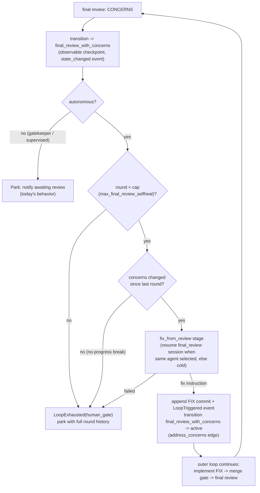

Mechanics:

- **No new FSM state or trigger.** The loop reuses the existing
  `address_concerns: final_review_with_concerns -> active` edge; only *who fires it*
  changes (the autonomous flow, not an operator). Going through
  `final_review_with_concerns` keeps the checkpoint observable and crash-safe.
- **In-process, not re-dispatch.** After appending the FIX commit the flow returns
  the workstream to `active` and continues the outer micro-commit loop — the same
  mechanism merge-gate test-failure fixes use.
- **Warm-cache resume.** `fix_from_review` resumes the `final_review` agent session
  (via `--resume`, stage `fix_from_review_resume`) only when the operator selected the
  *same agent* for both stages; otherwise it cold-starts from the concerns text. A
  failed resume falls back cold and never breaks the loop.
- **Bound + safety.** The cap is `workflow.max_final_review_selfheal`
  (`defaults.yaml < system < project`, default 3; `0` disables the loop). The
  no-progress break parks early when a round's concerns match the previous round's
  (normalized signature) — the reviewer and fixer are thrashing.
- **Durability.** Each round is recorded as a `final_review_selfheal` event (round,
  cap, concerns signature) in the events table, so the count and the previous
  signature survive across runs. A live `LoopTriggered`/`LoopExhausted` pair drives
  TUI/Telegram "loop k/K" status and the exhaustion park.
- **Gate on verdict, not confidence.** The loop keys on the categorical `CONCERNS`
  verdict; the confidence float never gates it.

---

## Phase 4: Merge

**Default: direct merge to main.** Use `--pr` to opt in to forge PR workflow for external review. Supports GitHub, Bitbucket, and GitLab. The forge is auto-detected from your git remote or set explicitly via `forge:` in config.yaml.

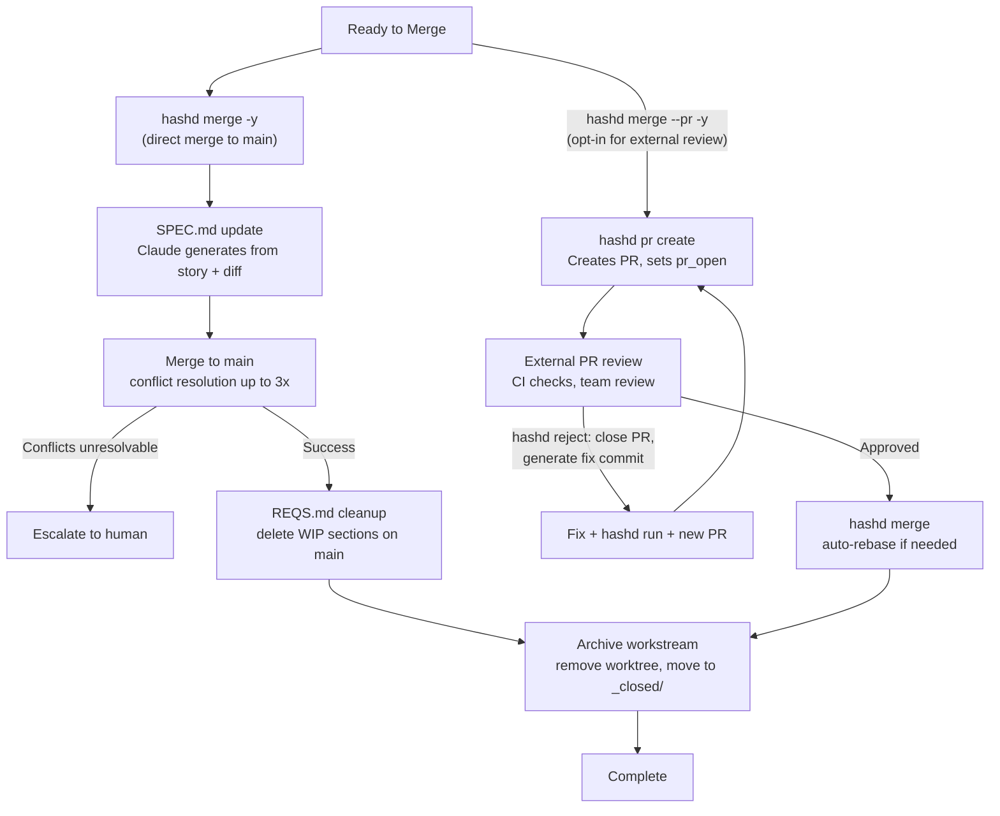

### Merge Modes

| Mode | CLI | TUI | Telegram | When to use |
|------|-----|-----|----------|-------------|
| **Direct** (default) | `hashd merge -y` | `[m] merge` | `/merge` | Standard workflow, AI-reviewed code |
| **PR** (opt-in) | `hashd merge --pr -y` | `[P] pr` | `hashd pr create` | External review needed (team, CI bots) |

The merge mode can also be set as a project default in config.yaml (`merge_mode: pr`). The `--pr` CLI flag overrides the project default for a single invocation.

The forge platform is auto-detected from the git remote URL, or set explicitly in config.yaml (e.g. `forge: github`, `forge: bitbucket`, or `forge: gitlab`).

---

## Command Reference

### Core Commands

| Command | Description |
|---------|-------------|
| `hashd plan` | Discover from REQS.md, save suggestions |
| `hashd plan list` | View current suggestions |
| `hashd plan story "title" [-f ctx]` | Quick feature (skips REQS discovery) |
| `hashd plan bug "title" [-f ctx]` | Quick bug fix (conditional SPEC update) |
| `hashd story edit STORY-xxx [-f "feedback"]` | Edit existing story |
| `hashd story clone STORY-xxx` | Clone a locked story |
| `hashd story retry STORY-xxx` | Retry failed planning run |
| `hashd plan reset` | Reclaim claimed suggestions whose story is gone (dead flow / out-of-band delete) so discovery is unblocked |
| `hashd story descope-ac STORY-xxx N` | Move acceptance criterion N to descoped list |
| `hashd story rescope-ac STORY-xxx N` | Move descoped criterion N back to acceptance criteria |
| `hashd story split STORY-xxx [--feedback ".."]` | Request an agent breakdown proposal for a large story |
| `hashd story split STORY-xxx 3,5,7 -t "title" [-y]` | Split criteria into one new draft sibling story |
| `hashd run [id] [--once\|--loop] [--gatekeeper\|--supervised\|--autonomous] [-f ".."] [-y]` | Dispatch the workstream run workflow (-f: guidance, -y: skip prompts) |
| `hashd list` | List stories and workstreams |
| `hashd show <id>` | Show story or workstream details |
| `hashd approve <id>` | Accept story or approve gate |
| `hashd reject [id] [-f "feedback"] [--reset]` | Reject a gate and fold review findings into the next FIX commit. `-f` is optional additive operator guidance and takes precedence over folded findings. Use `@directive <text>` in feedback to add durable constraints (e.g. `hashd reject ws-1 -f "fix X @directive do not modify RBAC"`) |
| `hashd assign <id> [user]` | Assign a story/workstream to a user by handle (default: yourself); ownership is open -- anyone can (re)assign |
| `hashd unassign <id>` | Clear the owner of a story/workstream |
| `hashd admin user rename <email> <name>` | Rename a user's unique display-name handle (team-server; the solo owner defaults from `git config user.name`) |
| `hashd pr create [id]` | Create PR/MR for specified workstream |
| `hashd pr feedback [id]` | View PR/MR review comments |
| `hashd merge [id] [--confirm\|-y] [--pr] [--no-push] [--fix] [--ai-resolve]` | Merge to main and archive (`--confirm`/`-y` required in supervised/gatekeeper mode, `--pr` forces PR workflow) |
| `hashd close [id] [--force] [--keep-branch] [--no-changes] [-r ".."]` | Abandon workstream (-r reason required with --no-changes) |
| `hashd skip [id] [commit] [-m ".."]` | Mark commit as done without changes |
| `hashd reset [id]` | Keep the plan, reset the worktree to baseline, redo the implementation |
| `hashd replan [id] [-f ".."]` | Regenerate the plan from a clean base (resets the worktree to baseline, clears the plan; `-f`: why the plan is wrong) |

### Supporting Commands

| Command | Description |
|---------|-------------|
| `hashd use [id] [--clear]` | Set/show/clear current workstream |
| `hashd watch [id]` | Interactive TUI - monitor execution progress |
| `hashd review [id]` | Show latest saved final review |
| `hashd diff [id] [--stat\|--staged\|--uncommitted] [--commit SHA] [--file path]` | Show workstream diff |
| `hashd log [id] [--since ISO] [-n limit] [-r]` | Show workstream timeline |
| `hashd docs [id]` | Update SPEC.md from workstream |
| `hashd refresh [id]` | Refresh touched files |
| `hashd conflicts [id]` | Check file conflicts |

### Plan regeneration: reset / replan / reject

Three operator verbs touch a workstream's plan + worktree, all backed by the one
`breakdown` engine (the same generator as the initial plan -- see "Test-Conflict
Escalation"). They differ only in scope and whether the plan is kept:

| Verb | Plan | Worktree | Feedback | What it's for |
|------|------|----------|----------|---------------|
| **reset** | kept (commits unmarked) | reset to **baseline** (drops committed + uncommitted work) | -- | The plan is right, the implementation went bad: redo it from clean. |
| **replan** | **regenerated** (breakdown re-runs) | reset to **baseline** | optional (`-f`) | The plan is wrong: re-derive it from the requirement. |
| **reject** (gate) | kept | current attempt only (`--reset` discards it; otherwise refine in place) | folded gate findings plus optional `-f` | At a review gate: iterate on the current micro-commit or branch feedback. |

reset and replan are the same operation modulo "keep vs regenerate the plan";
both reset the worktree to the recorded baseline via the shared
`resetWorktreeToBase` (`server/internal/api/mutations_reset.go`), then return the
workstream to active.

`resetWorktreeToBase` fails closed: it refuses (409) if a rebase or merge is in
progress, or if the recorded baseline is no longer the branch's live fork point
with its base branch (`merge-base HEAD origin/<base>`). The latter happens once
the branch has been rebased during merge prep -- the recorded `base_sha` is not
advanced by those paths, and stays a *transitive* ancestor of HEAD, so a plain
ancestry check would miss it. So reset/replan are practically available before
merge prep -- in implementing / awaiting_human_review -- and refuse afterward
rather than silently rewinding past the rebase to a stale base.

**Surface map** (every operation reachable in the surfaces that had it):

| Operation | CLI | TUI | Telegram |
|-----------|-----|-----|----------|
| Regenerate plan | `hashd replan [id] [-f ".."]` | `N` | — *(not exposed; the bot has no reset/replan)* |
| Redo implementation | `hashd reset [id]` | `R` | — *(not exposed)* |
| Gate reject / approve | `hashd reject [id] [--reset]` / `hashd approve [id]` | `r` / `a` | `/reject` / `/approve` |

The Telegram bot intentionally exposes only the human-gate verbs (`/approve`,
`/reject`); it has never had reset or replan. Adding bot parity is a separate
follow-up, not part of this surface.

### Question & Answer Commands

`hashd answer` is the single operator surface for clarification Q&A. CLQ-NNN ids
are internal — the operator talks to entities (stories and workstreams) and
the server fans out the bundle answer across every pending CLQ on the entity.
Submitting an answer always auto-dispatches the next agent run (edit-flow for
stories, start_impl/resume_impl for workstreams) so a single operator action
moves the entity forward.

Story clarifications can also carry `breakdown_proposal` payloads from
`hashd story split STORY-xxx`. Answer `yes` to apply the parent revision and create
sub-stories transactionally, `no` to reject without changes, or any non-yes/no
feedback to request a revised proposal.

| Command | Description |
|---------|-------------|
| `hashd answer` | Show help. |
| `hashd answer list` | List entities with pending clarifications (stories + workstreams). |
| `hashd answer show <entity>` | Show pending question text for one entity. |
| `hashd answer <entity> "<text>"` | Submit a bundle answer. Flips every pending CLQ on the entity to `answered` with this text and dispatches the next agent run. |

**State requirements.** Stories must be in `draft` (no linked workstream) for
`hashd answer`. Workstreams must be in `active` or `awaiting_human_review`. Other
states return a structured diagnostic that names the right next command.

**Failure semantics.** Dispatch happens before the CLQ flip. A transient
Temporal outage fails the call before any DB writes. A flip failure after a
successful dispatch surfaces a 500 instructing the operator to retry the
answer; the run itself is already in flight.

### Archive Commands

| Command | Description |
|---------|-------------|
| `hashd archive work` | List archived workstreams |
| `hashd archive stories` | List archived stories |
| `hashd archive delete <id> --confirm` | Permanently delete |
| `hashd open <id> [--force]` | Resurrect archived workstream |

### Directives Commands

| Command | Description |
|---------|-------------|
| `hashd directives` | View global directives |
| `hashd directives all` | View all (global + project + workstream) |
| `hashd directives project` | View project only |
| `hashd directives workstream <ws>` | View workstream's only |
| `hashd directives edit` | Edit global in $EDITOR |
| `hashd directives edit project` | Edit project in $EDITOR |
| `hashd directives edit workstream <ws>` | Edit workstream's in $EDITOR |
| `hashd directives ai-edit` | AI-assisted edit of global |
| `hashd directives ai-edit project` | AI-assisted edit of project |
| `hashd directives ai-edit workstream <ws>` | AI-assisted edit of workstream's |

### Project Commands

| Command | Description |
|---------|-------------|
| `hashd project add <path> [--no-interview] [--primary name] [--active name ...\|--all-active] [--repo-skip-test name] [--repo-skip-build name] [--commit-root-dirs]` | Register a new project |
| `hashd project list` | List registered projects |
| `hashd project use [name] [--clear]` | Set, show, or clear the current project |
| `hashd project show` | Show project configuration |
| `hashd project interview` | Update project configuration interactively |
| `hashd project remove <name> [-y]` | Remove a project |
| `hashd project config list` | List effective project config and mark overrides in TTY output |
| `hashd project config diff` | Show project overrides against inherited system/default config |
| `hashd project config show <key>` | Show effective value, source, override stack, and description |
| `hashd project config get <key>` | Get config value |
| `hashd project config set <key> <value>` | Set config value |
| `hashd project config reset <key>` | Remove one project override |
| `hashd project config reset --all` | Remove all project overrides |
| `hashd project describe` | Show current project description |
| `hashd project describe --suggest` | AI-generate a description suggestion |
| `hashd project reqs [show]` | Show configured REQS artifact content through hashd-server |
| `hashd project reqs set [--file F]` | Overwrite REQS from a file or stdin, atomically under the edit lock; active-story WIP sections are protected |
| `hashd project reqs {lock,refresh,unlock}` | Hold / renew / release the REQS edit lock across a multi-step script (identity-keyed, 10-min lease) |
| `hashd project spec [show]` | Show configured SPEC artifact content through hashd-server |
| `hashd project spec set [--file F]` | Overwrite SPEC from a file or stdin, atomically under the edit lock |
| `hashd project spec {lock,refresh,unlock}` | Hold / renew / release the SPEC edit lock across a multi-step script |

### System Config Commands

| Command | Description |
|---------|-------------|
| `hashd config list` | List effective system config and mark system overrides in TTY output |
| `hashd config diff` | Show system overrides against compiled defaults |
| `hashd config show <key>` | Show effective value, source, override stack, and description |
| `hashd config get <key>` | Get system config value |
| `hashd config set <key> <value>` | Set system config value |
| `hashd config reset <key>` | Remove one system override |
| `hashd config reset --all` | Remove all system overrides |

### Auth Commands

| Command | Description |
|---------|-------------|
| `hashd auth create --description <name>` | Create a bearer token for off-loopback clients; plaintext is shown once |
| `hashd auth list` | List token metadata without exposing secrets |
| `hashd auth delete <id>` | Revoke one bearer token |

### Workstream Commands

| Command | Description |
|---------|-------------|
| `hashd workstream remove <id>` | Remove orphaned workstream |

### Observability Commands

| Command | Description |
|---------|-------------|
| `hashd chat [id]` | Pair programmer chat with AI |
| `hashd agents` | Show installed AI agents and stage assignments |
| `hashd doctor` | Validate setup and diagnose issues |
| `hashd restart [component] [-y]` | Restart infrastructure (server, Temporal sidecar, event forwarder, messengers) |
| `hashd lineage <target> [--line N] [--lines N-M] [--format table\|json\|markdown]` | Trace code lineage (auto-detects file/SHA/STORY/BUG) |
| `hashd lineage export <sha\|STORY-xxxx\|BUG-xxxx> [--format slsa\|in-toto]` | Export attestation (SLSA v1.0 or in-toto) for SHA or story |
| `hashd lineage verify` | Validate hash chain integrity for project commits |
| `hashd system-log` | View system event log |
| `hashd prompts list` | List prompt templates |
| `hashd prompts show <name>` | Show prompt content |
| `hashd prompts edit <name>` | Edit prompt override |
| `hashd prompts reset <name>` | Reset prompt to default |
| `hashd prompts diff <name>` | Show diff from default |
| `hashd completion [bash\|zsh\|fish]` | Generate shell completion |

---

## Release Cuts

Release cuts are dev-team operations and are intentionally not exposed through
the user-facing `hashd` CLI.

1. `scripts/cut-release.sh <version>` runs from a clean hashd checkout. It requires local `main` at `origin/main`, `origin/dev` as a strict superset of `origin/main`, and no open PRs targeting `dev` unless the operator passes `--yes`.
2. The script creates an isolated candidate merge from `origin/main` plus `origin/dev`, runs `task -d server generate`, amends allowed generated artifacts, pushes an immutable annotated tag at `refs/tags/release-candidate/v<version>/<attempt>`, and dispatches `.github/workflows/release.yml` in candidate mode.
3. The workflow runs all pre-publish gates and then parks at the protected `release-publish` environment. The operator approves that environment in the GitHub UI to publish.
4. After approval, the workflow publishes hashd-code, pushes the source tag, updates `main`, and updates `dev` so `dev` contains `main`.
5. If the final dev back-merge conflicts after publish, the workflow fails loudly. The published release, source tag, and `main` stay authoritative; resolve `dev` manually by merging `origin/main` into `origin/dev`.

---

## Watch UI Keybindings

The `hashd watch` TUI provides context-sensitive keybindings based on workstream status:

### Dashboard

| Key | Action |
|-----|--------|
| `1-9` | Select workstream by number |
| `a-i` | Select story by letter |
| `p` | Open plan screen |
| `m` | Change autonomy mode (supervised/gatekeeper/autonomous) |
| `/` | Command palette |
| `?` | Help |
| `q` | Quit |

### Workstream Detail View

Available on any workstream detail screen:

| Key | Action |
|-----|--------|
| `G` | Go - run workstream |
| `c` | Answer pending clarifications (bundle modal -- one answer applies to all) |
| `d` | View diff |
| `l` | View log |
| `p` | Open plan view |
| `1` | Toggle status section |
| `2` | Toggle commits section |
| `3` | Toggle timeline section |

### Diff Mode

When the diff panel is active (`d`):

| Key | Action |
|-----|--------|
| `s` | Toggle side-by-side / unified view |
| `I` | Toggle lineage view |
| `f` | Toggle fullscreen (hides left column) |
| `Enter` | Show lineage detail for selected line (lineage view) |

### Stage: awaiting_human_review

| Key | Action |
|-----|--------|
| `a` | Approve changes, continue to next micro-commit |
| `r` | Reject with feedback, iterate on current commit |
| `R` | Reset -- keep the plan, redo the implementation from the baseline |
| `N` | Re-plan -- regenerate the plan from a clean base (prompts for guidance) |

### Stage: ready_to_merge / final_review_with_concerns

| Key | Action |
|-----|--------|
| `m` | Merge directly to main (default) |
| `P` | Create PR/MR (for external review) |
| `r` | Reject with feedback |
| `e` | Edit pending microcommit |
| `+` | Add new micro-commit to plan |

When `merge_mode: pr` is set in config.yaml, `P` (create PR) and `m` (merge PR) swap roles -- `P` appears when no PR exists, `m` appears once a PR is created.

**Note:** `final_review_with_concerns` has the same bindings as `ready_to_merge`. The difference is informational - the AI final review flagged concerns. The Details panel shows these concerns; review them before proceeding.

**Note:** `+` (add micro-commit) is also available in active and implementing states when the workstream is idle.

### Stage: merge_conflicts

| Key | Action |
|-----|--------|
| `i` | AI-resolve conflicts |
| `R` | Reset workstream |

### Stage: pr_open / pr_approved

| Key | Action |
|-----|--------|
| `r` | Reject - opens modal pre-filled with PR feedback |
| `o` | Open PR in browser |
| `a` | Merge PR |

The `[r] reject` action in PR states:
1. Fetches PR comments and pre-fills the input modal
2. User edits/confirms feedback (cannot submit empty)
3. **Closes the PR/MR** on the forge with comment
4. Clears PR metadata from workstream
5. Creates fix commit (COMMIT-xxx-FIX-NNN)
6. Use `[G] Go` to run, then `[P]` creates a fresh PR

### Plan Screen

| Key | Action |
|-----|--------|
| `s` | Create new story |
| `b` | Create new bug |
| `d` | Run discovery from REQS.md |
| `1-9` | Create story from suggestion |
| `Esc` | Back to dashboard |

### Story Detail Screen

| Key | Action |
|-----|--------|
| `A` | Approve story (Shift+A, draft -> accepted) |
| `a` | Answer open questions |
| `E` | Edit story with AI (Shift+E) |
| `e` | Edit selected acceptance criterion |
| `d` | Delete selected criterion |
| `D` | Descope selected criterion (Shift+D, moves to descoped list) |
| `r` | Rescope selected descoped criterion (moves back to AC) |
| `G` | Create workstream and run (Shift+G) |
| `C` | Open pair programmer chat (Shift+C) |
| `X` | Close/abandon story (Shift+X) |
| `v` | View full story markdown |
| `p` | Open plan screen |
| `Esc` | Back to dashboard |

### Global Keybindings (all screens)

| Key | Action |
|-----|--------|
| `?` | Show help (context-aware shortcuts) |
| `/` | Open command palette |
| `Ctrl+t` | Toggle dark/light theme |
| `Ctrl+s` | Save screenshot |
| `1-9` | Quick-select workstream (dashboard) |
| `a-i` | Quick-select story (dashboard) |
| `p` | Open plan screen |
| `q` | Back / Quit |
| `Esc` | Back to previous screen |

---

## Directives

Directives are curated standing rules that guide AI agents. They exist at three levels:

```
~/.config/hashd/directives.md        # Global user preferences
{repo}/directives.md              # Project rules
workstreams/{id}/directives.md    # Workstream-specific (rare)
```

**Why `directives.md` not `AGENTS.md`?** We want hashd to control when directives are passed to agents, not have agents auto-read them. Using `directives.md` ensures agents only see these rules when we explicitly include them in prompts.

**Key principle:** Directives are documentation, not runtime state. They persist and are version-controlled.

### Example directives.md

```markdown
# Project Directives

<!--
Directives guide AI agents during implementation.
hashd passes this file to agents - they don't auto-read it.
-->

- No backward compatibility. We have zero users.
- Use sync.Once pattern for handler initialization
- Follow existing templ component patterns in internal/templates
- HTMX handlers should set HX-Trigger for related component updates
```

### Commands

```bash
# Viewing
hashd directives                       # View global
hashd directives all                   # View all (global + project + workstream)
hashd directives project               # View project only
hashd directives workstream <ws>       # View workstream's only

# Manual editing
hashd directives edit                  # Edit global
hashd directives edit project          # Edit project
hashd directives edit workstream <ws>  # Edit workstream's

# AI-assisted editing
hashd directives ai-edit               # AI edit global
hashd directives ai-edit project       # AI edit project
hashd directives ai-edit workstream <ws>  # AI edit workstream's
```

### Usage

Directives are automatically included in all agent-driven stages that produce or judge work:

- implementation
- merge-conflict resolution
- per-commit review and review retry
- final review
- fix generation
- add-commit planning
- planning discovery
- story refine/edit
- breakdown
- concern triage

Use `hashd directives all` to view all directives at once.

### Stage-Scoped Directive Blocks

Directives can include optional stage markers when a rule should only reach a subset of agents. Unwrapped content still renders in every stage.

```markdown
<!--
This file is hashd's directives.md -- operator-authored standing guidance.

Sections wrapped in `<!-- STAGE: name1, name2 -->` / `<!-- END STAGE -->`
only render in those agent stages. Unwrapped sections render in every stage.

Valid stage names: planning, implement, fix_generation, review, final_review,
edit_flow.
-->

# Standing directives

Use msgspec for new data types.

<!-- STAGE: review, final_review -->
Be strict on test coverage for new public code paths.
<!-- END STAGE -->

<!-- STAGE: planning -->
Prefer one-commit-per-AC granularity.
<!-- END STAGE -->
```

Valid stage names are `planning`, `implement`, `fix_generation`, `review`, `final_review`, and `edit_flow`. The merge-conflict resolver uses `implement`; breakdown uses `planning`; concern triage uses `review`. Matching blocks render without the marker comments. Non-matching blocks are stripped. Malformed blocks fail open with a warning, so the content renders to every stage rather than silently disappearing. Nested stage blocks are not supported.

---

## Workstream State Model

A workstream's runtime position is described by two orthogonal fields: **stage** (where in the lifecycle) and **status** (what's happening at that stage right now). For stages with internal sequencing, a third field — **substage** — tracks position within the stage.

> **Note on current implementation**: today's code conflates stage and status into a single field (named `status` in Python, `state` in the Go server's FSM JSON). The model described below is the canonical design; the rename + additive `status` field lands as a post-v0.6.0 migration. Conceptually the system already operates this way — the docs lead the data model.
>
> **What's shipped (Brief 99 Phase 1 + Brief 114 Phase 5)**: the derived `runtime_status` field is exposed by the Go workstream serializer (`ComputeRuntimeStatus`, `server/internal/fsm/runtime_status.go`); clients read the derived field from the REST payload. Operator displays (`hashd show`, dashboard, watch detail subtitle) render the `<stage> / <runtime_status>` pair. The macro-state fold for `creation_failed` / `baseline_failed` landed in Brief 114: both states were dropped from the FSM and their incoming/outgoing transitions collapsed into `provisioning` (with `provision_error` / `baseline_failures` columns populated as the failure detail). The FSM rename (Phase 1 of the migration outline) remains future work — see the migration outline at the bottom of this section.

### Stage

A **stage** is an idempotent workflow position with defined inputs and outputs.

Properties:
- **Idempotent**: re-running the stage with the same inputs produces the same outputs (or at least is safe to re-execute without introducing new state changes).
- **Defined inputs/outputs**: each stage takes a known input set and produces a known output set. Listed per-stage in the implementation.
- **Leaving the stage mutates the flow**: the transition out is the commit point. While inside, the stage can be re-run or extended; once the FSM transitions, the output is locked in.
- **Going back destroys the current stage's terminal output**: rewinding from B to A discards B's verdict/decision. Only explicit current-cycle artifacts flow back to the next agent stage; stale review history and conversation context stay available to operator surfaces, not agent prompts.

The macro FSM enumerates the stages. See **State Diagram** below for the canonical list and transitions.

#### Additive flow state

When stage A → B → A happens (e.g., implementing → review → implementing on a rejection), the second visit to A starts with:
1. Original inputs to A
2. Plus the current-cycle artifact from B (e.g., the just-completed review's actionable feedback)

The terminal output of the first A is gone (replaced by the second A's output). Historical feedback and summaries remain queryable for humans, but they do not accumulate into per-commit reviewer or implementer prompts.

### Status

A **status** is the runtime state at the workstream's current stage. Seven values:

| Status | Meaning | Computed from |
|---|---|---|
| `running` | Process attached, work in progress at current stage | `runner_pid` alive AND `last_run` incomplete |
| `blocked` | Waiting for external input (clarification, human review, conflict resolution, post-rebase merge-test recovery, etc.) | `last_run.status == "blocked"`; `merge_test_failed` with latest run failed |
| `changes_required` | Reviewer requested changes; approve/reject/reset can decide the current diff. Review-loop exhaustion parks the workstream at `awaiting_human_review` (runtime `blocked`), so this value mostly describes runs recorded before that park existed | Latest review verdict is request changes |
| `failed` | Previous run errored, retryable via re-dispatch | `last_run.status == "failed"` |
| `idle` | Stage entered, no run has executed yet | No `last_run` record for current stage |
| `orphaned` | Runner exited without writing a terminal result, unintentionally | `runner_pid` dead AND `last_run` incomplete |
| `done` | Terminal stage reached; no further work | Stage in terminal set (`merged`, `closed`, `closed_no_changes`) |

#### Status is derived

Status is computed on read from primitive fields (`runner_pid`, last `runs` row, current stage), not stored as a column. Hard kills self-heal: pid not alive on next read → status flips to `orphaned`.

The canonical compute function lives Go-server-side (in the workstream serializer); clients consume the derived field from the REST payload rather than recomputing it.

#### `cancelled` vs `orphaned`

Same surface symptom (no live runner, no terminal result), different cause:
- **`orphaned`**: process died unintentionally (hard kill, prompt-render exit before `write_result`, etc.). Operator should investigate.
- **`cancelled`**: operator deliberately stopped the runner via a future `hashd cancel` command. No investigation needed; just decide whether to re-dispatch.

Today there's no explicit cancel mechanism; killed runs become `orphaned`. When `hashd cancel` lands, it writes `last_run.status = "cancelled"` cleanly.

### Substage (sub-FSM)

Stages with internal sequencing have their own sub-FSM. The substage field tracks position within the stage; the macro `status` describes the workstream's runtime state at that position.

Stages that have a sub-FSM today (or will when formalized):
- **`implementing`** — runner inner loop. **Formalized (Brief 123 Phase 3).** Spec at `server/internal/fsm/implementing_substages.json`; Go validator at `server/internal/fsm/implementing_substages.go` (loaded as `fsm.ImplementingSubstages`), enforced at the runner-stage write in `server/internal/runflow/substage.go`. See **Implementing sub-FSM** below for the transition table.
- **`merge_conflicts`** — resolution attempts: `initial → resolve_running → resolve_succeeded → retry_merge` (with `resolve_failed` as a recoverable sub-state). _Future phase._
- **`merging`** — merge sequence. **Formalized.** Local merge records `acquire_lock → pre_merge_tests → post_rebase_test → checkout → merge_attempt → finalize`; PR merge records `acquire_lock → pre_merge_tests → post_rebase_test → pr_merge → finalize`. The `post_rebase_test` substage runs the merge-gate command in the worktree after rebasing onto fresh main and before any merge lands.
- **`provisioning`** — create steps: `worktree → baseline → enrichment` (when applicable). _Future phase._

#### Implementing sub-FSM

States: `preflight`, `select`, `clarification_check`, `concern_triage`, `implement`, `test`, `adjudicate`, `review`, `qa_gate`, `commit`. (`breakdown` runs before `select` but is not a tracked sub-FSM state — like the initial breakdown, the escalation partial breakdown sets `runner_stage="breakdown"` without an FSM transition.)

Transitions:

| Trigger | From → To |
|---|---|
| `preflight_pass` | `preflight` → `select` |
| `select_pass` | `select` → `clarification_check` |
| `clarification_clean` | `clarification_check` → `concern_triage` |
| `triage_complete` | `concern_triage` → `implement` |
| `implement_pass` | `implement` → `test` |
| `test_pass` | `test` → `review` |
| `test_fail` | `test` → `implement` (build failure: straight back to implement) |
| `test_conflict` | `test` → `adjudicate` (test failure: judge the conflict) |
| `adjudicate_resolve` | `adjudicate` → `implement` (REGRESSION/OBSOLETE verdict) |
| `review_approve` | `review` → `qa_gate` |
| `review_request_changes` | `review` → `implement` |
| `qa_pass` | `qa_gate` → `commit` |
| `commit_pass` | `commit` → `select` |

Terminal triggers (exit-to-caller; control leaves the sub-FSM):

| Trigger | From | Exit reason |
|---|---|---|
| `select_complete` | `select` | all commits done |
| `clarification_blocked` | `clarification_check` | clarification needed |
| `implement_blocked` | `implement` | agent surfaced clarification or blocked work |
| `review_human_gate` | `review` | awaiting human review |
| `qa_fail` | `qa_gate` | qa gate blocked |
| `adjudicate_blocked` | `adjudicate` | test conflict needs a human decision (Supervised CANT_TELL) |

#### Test-Conflict Escalation (adjudicate → partial breakdown → human)

When a previously-passing test goes red after an implement attempt, the loop does
**not** blindly re-run implement with "fix the code." It runs a bounded, tiered
escalation: a judge (Tier 1), then a **partial breakdown** that re-derives the
uncommitted plan tail (Tier 2), then a human (Tier 3). Budget: **judge×1 →
partial-breakdown×1 (per failing-test signature) → human** — no unbounded looping.

```text
test red ─► adjudicate (judge, Tier 1)
              │
   verdict ──┼─ REGRESSION / OBSOLETE ─► implementer fix, 1 try ─► test ─► green ─► review
              │
              ├─ CANT_TELL, Supervised ────► blocking clarification (adjudicate_blocked, human)
              │
              └─ CANT_TELL, unattended ────► PARTIAL BREAKDOWN (Tier 2)

  same failing-test-identity signature twice (after a REGRESSION/OBSOLETE retry)?
     ├ not escalated yet ─► PARTIAL BREAKDOWN (Tier 2)
     └ already escalated this signature ─► Tier 3: human gate (blocked)

PARTIAL BREAKDOWN  (= the `breakdown` engine re-invoked, scope=partial, 1 try/sig)
  re-derive the UNCOMMITTED tail; committed prefix frozen; worktree left intact
     ├ Gatekeeper/Autonomous: apply ─► re-implement against the re-derived tail
     ├ Supervised: apply + block for plan review (hashd show / hashd run)
     └ can't resolve ─► raise a blocking clarification (human)
```

A red test first routes to a read-only judge substage (`adjudicate`) that
classifies the conflict **against the story's true requirement** (problem +
acceptance criteria) — deliberately distinct from the micro-commit task, which
may have over-specified something the requirement never asked for. Build failures
skip adjudication (the code simply doesn't compile) and go straight back to
implement via `test_fail`.

Verdicts (`server/internal/fsm/implementing_substages.json`; judge prompt in
`prompts/adjudicate.md`):

| Verdict | Meaning | Route |
|---|---|---|
| `REGRESSION` | the requirement never asked for this side effect; the change is wrong | back to implement: fix code, **keep the test** |
| `OBSOLETE` | the requirement supersedes the test; it encodes old behavior | back to implement: reconcile the test, recording it in `touched_tests` |
| `CANT_TELL` | requirement is silent, or it's a scope/product call | Supervised: blocking clarification (`adjudicate_blocked`); unattended: hand to the partial breakdown |

Separation of authority: the implementer may **fix its own code** freely, but
**only an OBSOLETE verdict authorizes a test change**. The judge is read-only
(no `Edit`/`Write`); it returns a verdict, the implementer acts on it, and any
test edit/deletion is declared in the implement result's `touched_tests` so the
terminal reviewer (which holds the acceptance criteria) re-checks it. An
unparseable or failed adjudication defaults to `CANT_TELL`.

**CANT_TELL routing by autonomy:** Supervised opens a blocking clarification
directly — a human is already in the loop. Gatekeeper/Autonomous hand the
ambiguous conflict to the partial breakdown instead: it can re-derive the tail or
raise its own clarification, a better first responder than a bare CLQ for
unattended modes.

**Oscillation trigger (Tier 1 → 2):** when the *same set of failing tests*
repeats across consecutive adjudications, Tier 1 isn't converging, so the loop
escalates to the **partial breakdown** (Tier 2) — and if it already escalated for
this conflict, to the **human** (Tier 3). The signature is the set of
failing-test **identities** (test name + file), parsed from `test.log` and stored
on the `review_history` entry — deliberately *not* the raw output, which carries
per-run durations that would make an unchanged failure look different every run
(the bug that made the original guard a silent no-op). It mirrors the review
loop's `_review_blocker_set` identity comparison.

Two known limitations, both bounded: (1) the signature depends on the parser
extracting structured failures — output it can't structure yields an empty
signature and no *early* escalation, but `max_review_attempts` still caps the
loop and routes to the human gate; (2) the identity excludes the failure
*message*, so "same test, different assertion" counts as oscillation (the
observed livelock was the identical failure every iteration).

#### Scope Adjudication (operator-invoked, advisory)

The review loop has two moves — retry or park — and it deadlocks when the
reviewer's objection is something the implementer structurally cannot fix: a
plan-scoping dispute over *where* work belongs, which neither party has the
authority to settle. `hashd workstream adjudicate <ws> [--commit <mc>]
[--wait] [--wait-timeout <dur>]` runs a read-only scope judge over the stuck
review and reports.
It is **not** wired into the runner loop, not auto-invoked, and mutates no
workstream state; the operator runs it, reads the briefing, and decides.

```mermaid
flowchart LR
    OP[operator: hashd workstream adjudicate] --> API[POST /workstreams/id/adjudicate]
    API --> WF["adjudicate:{project}:{ws} workflow"]
    WF --> ACT[RunnerScopeAdjudicate activity]
    ACT --> CTX[assemble dispute record:\nplan block, latest review,\nimplementer summary, guidance, diff]
    CTX --> J[scope judge agent\nprompts/scope_adjudicate.md]
    J --> N[normalize: cite-to-rule,\nconfidence floor, briefing guarantee]
    N --> ROW[(reviews row\nreview_type=scope_adjudication)]
    ROW --> SHOW[hashd show / --wait briefing]
    ROW -. never read by .-> LOOP[review loop / triage / lineage]
```

The judge rules on **where work belongs**, never on **what the software
should do**: if resolving the dispute requires changing or interpreting an
authored artifact (requirements, spec, an AC, a human-written prompt), it has
no jurisdiction and returns `CANT_TELL`. Rulings must cite to rule — a
`file:line`, AC id, plan block, or prior operator ruling — an `OUT_OF_SCOPE`
ruling must additionally name a target micro-commit that exists in the plan,
and every ruling must clear the active autonomy mode's commit-confidence
threshold; the normalize layer downgrades anything else (missing citation,
missing or phantom target commit, sub-threshold confidence) to `CANT_TELL`.
Every outcome, `CANT_TELL` included,
carries a six-section briefing (dispute, reviewer position, implementer
position, artifacts marked authored/derived, the single question the dispute
hinges on, and concrete operator options).

The ruling persists as a `reviews` row with
`review_type = 'scope_adjudication'`. The review-list queries
(`ListReviewsByMicrocommit`, `ListReviewsByWorkstream`,
`ListLatestReviewsByProject`) exclude that type, so the ruling never enters
review history, the review prompt, oscillation triage, runtime status, or
lineage surfaces — advisory means the loop cannot see it. `hashd show <ws>`
surfaces the latest ruling's verdict and hinge question.

Advisory is precise, not absolute silence: the judge runs through
`agents.RunStageWithOptions` like every agent stage, so the standard
agent-stage envelope still rides — active-invocation registration (an
in-flight judge honestly shows as agent activity), agent-stage event rows,
agent_calls, and transcripts. What never happens is an FSM transition, a
workstream-row write, or any consumption of the ruling by the runner loop.

**Partial breakdown (Tier 2):** the "architect" *is* the `breakdown` engine
re-invoked in **partial** scope — `RunPartialBreakdownStage`
(`server/internal/runflow/partialbreakdown.go`), the breakdown
generator run in partial scope with the conflict context: the failing
test, the judge's verdict + reason, and the existing plan with committed commits
**frozen** (the plan also carries the acceptance criteria, the fixed
requirement). It re-derives **only the uncommitted tail**:

- **Committed (`Done: [x]`) micro-commits are frozen** and preserved verbatim.
  The agent regenerates only the uncommitted tail; `ReplaceUncommittedTail`
  (`server/internal/plan`, the Go-canonical plan mutation) splices the new tail
  onto the committed prefix and **fails closed** (→ human) if a committed commit
  would land in the regenerated region.
- **The worktree is NOT reset.** The implementer's in-flight work stays; it gets
  the re-derived task on the next attempt and refines its work against it.
- After re-derivation the engine **re-selects** the in-flight micro-commit from
  the new tail (the previous selection may have changed).

| Mode | After re-deriving the tail |
|---|---|
| Gatekeeper / Autonomous | apply and re-implement against the revised tail |
| Supervised | apply, then block for plan review (`hashd show` / `hashd run` to continue) |
| can't resolve | raise a blocking clarification — a human decides |

**Safety boundary:** the partial breakdown rewrites micro-commit **tasks** only —
**never** the story's acceptance criteria/requirement ("task ≤ requirement"), and
**never** committed work. It is autonomous-eligible precisely *because* it is
breakdown, which structurally produces tasks from a fixed requirement and cannot
reach it. The budget is one partial breakdown per failing-test signature: if the
re-derived tail still oscillates, Tier 3 (human) takes it. This is the same
`breakdown` generation engine as the initial plan — differing only in scope
(uncommitted tail vs whole plan) and in leaving the worktree intact.

The validation hooks into the runner-stage write (`RecordRunnerSubstage` in `server/internal/runflow/substage.go`): when both the previous and the new `runner_stage` are in the spec's state set, the transition must match a registered edge. Cross-domain transitions (`preflight → breakdown`, `review → human_review`, anything involving `merge_gate` / `final_review`) are accepted unconditionally — those values are outside the implementing sub-FSM's state set.

Stages without sub-FSM (light operator-decision stages):
- `active`, `awaiting_human_review`, `ready_to_merge`, `final_review_with_concerns`, `merge_test_failed`, `pr_open`, `pr_approved`
- Terminal: `merged`, `closed`, `closed_no_changes`

`drafting`, `draft`, `editing`, and `accepted` are story-lifecycle stages, not workstream stages, so they are intentionally outside the workstream model here.

Sub-FSM transitions are **code-driven**, not operator-driven. Macro FSM transitions are operator-driven (or auto-fire on macro-stage completion). Both layers have validated transitions.

#### Display convention

Operator-facing displays combine the three fields:

```
implementing / running (review)        — workstream running, currently in review substage
implementing / blocked (clarification) — blocked, agent raised a clarification
implementing / failed (test)           — last run failed at test substage
merge_conflicts / running (ai-resolve) — AI resolution in progress
merge_test_failed / blocked            — post-rebase merge test failed; add a FIX commit, retry merge, or close
ready_to_merge / idle                  — approved, waiting for operator merge
merged / done                          — terminal
```

#### Timeouts

Substage timeouts have one effective settings source. Stages with an in-process primary timeout use `stages.<name>.timeout`, resolved by `defaults.yaml < system config < project config`; housekeeping derives their failsafe threshold as the effective `stages.<name>.timeout + 300s` (one housekeeping sweep interval). Runner-only substages live in `runner_stages.<name>.timeout`. Each runner-only entry is one of:

- A duration string: `"300s"`, `"10m"`, `"1h"` — see `server/internal/duration`.
- `"NA"` — no timeout (idle / operator-paced / pure-logic substages); housekeeping skips entirely.
- `"config"` — defers to project config (currently `ctx.profile.test_timeout`); resolved at sweep time.

**Locked values (Brief 110):**

| runner_stage | timeout | rationale |
|---|---|---|
| `preflight` | NA | pure logic, sub-second |
| `breakdown` | `stages.breakdown.timeout + 300s` | derived failsafe; default value is 600s |
| `select` | NA | pure logic |
| `clarification_check` | NA | pure logic |
| `concern_triage` | `stages.concern_triage.timeout + 300s` | derived failsafe; default value is 120s |
| `implement` | `stages.implement.timeout + 300s` | derived failsafe; default value is 1200s |
| `test` | config + 300s | `ctx.profile.test_timeout` plus failsafe margin |
| `adjudicate` | `stages.adjudicate.timeout + 300s` | derived failsafe; default value is 300s |
| `review` | `stages.review.timeout + 300s` | derived failsafe; default value is 900s |
| `human_review` | NA | indefinite by design |
| `qa_gate` | NA | pure logic |
| `commit` | 120s | bounds a hung `git push` (zombie risk) |
| `merge_gate` | config + 300s | `ctx.profile.test_timeout` plus failsafe margin |
| `final_review` | `stages.final_review.timeout + 300s` | derived failsafe; default value is 600s |
| `starting` / `stopped` | NA | DB write only |

**Activity timeouts.** Each runner agent substage is a Temporal activity, and the effective timeout above maps to its `StartToCloseTimeout` (+60s margin; gate stages like `final_review` use a fixed floor). Long agent stages additionally carry a 120s `HeartbeatTimeout` fed by a 30s ticker (`startActivityHeartbeat`), so a killed worker is detected within the heartbeat window rather than at the full StartToClose -- Temporal, not the housekeeping sweep, drives that detection server-side. Infrastructure failures retry via the activity `RetryPolicy` (`agentActivityOptions`): Tier A stages whose whole-body re-run is crash-safe (implement, adjudicate, concern_triage, test, probe, detect, provision, final_review, and review -- cumulative latest-wins records, with agent-outcome errors marked non-retryable via a typed `review_outcome` application error so only infra shapes retry) use `MaximumAttempts>1` and auto-absorb an infra blip, while stages that persist a plan or transition mid-body (breakdown, partial_breakdown), the mutating gate / self-heal legs (merge_gate, final_review_concerns), the single-activity mutations (add_commit, plan_split), and the one-shot commit leg keep the heartbeat but stay `MaximumAttempts:1`. An agent *outcome* is returned as data with a nil error and never retries -- only a non-nil infrastructure error does; the outcome/error split is the guard (review is the one stage whose outcome-shaped errors ride the error channel, which is why they carry the typed non-retryable marker). The `housekeeping` sweep still runs (below), but it fires the runner-substage failsafe only for an orphaned stamp whose run workflow has closed (the liveness gate is `temporalRunnerAlive`, which fails alive) -- while the workflow is alive its per-activity timeout fires first, server-side. It always fires for the coarse flow-owned labels (merging / provisioning substages, which live inside one activity).

**Convention.** The substage-timeout convention -- "this substage timed out" -- has two legs sharing one events-table sentinel: the in-process leg `runflow.RecordSubstageTimeout` (`server/internal/runflow/timeout.go`), called by the runner activities' own timeout handlers, and the `housekeeping` sweep's failsafe leg (`failSubstageTimeout` in `server/internal/api/housekeeping.go`). The convention emits one `StageTimeout` typed event per substage entry; the housekeeping leg additionally marks the latest run failed and emits the run-failed event, and a separate housekeeping step runs the engine-state janitor (below).

**Idempotency.** The convention queries the events table for an existing `stage_timeout` event since the most recent `stage_changed` event entering the current runner_stage. If found, it returns early. The `housekeeping` sweep (a Temporal Schedule firing every 5 minutes) therefore cannot generate duplicate events for a workstream whose in-process timeout already fired.

**Failsafe vs primary.** In-process timeouts are the PRIMARY mechanism — the runner activities catch their own subprocess/agent timeouts the moment they fire and produce the same StageTimeout event the housekeeping sweep would produce, and Temporal's per-activity StartToCloseTimeout backstops a killed activity server-side. Housekeeping is the FAILSAFE for what neither catches: an orphaned substage stamp whose run workflow has closed, and the coarse flow-owned labels (merging / provisioning).

**Time-in-substage** is derived from the events table — the most recent `stage_changed` event for the workstream whose `stage` matches the current `runner_stage` is the entry timestamp. No `runner_stage_entered_at` schema column; the events table is the source of truth.

**Workstream `runtime_status`** reflects timeout failures naturally via `last_run.status='failed'` (set by the runner's own failure handling, or by the housekeeping convention path when the runner is dead). Brief 99 Phase 1's `runtime_status` field reads from `last_run.status`, so a timed-out workstream surfaces as `failed` to UIs without any extra plumbing.

**Story FSM stays put.** Timeout failures bubble up at the workstream level via `runtime_status`. The story's macro FSM does not transition on a workstream substage timeout; the operator decides whether to retry, reset, or abandon the workstream.

**Auto-cancel beyond the engine-state janitor is future work.** The janitor (below) cancels drifted executions and prunes closed histories, but does not auto-rewind the workstream's macro FSM, free the worktree, or close the workstream. The operator drives the recovery decision via `hashd run --retry`, `hashd reset`, or `hashd close`.

**Engine-state janitor.** The FSM is the source of truth; `temporal.db` is re-derivable, so the housekeeping sweep (every 5 minutes, per project) reconciles drift between them in `sweepZombieWorkflows` (`server/internal/api/dispatch_engine.go`). It walks the workflow-ID families — `run`/`merge`/`resolve`/`addcommit` (scope: workstream), `plan`/`edit`/`plansplit` (scope: story), `docs`/`discovery`/`detect`/`pmdescribe` (scope: project-transient); the `pm:`/`mergelock:` singletons are excluded because cancelling the parent workflows covers them. Two passes per family: an OPEN pass cancels a still-running execution whose entity is FSM-terminal or absent, and a CLOSED pass deletes the history of a closed execution for a terminal/absent entity the way a merged PR's branch is pruned — leaving the 7-day namespace retention as the backstop for everything else (failed runs an operator may still inspect). Project-transient families carry no per-entity FSM row, so they cancel only past a 72h age floor and skip the closed pass entirely; `docs`/`discovery` are singleton IDs matched exactly (not by prefix) so a sweep of `proj` cannot reach `proj-staging`. A non-`sql.ErrNoRows` lookup error fails safe (entity treated as live). Every action writes a durable `engine_cleanup` events-table row. Cancel/abandon/remove are themselves recorded operator intent, so terminal status is the authorization; workstream removal additionally cancels its own open executions inline and, when a PR is attached, closes it on the forge and deletes the remote branch (idempotent when the ref is already gone), with the janitor as the backstop for anything missed.

### Operator Verbs

Four canonical verbs (plus a future fifth):

| Verb | Effect | When valid |
|---|---|---|
| **accept** | Forward FSM transition with current stage's output committed | Status is `blocked` or `idle` and a forward transition is defined for this stage |
| **reject** | Additive transition (typically backward or sideways) carrying feedback as input to the next stage instance | Status is `blocked` or `idle` and a reject transition is defined; not valid at running stages |
| **reset** | Destructive rewind to an earlier stage; discards work in current stage. Implies cancel-of-current if running. | Always valid (it's the universal interrupt) |
| **retry** | Re-dispatch the current stage idempotently; no feedback added, no FSM transition | Only valid at status=`failed` |
| **cancel** _(future)_ | Stop the runner without rewinding; status flips to `cancelled`, FSM stays at current stage | Only valid at status=`running` |

#### Verb rules

- **Running stages are one-way streams.** Only `reset` interrupts. `accept`, `reject`, `retry` are n/a while status=`running` — wait for the stage to halt naturally.
- **`reject` doesn't apply to drafting/editing.** Those stages exit via `accept` (forward) or `reset` (rewind), not `reject`. Operators provide refinement feedback through edit cycles, not rejection.
- **`merge_conflicts` has no `accept`.** Until conflicts are resolved (manually or via ai-resolve), there's nothing to accept. Resolution + `retry` proceeds with the merge.
- **`retry` is operator-clarity sugar for `hashd run`** when status=`failed`. Same effect, different operator hint ("transient retry, don't add new context") vs `hashd run -f "..."` ("retry with feedback").
- **`reset` = cancel + rewind**. Today it's the only way to stop a running flow. When `cancel` lands, the two operations separate.

#### Verb → CLI mapping

| Verb | Command | Status |
|---|---|---|
| accept | `hashd accept <id>` | Future rename from `hashd approve` |
| reject | `hashd reject <id> [-f "feedback"]` | Existing |
| reset | `hashd reset <id>` | Existing |
| retry | `hashd retry <id>` | Future addition |
| cancel | `hashd cancel <id>` | Future addition |

CLI surface changes (renames, additions, flags, and REST patterns) require
explicit maintainer sign-off before implementation. See
`docs/ARCHITECTURE.md` for the public-interface rule.

### Recovery from Crashes

When a process crashes mid-stage, the workstream lands at status=`orphaned` (runner_pid dead AND last_run incomplete). This is recognized state with documented recovery:

- **`hashd run <id>`** — re-dispatch in place. The runner picks up where it left off. The engine tolerates leftover staged changes and injects them as context for the next implement attempt; session resume is attempted; clean fallback exists.
- **`hashd reset <id>`** — rewind to an earlier stage, discard partial work.

There is no "stuck" state — `orphaned` is recognized and recoverable: the FSM preserves the phase, and `hashd run` is the canonical resume.

### Why this model

The conceptual separation makes implicit invariants explicit:

- **Phase ≠ liveness**: a workstream in `implementing` may or may not have a process attached. Today operators can't tell from the status field. The two-field model surfaces this directly.
- **Recovery is uniform**: `hashd run` from `orphaned`, `failed`, or `idle` all do the right thing because the engine reads stage as phase, not as "is something running."
- **Operator verbs map cleanly**: each verb has a defined effect at each (stage, status) pair. The operator interface is a closed set, not implicit code behavior.
- **Sub-FSMs formalize the runner inner loop**: the runner-stage progression is no longer a field that "happens to work" — it's a validated state machine with documented transitions.

### Migration outline (post-v0.6.0)

1. Rename current `state`/`status` field → `stage` (Go FSM JSON, Python `Workstream` dataclass, REST shapes, all callsites). _Pending — quiet-window work; biggest blast radius._
2. Add the `runtime_status` derived field to the workstream serializer (Go). **Shipped (Brief 99 Phase 1).** `ComputeRuntimeStatus` lives in `server/internal/fsm/runtime_status.go`; the contract fixture at `tests/fixtures/runtime_status/cases.json` pins the compute (`server/internal/fsm/runtime_status_contract_test.go`).
3. Formalize sub-FSMs for `implementing`, `merge_conflicts`, `merging`, `provisioning` (one JSON per stage). **Implementing shipped (Brief 123 Phase 3.1).** Spec at `server/internal/fsm/implementing_substages.json`; the Go validator enforces the runner inner loop's transitions at the boundary. `merge_conflicts`, `merging`, `provisioning` remain pending future phases.
4. Update TUI and CLI displays to render `(stage, status)` (and substage where applicable). **Shipped (Brief 99 Phase 1).** `hashd show`, dashboard rows, and watch detail subtitle now render `<stage> / <runtime_status>` per the **Display convention** above.
5. Fold `creation_failed` and `baseline_failed` into `provisioning` sub-status. **Shipped (Brief 114).** Both macro states were dropped from `server/internal/fsm/workstream_fsm.json`; the `provision_failed`, `provision_baseline_failed`, and `retry_provision` triggers were removed (provisioning failure is now a field-only write to `provision_error` / `baseline_failures`); `override_baseline` now goes from `provisioning → active`. Migration `000018_fold_provisioning_failures` rewrites existing `creation_failed` / `baseline_failed` rows to `provisioning` so deployed databases carry over cleanly. `ComputeRuntimeStatus` reports `provisioning / failed` for both failure shapes; operator displays render that combined string.
6. CLI verb additions (`hashd accept`, `hashd retry`, eventually `hashd cancel`) — each requires explicit maintainer sign-off before implementation.

Each step is its own brief / PR. Migration is scoped to non-shipping windows.

---

## State Diagram

Legend: [STATE] = FSM macro stage (the `stage` field per the **Workstream State Model** above). Substages (e.g. preflight, select, implement, test, review, qa_gate, commit inside `implementing`) are tracked separately and rendered alongside the macro stage in operator displays — not shown in this diagram.

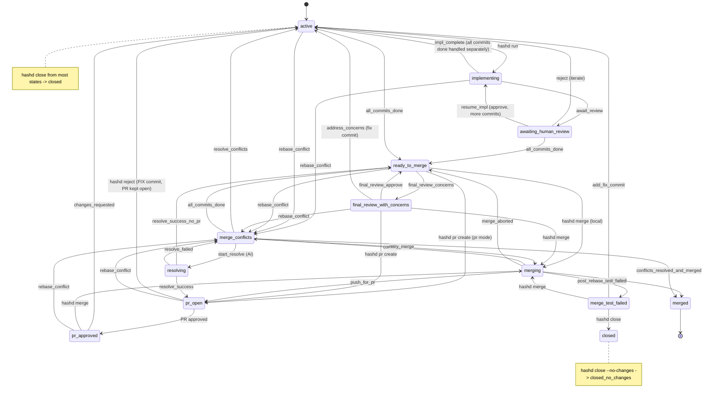

**Legend:** [STATE] = FSM macro stage. Substages (implement, test, review, etc.) run within `implementing` and are tracked via the substage / sub-FSM model — they're persisted (via `runner_stage`) and surfaced alongside the macro stage in operator displays. See **Workstream State Model** above.

**Terminal stages:** `merged` (archived), `closed` (hashd close), `closed_no_changes` (hashd close --no-changes). `closed` and `closed_no_changes` can be reopened via `hashd open`; `merged` cannot.

### ready_to_merge vs final_review_with_concerns

Both states indicate all micro-commits are complete. The difference is the final branch review verdict:

| State | Final Review | Meaning |
|-------|--------------|---------|
| `ready_to_merge` | APPROVE | Green light - no concerns |
| `final_review_with_concerns` | CONCERNS | Human should review concerns before proceeding |

**Functionally identical:** Both states allow the same actions (create PR, merge, edit). The distinction is informational - `final_review_with_concerns` means the AI reviewer flagged concerns that a human should acknowledge before proceeding.

**Transitions:**
- `ready_to_merge` -> `final_review_with_concerns`: Via `final_review_concerns` trigger (final review found issues)
- `final_review_with_concerns` -> `ready_to_merge`: Via `final_review_approve` trigger (concerns addressed)
- `final_review_with_concerns` -> `active`: Via `address_concerns` trigger (generate fix commit)

**In TUI:** When in `final_review_with_concerns`, the Details panel shows the specific concerns from the final review (stored in SQLite).

---

## Story Lifecycle

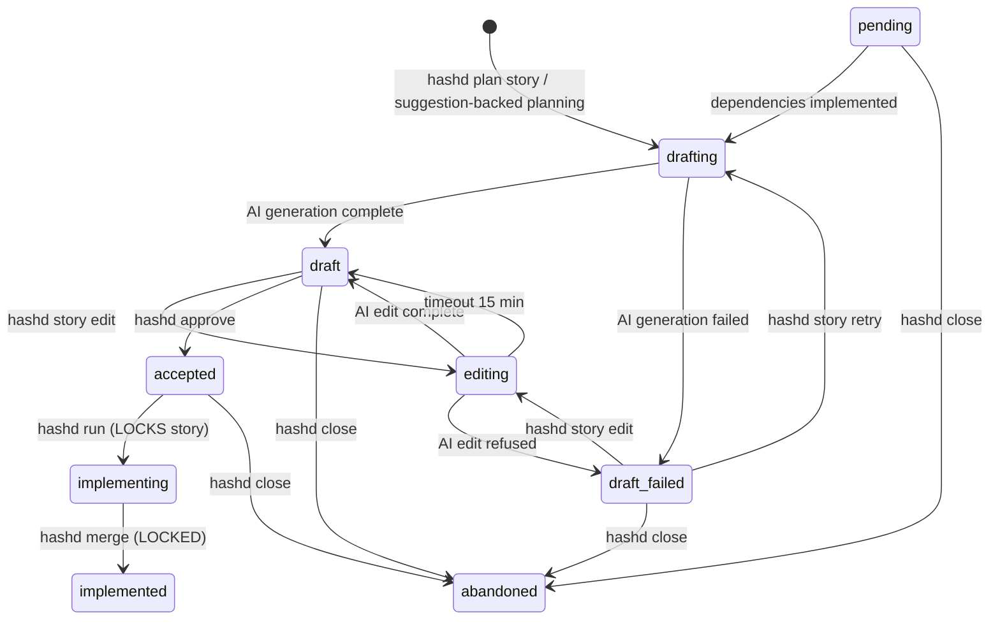

**Stages:**

| Stage | Description | Editable |
|-------|-------------|----------|
| `drafting` | AI generating story (in progress) | No |
| `pending` | Split sub-story waiting for parent/sibling dependencies before redraft | No |
| `draft_failed` | AI generation failed; needs operator clarification, retry, or close | Yes (via `hashd story edit`; retry with `hashd story retry`) |
| `draft` | Generated, awaiting approval | Yes |
| `editing` | AI edit in progress (auto-reverts after 15 min) | No |
| `accepted` | Ready for implementation | Yes |
| `implementing` | Workstream active | No (use clone) |
| `implemented` | Workstream merged | No |
| `abandoned` | Closed without implementation | No |

**Transitions:**

- `hashd approve STORY-xxx` moves draft -> accepted
- `hashd story split STORY-xxx` can create dependent sub-stories in pending
- dependency completion moves pending -> drafting for a fresh plan against current code
- `hashd story edit STORY-xxx` moves draft -> editing -> draft
- `hashd run STORY-xxx` moves accepted -> implementing (LOCKS story)
- `hashd merge <ws>` moves implementing -> implemented
- `hashd close <ws>` unlocks story (returns to accepted)
- `hashd story clone STORY-xxx` creates editable copy of locked story

**Editing timeout recovery:** If a story gets stuck in `editing` state (e.g., process killed, network failure), it auto-recovers to `draft` after 15 minutes. Recovery triggers on the next `hashd story edit` or TUI refresh.

---

## Suggestion Lifecycle

Suggestions are created by `hashd plan` phase 1 (REQS discovery) and stored in SQLite (`suggestions` table):

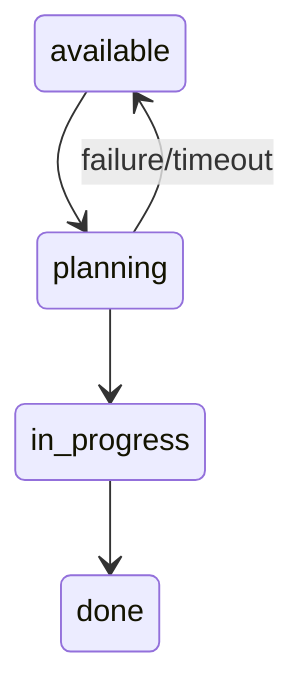

| Stage | Description |
|-------|-------------|
| `available` | Ready to be selected |
| `planning` | Story creation in progress (15 min timeout) |
| `in_progress` | Story created, workstream active |
| `done` | Workstream completed |

In the TUI, suggestions show status indicators:
- `(planning...)` - cyan, creation in progress
- `(planning timed out)` - red, can be retried
- `(in progress)` - yellow, story exists
- `(done)` - green, completed

**Note on tech tree suggestions:** the tech tree planner (`hashd plan` phase 2) produces a separate, ephemeral artifact class — "tech tree suggestions" — that does NOT enter the `suggestions` table and has no lifecycle states. They live only in server-side in-memory storage, render in the TUI tree visualization, and disappear on the next `hashd plan`. They never cross the agent boundary. See `DAS_PLAN.md > Story Dependencies, Thin Slicing, and the Tech Tree` for details.

---

## Requirements Lifecycle


### Document Update Flow

REQS.md and SPEC.md are updated at specific points, always on main (never in feature branches).
This ensures doc changes cannot be lost during rebase conflicts.

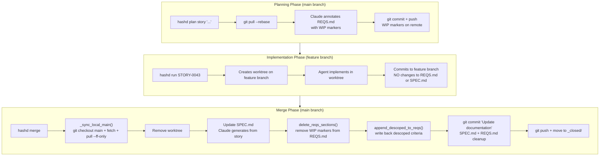

### Critical Invariants

1. **WIP tags are added to main** during planning and pushed immediately
2. **Feature branches never touch REQS.md or SPEC.md** - all doc work happens post-merge
3. **Must sync main before doc updates** - `_sync_local_main()` ensures local main has WIP tags from remote
4. **SPEC + REQS committed together** - single "Update documentation" commit after merge
5. **Doc commit pushed to remote** - ensures other machines see the cleanup

### Manual Artifact Inspection and Edits

Operators can inspect the current configured documents without shelling into the
project repository:

```bash
hashd project reqs       # same as hashd project reqs show
hashd project spec       # same as hashd project spec show
```

Manual edits go through the same server-side ownership boundary. The CLI is batch
only -- there is no interactive `$EDITOR` session holding a lock open (that is the
TUI editor's job). Overwrite in one shot from a file or stdin:

```bash
hashd project reqs set --file new-reqs.md
hashd project spec set < new-spec.md
```

`set` fetches the current `head_sha`, then the server acquires the document's edit
lock, writes, commits, pushes, and releases -- atomically, mutually exclusive with
planning and other editors. To fence the document across several manual steps,
hold the lock explicitly (identity-keyed, 10-minute lease, renew before it lapses):

```bash
hashd project reqs lock       # hold it
hashd project reqs set --file draft.md
hashd project reqs refresh    # extend the lease if the work runs long
hashd project reqs unlock     # release
```

A `set` records the document `head_sha` it read for the CAS check. The server
rejects:

- stale edits where the artifact changed after the editor opened
- dirty repos, because manual artifact edits must commit exactly one document change
- symlink artifact paths
- REQS edits that change bytes between `BEGIN WIP` and `END WIP` markers

Treat REQS WIP sections as owned by active stories. Edit outside them or wait for
the story to merge/close and clean up its markers.

### Failure Modes

| Symptom | Cause | Fix |
|---------|-------|-----|
| WIP tags remain after merge | `_sync_local_main()` not called | Run `hashd merge` again |
| SPEC.md not updated | Archive interrupted mid-way | Run `hashd merge` again |
| "No annotations found" | Local main stale (missing WIP tags) | Pull main, re-run archive |

### WIP Tag Conflicts = Scope Overlap

If `git push` fails during planning due to conflicting WIP markers, this is NOT a git problem to auto-resolve.

**What it means:** Two stories are claiming the same requirements.

```
Story A (already pushed):                Story B (trying to push):
<!-- BEGIN WIP: STORY-0042 -->           <!-- BEGIN WIP: STORY-0043 -->
| Skill Level Filtering | ... |    <--   | Skill Level Filtering | ... |
<!-- END WIP -->                         <!-- END WIP -->
```

**Required action:** Rescope one of the stories. The overlap indicates:
- Stories are too broad
- Work is being duplicated
- Requirements need to be split more granularly

The system should abort story creation and report: "STORY-B overlaps with STORY-A. Rescope before proceeding."

---

## Execution Model

### Temporal Workflows

Each long-running operation runs as a Temporal workflow under a singleton workflow ID, so a duplicate dispatch fails instead of double-running:

| Workflow | Purpose | Trigger |
|------|---------|---------|
| `run:{project}:{ws}` | Execute micro-commit loop | `hashd run` |
| `plan:{project}:{story}` | Create story from suggestion | Plan screen suggestion claim, `hashd plan story`, or `hashd plan bug` |
| `merge:{project}:{ws}` | Merge to main and archive | `hashd merge` |

The other operations (resolve, edit, docs, discovery, detect, plan-split, add-commit) follow the same singleton-ID pattern; PM-artifact mutations additionally serialize through the `pm:{project}` section, and the `housekeeping` sweep fires from a Temporal Schedule every 5 minutes. `hashd project describe --suggest` and `hashd project tech --suggest` dispatch the same way under `pmdescribe:{project}:{target}` (target `description` or `tech`): the CLI POSTs `/projects/{name}/describe` or `/tech`, the server runs the `pm_describe` agent stage server-side, and the CLI renders the result from the `pm_describe_completed` event -- so the agent runs on the server in both local and team mode and the CLI never invokes an agent itself.

#### Project-describe map-reduce (project add)

`hashd project add --suggest` describes a whole project -- for a multi-repo
project, every repo -- as one server-orchestrated map-reduce, so the CLI stays a
thin dispatch+await client instead of running N describe agents itself. The CLI
POSTs `/projects/describe` (config-load-free, because the project does not exist
yet; every sub-repo path must resolve under `root_path`) and awaits a single
aggregate `pm_describe_project_completed` event under
`pmdescribeproject:{project}`. The workflow runs `RunProjectDescribe`, which
describes the primary repo first (its summary frames the others), fans the rest
out in parallel, reduces them into the project description via a synthesis pass,
then analyzes tech. Per-step failures become warnings and never abort the run.

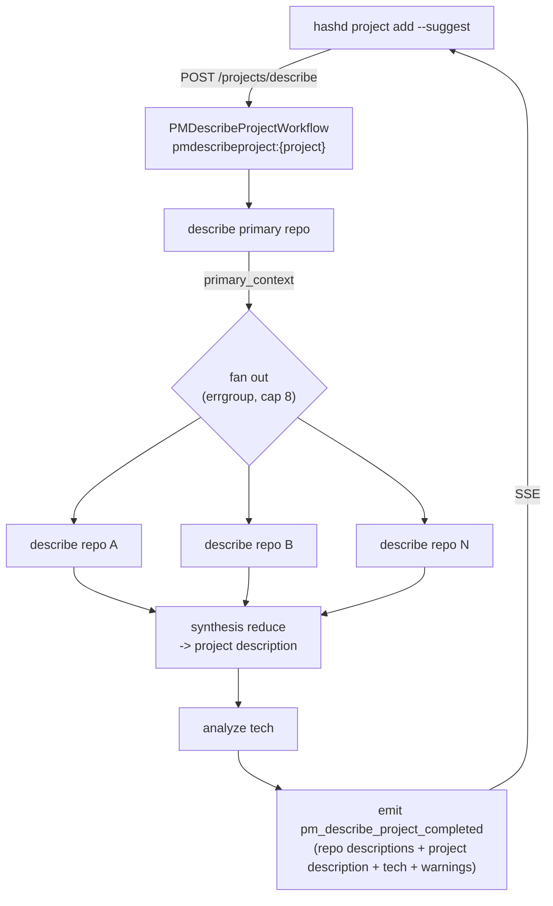

Single-repo projects skip the map-reduce: one `description` pass plus tech. The
per-repo describe/synthesis prompts and the `describe_repo`/`synthesis` stage
targets are the same `pm_describe` stage parameterized -- see the Agent Contract
retry table for its crash-safety tier.

`hashd project repo edit <name> --suggest` (an existing project) rides the same
agent surfaces, but the CLI sends the repo **name** rather than a path: both
`POST /projects/detect` and `POST /projects/describe` accept an optional
`repo_name` that makes the server resolve the repo's working path from the repo
it owns (`reqs.ResolveTargetRepoPath`). So the suggest flow needs no
client-computed path and works unchanged in remote mode.

Workflows execute asynchronously on the in-server Temporal worker.
Human gates park the run workflow on the `human-gate` signal channel until the operator's decision arrives via API.

### Workflow Lifecycle

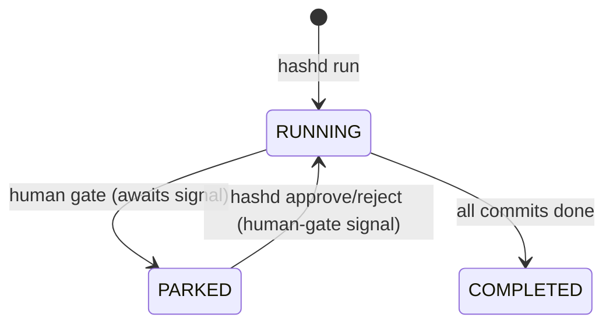

### Activities

Each stage executes as a Temporal activity with a stage-derived `StartToCloseTimeout`, a heartbeat, and a `RetryPolicy` for observability and retry (see **Automatic Transient Failure Retries** below and **Timeouts** in the Workstream State Model).

---

## Retry Limits

### Business Logic Retries

| Stage | Max Retries | On Exhaust |
|-------|-------------|------------|
| Implement/Test/Review loop | 5 | HITL |
| Final Review (`hashd review`) | Same as implement loop | Auto-retry last commit with feedback |
| Merge conflict resolution | 3 | HITL |
| PR auto-rebase | 3 | HITL |

### Automatic Transient Failure Retries

Transient agent failures (API timeouts, rate limits) are retried automatically in two layers (git pushes are NOT blanket-retried: the archive push retries once behind a pull --rebase, while the one-shot commit leg stays MaximumAttempts:1):

1. **Within an attempt** — the Go agent runner retries a classified-`transient` agent failure internally.
2. **Across attempts** — each long agent stage activity carries a `RetryPolicy` (`agentActivityOptions`: `InitialInterval 5s`, `BackoffCoefficient 2.0`, `MaximumInterval 60s`) plus a 120s `HeartbeatTimeout`. It retries ONLY infrastructure failures (worker death detected via a missed heartbeat, DB faults). An agent *outcome* is returned as data with a nil error and never retries — the outcome/error split is the guard, so a review verdict of "changes required" is data, not a retryable error. Tier A stages whose whole-body re-run is crash-safe (implement, adjudicate, concern_triage, test, probe, detect, provision, final_review, and review -- its agent-outcome errors carry the typed non-retryable `review_outcome` marker so only infra shapes retry) use `MaximumAttempts>1`; stages that persist a plan or transition mid-body (breakdown, partial_breakdown) and the one-shot commit leg keep the heartbeat but stay `MaximumAttempts:1`. On a Tier-A retry the implement driver resumes the agent's session (crash-resume); other stages re-run fresh.

These retries happen transparently within a single micro-commit cycle. The business-logic retry loops (implement/test/review = 5, merge-conflict = 3, PR-rebase = 3) are workflow-level, independent of activity retries.

---

## Resume Behavior

When `hashd run` detects uncommitted changes in the worktree, it checks the previous run's status to determine whether to resume or re-implement:

| Last Run Failed At | Failure Type | Action |
|-------------------|--------------|--------|
| **test** | Timeout/infra | Resume from test stage |
| **test** | Tests failed | Re-implement (code bug) |
| **review** | Timeout/infra | Resume from review stage |
| **review** | Rejected | Re-implement with feedback |
| **human_review** | Waiting | Continue waiting |

### Auto-Skip Logic

When Codex reports "already_done" (work is complete):

| Uncommitted Changes | Action |
|---------------------|--------|
| **None** | Auto-skip to next micro-commit |
| **Present** | Proceed to test/review (changes ARE the implementation) |

This prevents orphaned changes when a timeout leaves uncommitted work in the worktree.

---

## Merge Safety

### Auto-Rebase for PRs

When using `--pr` or `merge_mode: pr`, if a PR becomes conflicting (main moved ahead):

1. `hashd merge` automatically attempts rebase
2. Uses `--force-with-lease` (safe force push)
3. Retries status check after push
4. Blocks for human if rebase has conflicts
5. Max 3 rebase attempts before escalating

### Review Requirements

The merge command respects the forge's review settings:

| Review Status | Behavior |
|---------------|----------|
| **APPROVED** | Merge proceeds |
| **PENDING/None** | Merge proceeds (no review required by repo) |
| **CHANGES_REQUESTED** | Blocks, returns to active state |
| **REVIEW_REQUIRED** | Blocks until required reviews are complete |

### Check Requirements

| Check Status | Behavior |
|--------------|----------|
| **success** | Merge proceeds |
| **pending** | Merge proceeds (for slow bots like CodeRabbit) |
| **failure** | Blocks until checks pass |

### Force Push Safety

- Only force-pushes to PR branches (never main)
- Uses `--force-with-lease` to prevent overwriting others' work
- Only applies to worktrees managed by hashd

---

## Files

| File / Column | Location | Purpose |
|---------------|----------|---------|
| `workstreams.plan` | `hashd.db` | Micro-commit definitions (markdown) |
| `workstreams.touched_files` | `hashd.db` | Files changed in branch (newline-separated) |
| `workstreams.directives` | `hashd.db` | Workstream-specific directives (markdown) |
| `logs/` | `workstreams/<id>/` | Agent stdout/stderr logs |
| `hashd.db` | `projects/<project>/` | All workstream metadata, stories, events, runs, reviews, etc. |

---

## Modality Reference

Each interface exposes the same workflow but with different interaction patterns.
This section is the source of truth for what actions are available at each stage.

### Decision Points

| Stage | CLI | TUI | Telegram |
|-------|-----|-----|----------|
| awaiting_human_review | `hashd approve` / `hashd reject [-f ".."]` | [a] Approve / [r] Reject | [Approve] [Reject] [Review] |
| ready_to_merge | `hashd merge -y` | [m] Merge / [P] Create PR | [Merge] [Reject] [Review] |
| final_review_with_concerns | `hashd merge -y` | [m] Merge / [P] Create PR | [Merge] [Reject] [Review] |
| pr_open | `hashd reject -f ".."` | [r] Reject / [o] Open PR | [Open PR]* [Reject] [Review] |
| pr_approved | `hashd merge` / `hashd reject -f ".."` | [a] Merge / [o] Open PR | [Open PR]* [Merge] [Review] |

> CLI commands above reflect current command names. Per the **Workstream State Model**, `hashd approve` is being renamed to `hashd accept`; this table will update when the rename lands.

Default is direct merge to main. Use `hashd merge --pr -y` (CLI) or `[P]` (TUI) to create a PR instead.

*"Open PR" is a URL button that opens the PR directly. Only shown when `pr_url` is set.

### Review Context

At decision points, each modality must surface the AI review findings:

| Decision Point | What to show |
|---------------|-------------|
| awaiting_human_review | Per-commit review: decision, blockers, concerns, suggestions, notes |
| final_review_with_concerns | Final branch review: full markdown with verdict and concerns |
| ready_to_merge | Final review summary (approve verdict) |
| pr_open / pr_approved | PR/MR feedback from forge (CI bots, team comments) |

### Worker-Host Locality

Run artifacts (`run_dir/stages/*.log`, transcripts, signature files) are
written by the in-server Temporal worker to the local filesystem, so they
are only readable on the host that ran the work. The deployment model is
one worker per host (the worker lives inside hashd-server). A multi-worker
fleet would need host-affine task-queue routing so a run's activities all
land on one host -- and separately, shared or replicated storage if the
artifacts must survive that host.

## Review Scoping Rules

Per-commit stage reviews are **stable records** about the code at the moment they ran. They are never filtered by `run_id`, but their `concerns` do not carry forward into later implementer prompts. Instead, per-commit concerns form a single-shot pool for the first final review only.

The first `run_final_review()` invocation dumps active per-commit concerns into the prompt with commit provenance. After that run completes, `concerns_pool_consumed_at` is set on the workstream. Subsequent final-review iterations see an empty per-commit concern pool; previous final-review findings are the only carry-forward review context.

The rejection path (`hashd reject`) and micro-commit planning path (`hashd workstream add-commit`) pull the most recent final review via `parse_final_review_feedback()` (unscoped, `limit=1 ORDER BY created_at DESC`). The latest final review is always the one the user is reacting to.

`run_final_review()` tags `save_review()` and `record_agent_call()` with the real `run_id` when called from the engine. This is for bookkeeping and traceability, not for read-side filtering.

### Operator Guidance (workstream_guidance)

Operator guidance -- rejection feedback and replan instructions -- is an append-only record in the `workstream_guidance` table, sharing the reviews identity convention (`project`, `run_id`, `workstream_id`, `story_id`, `microcommit_id`). The same scoping rule applies: `run_id` is write-side provenance only, never a read filter. `story_id` is the durable anchor (guidance survives workstream removal and re-creation); `microcommit_id` NULL means workstream-wide. All rows are standing: the per-commit review loader pulls every row scoped to the commit or the whole workstream, newest first, and the newest one renders as the prompt's HUMAN GUIDANCE section. There is no consumed/applied lifecycle -- introducing one is a deliberate future change, pinned by tests.

#### PR Review Finding Ledger

PR/MR review threads from the forge are durable external findings. They are not the same thing as the single-shot per-commit concern pool above.

When final review completes for a workstream that already has a PR, the engine asks the server to reconcile forge review threads. The server calls `forge.ListReviewThreads`, dedupes by the forge-stable thread ID, and upserts into `pr_review_findings`. The forge owns resolution: hashd writes `resolved_by_forge` only when the forge reports `IsResolved`, and writes `outdated` only when the forge reports `IsOutdated`. Hashd does not close or self-resolve review findings.

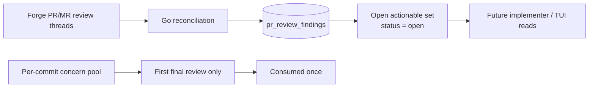

The ledger is durable and reconciled across review cycles. The concern pool is internal review context consumed once by the first final review. Keeping them separate prevents stale per-commit notes from leaking into later prompts while preserving forge-owned review threads until the forge itself says they are resolved or outdated.

#### Two-Phase Review Context

`run_final_review()` uses different context depending on whether a prior final review exists:

1. **First final review** (no prior `final_review` record): Human decisions plus the single-shot per-commit concerns pool. This gives the reviewer cross-commit concern awareness once, without leaking stale concerns into later cycles.

2. **Subsequent final reviews** (prior v2 `final_review` exists **and** FIX commits in plan): The previous final review's findings formatted as a verification checklist, plus human rejection feedback extracted from the most recent FIX commit. Per-commit stage notes are omitted -- they cause echo/doom-loop problems where the LLM re-raises concerns that FIX commits already addressed.

Falls back to human decisions when: no prior final review, prior is v1 (no structured fields), no FIX commits in the plan (e.g. manual `hashd review` re-run), or the checklist would be empty. The per-commit concerns pool does not refill after `concerns_pool_consumed_at` is set.

The verification checklist (loaded from `prompts/review_verification_section.md`) instructs the LLM to verify each item against the diff, mark resolved items, and only re-raise what is demonstrably unfixed.

### Per-stage artifact passing

Different surfaces have different audiences and different needs:

- **Agent surfaces** (reviewer/implementer prompts in the per-commit loop): ephemeral, fresh per cycle. The reviewer sees only the current diff plus story/AC context. The implementer sees only the just-completed review's feedback. Prior cycles are not carried in the prompt -- each cycle is an independent evaluation.
- **Operator surfaces** (TUI detail, `hashd show`, CLI summaries, review history inspection): cumulative across attempts. Humans need to see the workstream's history; agents don't.
- **Concern lifecycle**: concerns flagged in per-commit reviews persist at workstream level until the first final review, then drop. Concerns do not flow to next per-commit implementers.
- **Operator guidance** (`hashd reject <id> -f "<text>"`): the operator's free-text guidance for a specific reject is passed to the next implementer attempt via the human-guidance section -- per-cycle on that implementer surface (signal-borne, cleared after first use). A reject that lands on a closed run (orphan recovery) and a replan additionally record the guidance as a standing `workstream_guidance` row, which keeps informing every subsequent review of its scope (see Operator Guidance under Review Scoping Rules). At review gates, `-f` is optional and additive: hashd folds the gate findings into the FIX commit by default, while human guidance appears first and takes precedence.
- **Per-commit oscillation check** (in `stage_concern_triage`): the explicit exception that uses cross-run historical context. It runs once a selected micro-commit has at least two prior stage reviews, whether the commit is a regular `COMMIT-...-001` or a `COMMIT-...-FIX-001`. It detects "going in circles" on the same finding, including A -> B -> A and persistent identical reviews. It does not treat partial progress as oscillation: if `(A, B)` becomes `A`, the workstream is still converging. Pure `A -> A` needs three consecutive identical reviews before escalation. FIX commits continue to use their structured fix history and oscillation-resolution records.

Principle: artifacts visible to agents are ephemeral and current; artifacts visible to humans are cumulative.

### Reject Behavior

| State | Feedback | Effect |
|-------|----------|--------|
| awaiting_human_review | Typed feedback (optional) | Iterate on current commit |
| final_review_with_concerns | Final-review findings folded by default; optional `-f` guidance | Generate FIX commit |
| ready_to_merge | Final-review findings folded when present; otherwise `-f` required | Generate FIX commit |
| pr_open | `-f` required; the TUI prefills the PR's open review threads into an editable box (no server auto-pull) | Keep PR open; append FIX commit |
| pr_approved | `-f` required; the TUI prefills the PR's open review threads into an editable box (no server auto-pull) | Keep PR open; append FIX commit |

**Durable PR:** rejecting a PR never closes it. hashd does not pull findings from the forge in the reject handler -- the TUI reject box prefills the PR's open (unresolved) review threads for the operator to curate, the CLI passes `-f`, and the submitted text becomes the FIX guidance. The same PR gains a FIX commit and is reused when the FIX completes (`handlePRStateReject` in `server/internal/api/mutations.go`). Open/resolved state is read from the forge via `GET /workstreams/{id}/pr/threads` (`forge.ListReviewThreads`); the reviewer (bot or human) owns resolution, hashd just reads it.

#### Reject Fold Loop

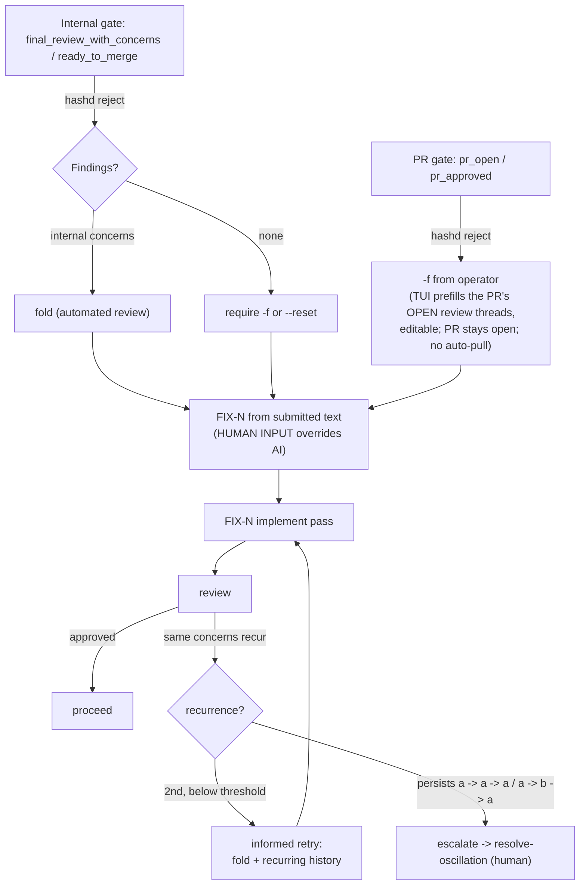

### Adding a New Modality

When adding a new interface (web, WhatsApp, etc.):
1. Implement the decision point matrix above
2. Surface review context at every human gate
3. Default to direct merge; offer PR as opt-in action
4. Add a column to the tables in this section
