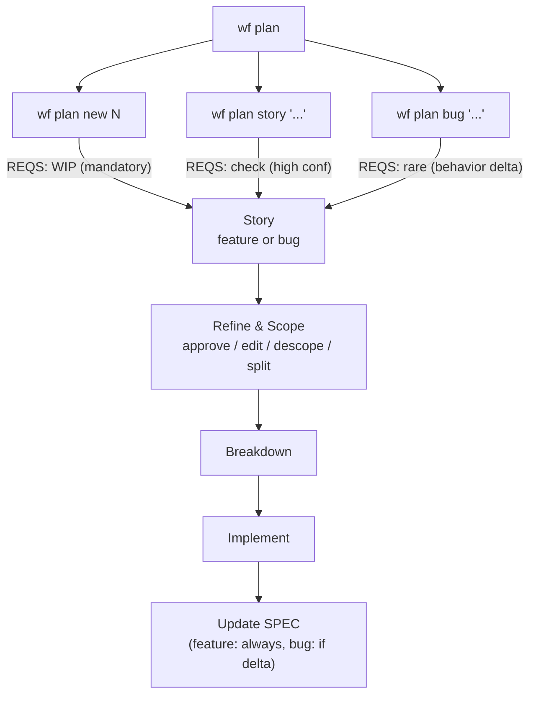
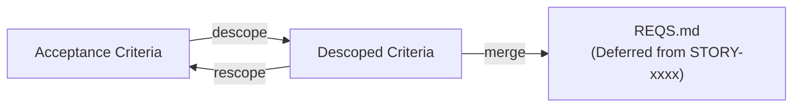
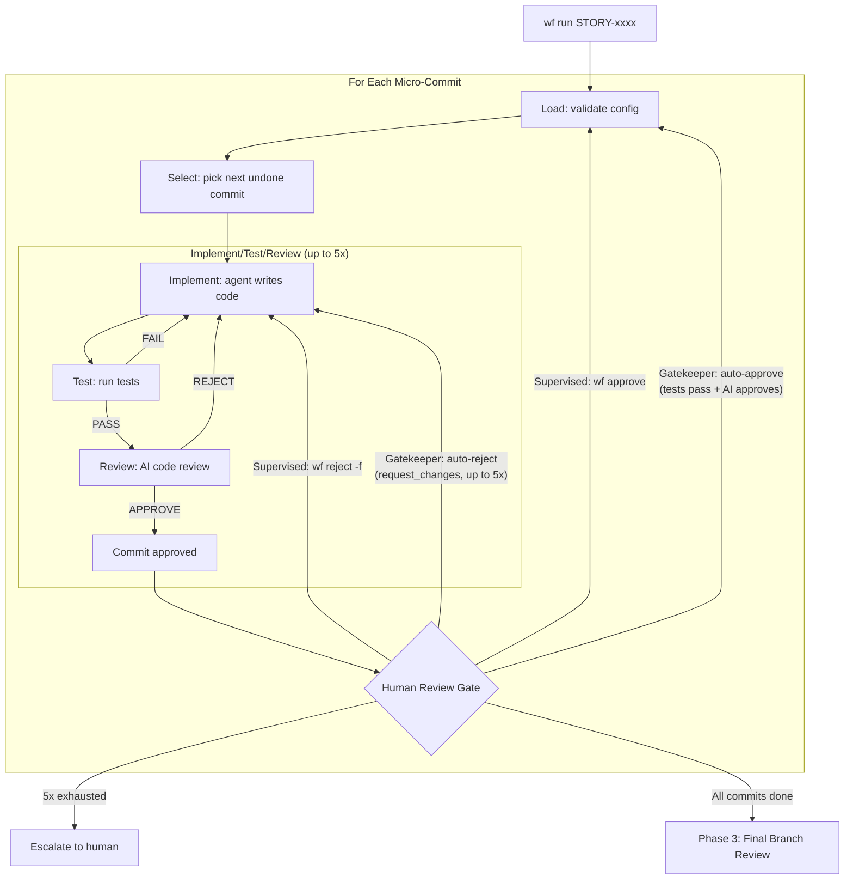
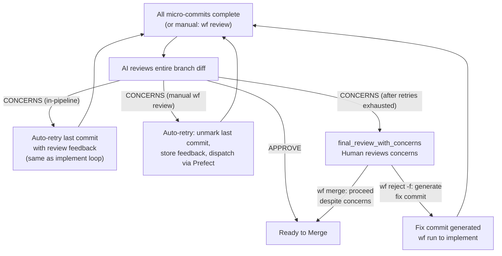
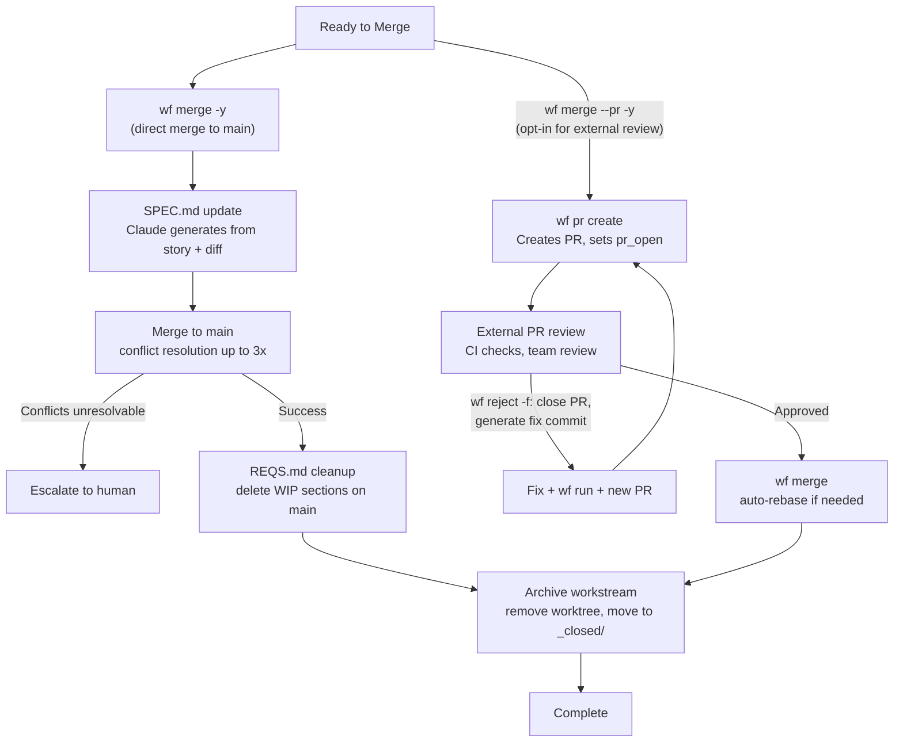
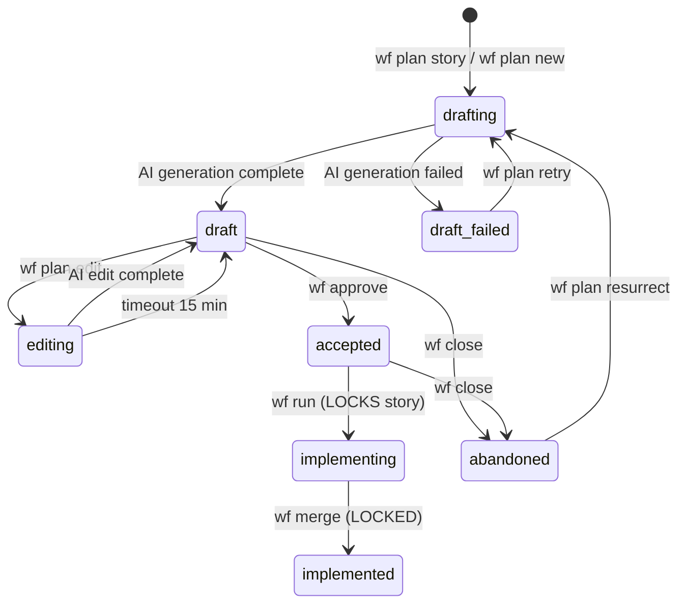
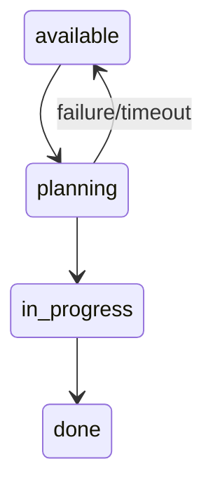
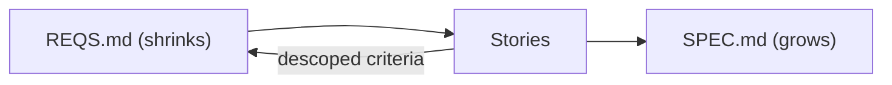
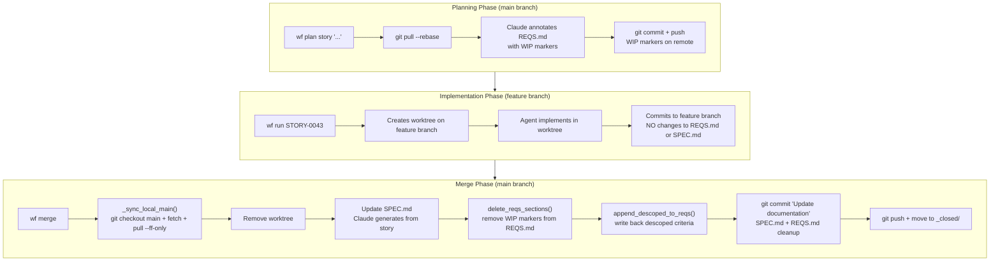
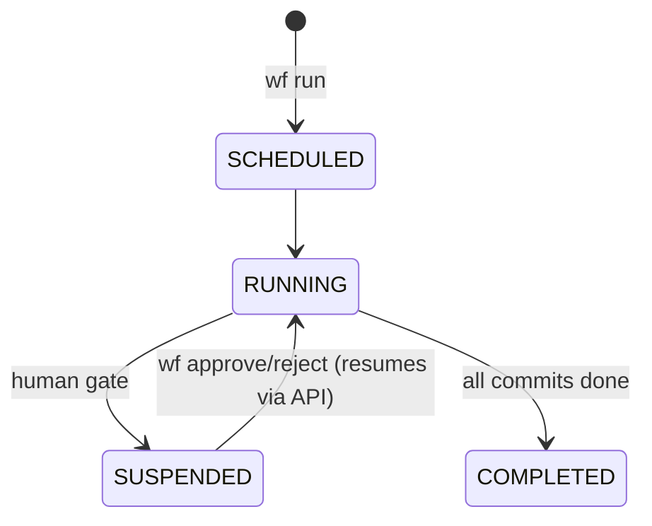

# Hashd Workflow - Complete Flow

## Architecture Overview

Hashd uses **Prefect** for workflow orchestration with these components:

| Component | Purpose |
|-----------|---------|
| **Prefect Server** | Coordinates flow runs, handles state, provides UI |
| **Worker Pool** | Executes flows (process-based, local to ops machine) |
| **Deployments** | Named flow entry points with parameters |
| **suspend_flow_run()** | Pauses flow for human input, resumes via API |

Flows run asynchronously. `wf run` submits to the worker and returns immediately.
Monitor via `wf watch` (TUI) or Prefect UI at `http://localhost:4200`.

---

## Modes

| Mode | Flag | Description |
|------|------|-------------|
| **supervised** | `--supervised` | Always pause at commits and merge |
| **gatekeeper** | `--gatekeeper` | Auto-continue commits if confident, human approves merge (default) |
| **autonomous** | `--autonomous` | Auto-continue commits and merge (unattended) |

Mode is set per-project via `wf project interview` or `config.yaml`.
Override per-run: `wf run --supervised`, `wf run --gatekeeper`, or `wf run --autonomous`

### Confidence Scoring

AI reviews include a confidence score (0.0-1.0) that influences auto-continue decisions:

| Range | Meaning |
|-------|---------|
| 0.9-1.0 | Highly confident - solid code, well-tested patterns |
| 0.7-0.9 | Confident - standard implementation, minor concerns |
| 0.5-0.7 | Moderate - some uncertainty, review recommended |
| 0.0-0.5 | Low - significant concerns, human review required |

---

## Phase 1: Planning

### Three Paths to Stories



### Full Flow (from REQS)

```
[Human] Start with requirements
        - Write REQS.md (dirty requirements)
        - Or have existing feature requests

[Human/AI] Discover stories
        $ wf plan                     # Analyze REQS.md, save suggestions
        $ wf plan list                # View suggestions

[Human] Pick a suggestion
        $ wf plan new 1               # By number
        $ wf plan new "auth"          # By name match

        Creates STORY-xxxx, marks REQS as WIP
```

### Quick Flow (skip REQS discovery)

```
[Human] Create story directly
        $ wf plan story "add logout button"              # Feature
        $ wf plan bug "fix null pointer" -f context.md   # Bug

        -f is smart: file path reads file, else uses as text

        Feature: checks REQS for overlap (high confidence)
        Bug: skips REQS annotation, conditional SPEC update
```

### Story Refinement

```
[Human] Review and accept story
        $ wf show STORY-xxxx
        $ wf approve STORY-xxxx     # draft -> accepted

[Human] Edit story if needed
        $ wf plan edit STORY-xxxx [-f "feedback"]

[Human] Set context (optional)
        $ wf use <workstream_id>

                              |
                              v
```

### Story Scope Management

Stories created from dense REQS paragraphs often expand into many acceptance criteria.
Three operations let you tighten scope without losing work:

**Descope** -- "not now, maybe later." Moves a criterion to a descoped list.
During implementation, agents see descoped criteria as negative requirements (DO NOT implement).
At merge time, descoped criteria are written back to REQS.md with provenance so the
requirement survives the WIP marker deletion.

```
$ wf plan descope-ac STORY-0054 5         # Move criterion #5 to descoped
$ wf plan rescope-ac STORY-0054 1         # Bring descoped #1 back to AC
$ wf show STORY-0054                      # Shows both lists
```

**Split** -- "I want this, just not in this story." Extracts selected criteria into a
new `draft` story. For breaking large stories into smaller implementable pieces.

```
$ wf plan split STORY-0054 3,5,7 -t "Referral Reward Configuration"
# Creates STORY-0055 with criteria 3, 5, 7 removed from STORY-0054
```

**Chat** -- all scope operations are also available via pair programmer chat:

```
~~~action
{"op": "descope_criterion", "index": 4}
~~~

~~~action
{"op": "split_story", "criteria": [3, 5, 7], "title": "Referral Reward Config"}
~~~
```

#### Descoped Criteria Lifecycle



- Descoped criteria are stored on the story record (SQLite JSON blob).
- Every operation is reversible until merge. `rescope-ac` brings criteria back.
- At merge time, `_archive_workstream()` calls `append_descoped_to_reqs()` after
  WIP marker deletion, adding a "Deferred from STORY-xxxx" section to REQS.md.
- The deferred REQS items are picked up by the next `wf plan` discovery run.
- During implementation, descoped criteria are injected into agent prompts as
  negative requirements ("DO NOT implement").

#### TUI Scope Operations

In the Story Detail screen, acceptance criteria and descoped criteria appear in a
single list. Descoped items render at reduced opacity with a `DESCOPED:` prefix.
Keybindings change based on which type is selected:

| Selection | Key | Action |
|-----------|-----|--------|
| Active criterion | `D` | Descope (with confirmation) |
| Active criterion | `e` | Edit |
| Active criterion | `d` | Delete |
| Descoped criterion | `r` | Rescope (immediate) |

---

## Phase 2: Implementation



---

## Phase 3: Final Branch Review



---

## Phase 4: Merge

**Default: direct merge to main.** Use `--pr` to opt in to forge PR workflow for external review. Supports GitHub, Bitbucket, and GitLab. The forge is auto-detected from your git remote or set explicitly via `forge:` in config.yaml.



### Merge Modes

| Mode | CLI | TUI | Telegram | When to use |
|------|-----|-----|----------|-------------|
| **Direct** (default) | `wf merge -y` | `[m] merge` | `/merge` | Standard workflow, AI-reviewed code |
| **PR** (opt-in) | `wf merge --pr -y` | `[P] pr` | `wf pr create` | External review needed (team, CI bots) |

The merge mode can also be set as a project default in config.yaml (`merge_mode: pr`). The `--pr` CLI flag overrides the project default for a single invocation.

The forge platform is auto-detected from the git remote URL, or set explicitly in config.yaml (e.g. `forge: github`, `forge: bitbucket`, or `forge: gitlab`).

---

## Command Reference

### Core Commands

| Command | Description |
|---------|-------------|
| `wf plan` | Discover from REQS.md, save suggestions |
| `wf plan list` | View current suggestions |
| `wf plan new <id_or_name>` | Create story from suggestion |
| `wf plan story "title" [-f ctx]` | Quick feature (skips REQS discovery) |
| `wf plan bug "title" [-f ctx]` | Quick bug fix (conditional SPEC update) |
| `wf plan edit STORY-xxx [-f ".."]` | Edit existing story |
| `wf plan clone STORY-xxx` | Clone a locked story |
| `wf plan add <ws> "title" [-f ".."]` | Add micro-commit to workstream |
| `wf plan resurrect STORY-xxx` | Resurrect abandoned story |
| `wf plan retry STORY-xxx` | Retry failed planning run |
| `wf plan descope-ac STORY-xxx N` | Move acceptance criterion N to descoped list |
| `wf plan rescope-ac STORY-xxx N` | Move descoped criterion N back to acceptance criteria |
| `wf plan split STORY-xxx 3,5,7 -t "title"` | Split criteria into new draft story |
| `wf run [id] [--once\|--loop] [--gatekeeper\|--supervised\|--autonomous] [-f ".."] [-y]` | Submit workstream to Prefect (-f: guidance, -y: skip prompts) |
| `wf list` | List stories and workstreams |
| `wf show <id> [--stats]` | Show story or workstream details |
| `wf approve <id>` | Accept story or approve gate |
| `wf reject [id] [-f ".."] [--reset]` | Reject with feedback (-f required for PR states). Use `@directive <text>` in feedback to add durable constraints (e.g. `-f "fix X @directive do not modify RBAC"`) |
| `wf pr` | Create PR/MR on forge for current workstream |
| `wf pr create [id]` | Create PR/MR for specified workstream |
| `wf pr feedback [id]` | View PR/MR review comments |
| `wf merge [id] [-y] [--pr] [--no-push] [--ai-resolve]` | Merge to main and archive (-y required in supervised/gatekeeper mode, --pr forces PR workflow) |
| `wf close [id] [--force] [--keep-branch] [--no-changes] [-r ".."]` | Abandon workstream (-r reason required with --no-changes) |
| `wf skip [id] [commit] [-m ".."]` | Mark commit as done without changes |
| `wf reset [id] [--force] [--hard]` | Reset workstream to start fresh |

### Supporting Commands

| Command | Description |
|---------|-------------|
| `wf use [id] [--clear]` | Set/show/clear current workstream |
| `wf watch [id]` | Interactive TUI - monitor execution progress |
| `wf review [id]` | Run final branch review |
| `wf diff [id] [--stat\|--staged\|--branch]` | Show workstream diff |
| `wf log [id] [-s since] [-n limit] [-v] [-r]` | Show workstream timeline |
| `wf docs [id]` | Update SPEC.md from workstream |
| `wf refresh [id]` | Refresh touched files |
| `wf conflicts [id]` | Check file conflicts |

### Clarification Commands

| Command | Description |
|---------|-------------|
| `wf clarify` | List pending clarifications |
| `wf clarify show <id>` | Show clarification details |
| `wf clarify answer <id> [-a ".."]` | Answer a clarification |

### Archive Commands

| Command | Description |
|---------|-------------|
| `wf archive work` | List archived workstreams |
| `wf archive stories` | List archived stories |
| `wf archive delete <id> --confirm` | Permanently delete |
| `wf open <id> [--use] [--force]` | Resurrect archived workstream |

### Directives Commands

| Command | Description |
|---------|-------------|
| `wf directives` | View global directives |
| `wf directives all` | View all (global + project + workstream) |
| `wf directives project` | View project only |
| `wf directives workstream <ws>` | View workstream's only |
| `wf directives edit` | Edit global in $EDITOR |
| `wf directives edit project` | Edit project in $EDITOR |
| `wf directives edit workstream <ws>` | Edit workstream's in $EDITOR |
| `wf directives ai-edit` | AI-assisted edit of global |
| `wf directives ai-edit project` | AI-assisted edit of project |
| `wf directives ai-edit workstream <ws>` | AI-assisted edit of workstream's |

### Project Commands

| Command | Description |
|---------|-------------|
| `wf project add <path> [--no-interview]` | Register a new project |
| `wf project list` | List registered projects |
| `wf project use <name>` | Set active project |
| `wf project show` | Show project configuration |
| `wf project interview` | Update project configuration interactively |
| `wf project remove <name>` | Remove a project |
| `wf project config list` | List config settings |
| `wf project config get <key>` | Get config value |
| `wf project config set <key> <value>` | Set config value |
| `wf project config reset <key>` | Reset config key to default |
| `wf project describe` | Show current project description |
| `wf project describe --suggest` | AI-generate a description suggestion |

### Workstream Commands

| Command | Description |
|---------|-------------|
| `wf workstream remove <id>` | Remove orphaned workstream |

### Observability Commands

| Command | Description |
|---------|-------------|
| `wf chat [id]` | Pair programmer chat with AI |
| `wf agents` | Show installed AI agents and stage assignments |
| `wf doctor` | Validate setup and diagnose issues |
| `wf restart` | Restart infrastructure (Prefect, ZMQ, messengers) |
| `wf lineage <target> [--line N] [--lines N-M] [--format table\|json\|markdown]` | Trace code lineage (auto-detects file/SHA/STORY/BUG) |
| `wf lineage export <sha\|STORY-xxxx\|BUG-xxxx> [--attestation-format slsa\|in-toto]` | Export attestation (SLSA v1.0 or in-toto) for SHA or story |
| `wf lineage verify` | Validate hash chain integrity for project commits |
| `wf system-log [--errors] [--since] [--limit]` | View system event log |
| `wf prompts list` | List prompt templates |
| `wf prompts show <name>` | Show prompt content |
| `wf prompts edit <name>` | Edit prompt override |
| `wf prompts reset <name>` | Reset prompt to default |
| `wf prompts diff <name>` | Show diff from default |
| `wf --completion bash\|zsh\|fish` | Generate shell completion |

---

## Watch UI Keybindings

The `wf watch` TUI provides context-sensitive keybindings based on workstream status:

### Dashboard

| Key | Action |
|-----|--------|
| `1-9` | Select workstream by number |
| `a-i` | Select story by letter |
| `p` | Open plan screen |
| `m` | Change autonomy mode (supervised/gatekeeper/autonomous) |
| `/` | Command palette |
| `?` | Help |
| `q` | Quit |

### Workstream Detail View

Available on any workstream detail screen:

| Key | Action |
|-----|--------|
| `G` | Go - run workstream |
| `d` | View diff |
| `l` | View log |
| `p` | Open plan view |
| `1` | Toggle status section |
| `2` | Toggle commits section |
| `3` | Toggle timeline section |

### Diff Mode

When the diff panel is active (`d`):

| Key | Action |
|-----|--------|
| `s` | Toggle side-by-side / unified view |
| `b` | Toggle blame view (git blame with lineage annotations) |
| `f` | Toggle fullscreen (hides left column) |
| `Enter` | Show lineage detail for selected line (blame view) |

### Status: awaiting_human_review

| Key | Action |
|-----|--------|
| `a` | Approve changes, continue to next micro-commit |
| `r` | Reject with feedback, iterate on current commit |
| `R` | Reset (discard changes, start fresh) |

### Status: ready_to_merge / final_review_with_concerns

| Key | Action |
|-----|--------|
| `m` | Merge directly to main (default) |
| `P` | Create PR/MR (for external review) |
| `r` | Reject with feedback |
| `e` | Edit pending microcommit |
| `+` | Add new micro-commit to plan |

When `merge_mode: pr` is set in config.yaml, `P` (create PR) and `m` (merge PR) swap roles -- `P` appears when no PR exists, `m` appears once a PR is created.

**Note:** `final_review_with_concerns` has the same bindings as `ready_to_merge`. The difference is informational - the AI final review flagged concerns. The Details panel shows these concerns; review them before proceeding.

**Note:** `+` (add micro-commit) is also available in active and implementing states when the workstream is idle.

### Status: merge_conflicts

| Key | Action |
|-----|--------|
| `i` | AI-resolve conflicts |
| `R` | Reset workstream |

### Status: pr_open / pr_approved

| Key | Action |
|-----|--------|
| `r` | Reject - opens modal pre-filled with PR feedback |
| `o` | Open PR in browser |
| `a` | Merge PR |

The `[r] reject` action in PR states:
1. Fetches PR comments and pre-fills the input modal
2. User edits/confirms feedback (cannot submit empty)
3. **Closes the PR** on GitHub with comment
4. Clears PR metadata from workstream
5. Creates fix commit (COMMIT-xxx-FIX-NNN)
6. Use `[G] Go` to run, then `[P]` creates a fresh PR

### Plan Screen

| Key | Action |
|-----|--------|
| `s` | Create new story |
| `b` | Create new bug |
| `d` | Run discovery from REQS.md |
| `1-9` | Create story from suggestion |
| `Esc` | Back to dashboard |

### Story Detail Screen

| Key | Action |
|-----|--------|
| `A` | Approve story (Shift+A, draft -> accepted) |
| `a` | Answer open questions |
| `E` | Edit story with AI (Shift+E) |
| `e` | Edit selected acceptance criterion |
| `d` | Delete selected criterion |
| `D` | Descope selected criterion (Shift+D, moves to descoped list) |
| `r` | Rescope selected descoped criterion (moves back to AC) |
| `G` | Create workstream and run (Shift+G) |
| `C` | Open pair programmer chat (Shift+C) |
| `X` | Close/abandon story (Shift+X) |
| `v` | View full story markdown |
| `p` | Open plan screen |
| `Esc` | Back to dashboard |

### Global Keybindings (all screens)

| Key | Action |
|-----|--------|
| `?` | Show help (context-aware shortcuts) |
| `/` | Open command palette |
| `Ctrl+t` | Toggle dark/light theme |
| `Ctrl+s` | Save screenshot |
| `1-9` | Quick-select workstream (dashboard) |
| `a-i` | Quick-select story (dashboard) |
| `p` | Open plan screen |
| `q` | Back / Quit |
| `Esc` | Back to previous screen |

---

## Directives

Directives are curated rules that guide AI implementation. They exist at three levels:

```
~/.config/wf/directives.md        # Global user preferences
{repo}/directives.md              # Project rules
workstreams/{id}/directives.md    # Workstream-specific (rare)
```

**Why `directives.md` not `AGENTS.md`?** We want hashd to control when directives are passed to agents, not have agents auto-read them. Using `directives.md` ensures agents only see these rules when we explicitly include them in prompts.

**Key principle:** Directives are documentation, not runtime state. They persist and are version-controlled.

### Example directives.md

```markdown
# Project Directives

<!--
Directives guide AI agents during implementation.
hashd passes this file to agents - they don't auto-read it.
-->

- No backward compatibility. We have zero users.
- Use sync.Once pattern for handler initialization
- Follow existing templ component patterns in internal/templates
- HTMX handlers should set HX-Trigger for related component updates
```

### Commands

```bash
# Viewing
wf directives                       # View global
wf directives all                   # View all (global + project + workstream)
wf directives project               # View project only
wf directives workstream <ws>       # View workstream's only

# Manual editing
wf directives edit                  # Edit global
wf directives edit project          # Edit project
wf directives edit workstream <ws>  # Edit workstream's

# AI-assisted editing
wf directives ai-edit               # AI edit global
wf directives ai-edit project       # AI edit project
wf directives ai-edit workstream <ws>  # AI edit workstream's
```

### Usage

Directives are automatically included in Codex implementation prompts. Use `wf directives all` to view all directives at once.

---

## State Diagram

Legend: [STATE] = FSM state, (stage) = pipeline stage (not persisted)

```mermaid
stateDiagram-v2
    [*] --> active
    active --> implementing : wf run

    implementing --> awaiting_human_review : await_review
    implementing --> active : impl_complete (all commits done handled separately)
    implementing --> merge_conflicts : rebase_conflict

    awaiting_human_review --> active : reject (iterate)
    awaiting_human_review --> implementing : resume_impl (approve, more commits)
    awaiting_human_review --> ready_to_merge : all_commits_done

    active --> ready_to_merge : all_commits_done
    active --> merge_conflicts : rebase_conflict

    ready_to_merge --> final_review_with_concerns : final_review_concerns
    final_review_with_concerns --> ready_to_merge : final_review_approve
    final_review_with_concerns --> active : address_concerns (fix commit)

    ready_to_merge --> merging : wf merge (local)
    ready_to_merge --> pr_open : wf pr create (pr mode)
    final_review_with_concerns --> merging : wf merge
    final_review_with_concerns --> pr_open : wf pr create

    pr_open --> pr_approved : PR approved
    pr_open --> active : wf reject -f (closes PR, fix commit)
    pr_open --> merge_conflicts : rebase_conflict
    pr_approved --> active : changes_requested
    pr_approved --> merging : wf merge
    pr_approved --> merge_conflicts : rebase_conflict

    merging --> merged : success
    merging --> merge_conflicts : conflicts
    merging --> ready_to_merge : merge_aborted
    merging --> pr_open : push_for_pr

    merge_conflicts --> active : resolve_conflicts
    merge_conflicts --> merging : retry_merge
    merge_conflicts --> resolving : start_resolve (AI)
    merge_conflicts --> ready_to_merge : all_commits_done
    merge_conflicts --> merged : conflicts_resolved_and_merged

    resolving --> pr_open : resolve_success
    resolving --> ready_to_merge : resolve_success_no_pr
    resolving --> merge_conflicts : resolve_failed

    merged --> [*]

    note right of active : wf close from most states -> closed
    note right of closed : wf close --no-changes -> closed_no_changes
```

**Legend:** [STATE] = FSM state (persisted). Pipeline stages (implement, test, review) run within the `implementing` state and are not separate FSM states.

**Terminal states:** `merged` (archived), `closed` (wf close), `closed_no_changes` (wf close --no-changes). `closed` can be reopened via `wf open`.

### ready_to_merge vs final_review_with_concerns

Both states indicate all micro-commits are complete. The difference is the final branch review verdict:

| State | Final Review | Meaning |
|-------|--------------|---------|
| `ready_to_merge` | APPROVE | Green light - no concerns |
| `final_review_with_concerns` | CONCERNS | Human should review concerns before proceeding |

**Functionally identical:** Both states allow the same actions (create PR, merge, edit). The distinction is informational - `final_review_with_concerns` means the AI reviewer flagged concerns that a human should acknowledge before proceeding.

**Transitions:**
- `ready_to_merge` -> `final_review_with_concerns`: Via `final_review_concerns` trigger (final review found issues)
- `final_review_with_concerns` -> `ready_to_merge`: Via `final_review_approve` trigger (concerns addressed)
- `final_review_with_concerns` -> `active`: Via `address_concerns` trigger (generate fix commit)

**In TUI:** When in `final_review_with_concerns`, the Details panel shows the specific concerns from the final review (stored in SQLite).

---

## Story Lifecycle



**States:**

| State | Description | Editable |
|-------|-------------|----------|
| `drafting` | AI generating story (in progress) | No |
| `draft_failed` | AI generation failed | No (retry with `wf plan retry`) |
| `draft` | Generated, awaiting approval | Yes |
| `editing` | AI edit in progress (auto-reverts after 15 min) | No |
| `accepted` | Ready for implementation | Yes |
| `implementing` | Workstream active | No (use clone) |
| `implemented` | Workstream merged | No |
| `abandoned` | Closed without implementation | No |

**Transitions:**

- `wf approve STORY-xxx` moves draft -> accepted
- `wf plan edit STORY-xxx` moves draft -> editing -> draft
- `wf run STORY-xxx` moves accepted -> implementing (LOCKS story)
- `wf merge <ws>` moves implementing -> implemented
- `wf close <ws>` unlocks story (returns to accepted)
- `wf plan clone STORY-xxx` creates editable copy of locked story

**Editing timeout recovery:** If a story gets stuck in `editing` state (e.g., process killed, network failure), it auto-recovers to `draft` after 15 minutes. Recovery triggers on the next `wf plan edit` or TUI refresh.

---

## Suggestion Lifecycle

Suggestions are created by `wf plan` (REQS discovery) and stored in SQLite (`suggestions` table):



| State | Description |
|-------|-------------|
| `available` | Ready to be selected |
| `planning` | Story creation in progress (15 min timeout) |
| `in_progress` | Story created, workstream active |
| `done` | Workstream completed |

In the TUI, suggestions show status indicators:
- `(planning...)` - cyan, creation in progress
- `(planning timed out)` - red, can be retried
- `(in progress)` - yellow, story exists
- `(done)` - green, completed

---

## Requirements Lifecycle



### Document Update Flow

REQS.md and SPEC.md are updated at specific points, always on main (never in feature branches).
This ensures doc changes cannot be lost during rebase conflicts.



### Critical Invariants

1. **WIP tags are added to main** during planning and pushed immediately
2. **Feature branches never touch REQS.md or SPEC.md** - all doc work happens post-merge
3. **Must sync main before doc updates** - `_sync_local_main()` ensures local main has WIP tags from remote
4. **SPEC + REQS committed together** - single "Update documentation" commit after merge
5. **Doc commit pushed to remote** - ensures other machines see the cleanup

### Failure Modes

| Symptom | Cause | Fix |
|---------|-------|-----|
| WIP tags remain after merge | `_sync_local_main()` not called | Run `wf merge` again |
| SPEC.md not updated | Archive interrupted mid-way | Run `wf merge` again |
| "No annotations found" | Local main stale (missing WIP tags) | Pull main, re-run archive |

### WIP Tag Conflicts = Scope Overlap

If `git push` fails during planning due to conflicting WIP markers, this is NOT a git problem to auto-resolve.

**What it means:** Two stories are claiming the same requirements.

```
Story A (already pushed):                Story B (trying to push):
<!-- BEGIN WIP: STORY-0042 -->           <!-- BEGIN WIP: STORY-0043 -->
| Skill Level Filtering | ... |    <--   | Skill Level Filtering | ... |
<!-- END WIP -->                         <!-- END WIP -->
```

**Required action:** Rescope one of the stories. The overlap indicates:
- Stories are too broad
- Work is being duplicated
- Requirements need to be split more granularly

The system should abort story creation and report: "STORY-B overlaps with STORY-A. Rescope before proceeding."

---

## Execution Model

### Prefect Flows

Hashd uses two Prefect flows:

| Flow | Purpose | Trigger |
|------|---------|---------|
| `workstream-flow` | Execute micro-commit loop | `wf run` |
| `planning-flow` | Create story from suggestion | `wf plan new` (TUI) |

Flows are submitted to a **worker pool** and execute asynchronously.
Human gates use `suspend_flow_run()` to pause until input arrives via API.

### Flow Lifecycle



### Task Wrappers

Each stage is wrapped with `@task` for observability and retry:

```python
@task(retries=2, retry_delay_seconds=10, name="implement")
def task_implement(ctx): ...
```

---

## Retry Limits

### Business Logic Retries

| Stage | Max Retries | On Exhaust |
|-------|-------------|------------|
| Implement/Test/Review loop | 5 | HITL |
| Final Review (`wf review`) | Same as implement loop | Auto-retry last commit with feedback |
| Merge conflict resolution | 3 | HITL |
| PR auto-rebase | 3 | HITL |

### Automatic Transient Failure Retries (Prefect)

Transient failures (API timeouts, rate limits, git push failures) are automatically retried via Prefect `@task` decorators:

| Stage | Retries | Delay | Handles |
|-------|---------|-------|---------|
| implement | 2 | 10s | Codex timeouts, API errors |
| test | 2 | 5s | Subprocess timeouts |
| review | 1 | 30s | Claude rate limits (custom condition) |
| qa_gate | 1 | 5s | Validation errors |
| commit | 2 | 5s | Git push failures |

**Note:** Review stage uses a custom retry condition - only retries on `StageError` (technical failure), NOT on `StageReviewChangesRequested` (code needs fixes).

These retries happen transparently within a single micro-commit cycle.

---

## Resume Behavior

When `wf run` detects uncommitted changes in the worktree, it checks the previous run's status to determine whether to resume or re-implement:

| Last Run Failed At | Failure Type | Action |
|-------------------|--------------|--------|
| **test** | Timeout/infra | Resume from test stage |
| **test** | Tests failed | Re-implement (code bug) |
| **review** | Timeout/infra | Resume from review stage |
| **review** | Rejected | Re-implement with feedback |
| **human_review** | Waiting | Continue waiting |

### Auto-Skip Logic

When Codex reports "already_done" (work is complete):

| Uncommitted Changes | Action |
|---------------------|--------|
| **None** | Auto-skip to next micro-commit |
| **Present** | Proceed to test/review (changes ARE the implementation) |

This prevents orphaned changes when a timeout leaves uncommitted work in the worktree.

---

## Merge Safety

### Auto-Rebase for PRs

When using `--pr` or `merge_mode: pr`, if a PR becomes conflicting (main moved ahead):

1. `wf merge` automatically attempts rebase
2. Uses `--force-with-lease` (safe force push)
3. Retries status check after push
4. Blocks for human if rebase has conflicts
5. Max 3 rebase attempts before escalating

### Review Requirements

The merge command respects the forge's review settings:

| Review Status | Behavior |
|---------------|----------|
| **APPROVED** | Merge proceeds |
| **PENDING/None** | Merge proceeds (no review required by repo) |
| **CHANGES_REQUESTED** | Blocks, returns to active state |
| **REVIEW_REQUIRED** | Blocks until required reviews are complete |

### Check Requirements

| Check Status | Behavior |
|--------------|----------|
| **success** | Merge proceeds |
| **pending** | Merge proceeds (for slow bots like CodeRabbit) |
| **failure** | Blocks until checks pass |

### Force Push Safety

- Only force-pushes to PR branches (never main)
- Uses `--force-with-lease` to prevent overwriting others' work
- Only applies to worktrees managed by the orchestrator

---

## Files

| File / Column | Location | Purpose |
|---------------|----------|---------|
| `workstreams.plan` | `hashd.db` | Micro-commit definitions (markdown) |
| `workstreams.touched_files` | `hashd.db` | Files changed in branch (newline-separated) |
| `workstreams.directives` | `hashd.db` | Workstream-specific directives (markdown) |
| `logs/` | `workstreams/<id>/` | Agent stdout/stderr logs |
| `hashd.db` | `projects/<project>/` | All workstream metadata, stories, events, runs, reviews, etc. |

---

## Modality Reference

Each interface exposes the same workflow but with different interaction patterns.
This section is the source of truth for what actions are available at each state.

### Decision Points

| State | CLI | TUI | Telegram |
|-------|-----|-----|----------|
| awaiting_human_review | `wf approve` / `wf reject [-f ".."]` | [a] Approve / [r] Reject | [Approve] [Reject] [Review] |
| ready_to_merge | `wf merge -y` | [m] Merge / [P] Create PR | [Merge] [Reject] [Review] |
| final_review_with_concerns | `wf merge -y` | [m] Merge / [P] Create PR | [Merge] [Reject] [Review] |
| pr_open | `wf reject -f ".."` | [r] Reject / [o] Open PR | [Open PR]* [Reject] [Review] |
| pr_approved | `wf merge` / `wf reject -f ".."` | [a] Merge / [o] Open PR | [Open PR]* [Merge] [Review] |

Default is direct merge to main. Use `wf merge --pr -y` (CLI) or `[P]` (TUI) to create a PR instead.

*"Open PR" is a URL button that opens the PR directly. Only shown when `pr_url` is set.

### Review Context

At decision points, each modality must surface the AI review findings:

| Decision Point | What to show |
|---------------|-------------|
| awaiting_human_review | Per-commit review: decision, blockers, concerns, suggestions, notes |
| final_review_with_concerns | Final branch review: full markdown with verdict and concerns |
| ready_to_merge | Final review summary (approve verdict) |
| pr_open / pr_approved | PR feedback from GitHub (CodeRabbit, team comments) |

### Review Scoping Rules

Per-commit stage reviews are **stable facts** about the code. The final review sees all stage reviews for the workstream across all runs -- they are never filtered by `run_id`. After a rejection and re-run, the original commit reviews (commit-1, commit-2, etc.) remain visible to the next final review alongside the new fix-commit reviews.

The rejection path (`wf reject`) and plan path (`wf plan add`) pull the most recent final review via `parse_final_review_feedback()` (unscoped, `limit=1 ORDER BY created_at DESC`). The latest final review is always the one the user is reacting to.

`run_final_review()` tags `save_review()` and `record_agent_call()` with the real `run_id` when called from the engine (falls back to a synthetic timestamp for ad-hoc `wf review`). This is for bookkeeping and traceability, not for read-side filtering.

#### Two-Phase Review Context

`run_final_review()` uses different context depending on whether a prior final review exists:

1. **First final review** (no prior `final_review` record): Per-commit stage review notes and human decisions (current behavior). This gives the reviewer cross-commit pattern awareness.

2. **Subsequent final reviews** (prior v2 `final_review` exists **and** FIX commits in plan): The previous final review's findings formatted as a verification checklist, plus human rejection feedback extracted from the most recent FIX commit. Per-commit stage notes are omitted -- they cause echo/doom-loop problems where the LLM re-raises concerns that FIX commits already addressed.

Falls back to per-commit notes when: no prior final review, prior is v1 (no structured fields), no FIX commits in the plan (e.g. manual `wf review` re-run), or the checklist would be empty.

The verification checklist (loaded from `prompts/review_verification_section.md`) instructs the LLM to verify each item against the diff, mark resolved items, and only re-raise what is demonstrably unfixed.

### Reject Behavior

| State | Feedback | Effect |
|-------|----------|--------|
| awaiting_human_review | Typed feedback (optional) | Iterate on current commit |
| final_review_with_concerns | Typed feedback (required) | Generate fix commit |
| ready_to_merge | Typed feedback (required) | Generate fix commit |
| pr_open | Pre-filled from PR comments | Close PR, generate fix commit |
| pr_approved | Pre-filled from PR comments | Close PR, generate fix commit |

### Adding a New Modality

When adding a new interface (web, WhatsApp, etc.):
1. Implement the decision point matrix above
2. Surface review context at every human gate
3. Default to direct merge; offer PR as opt-in action
4. Add a column to the tables in this section
