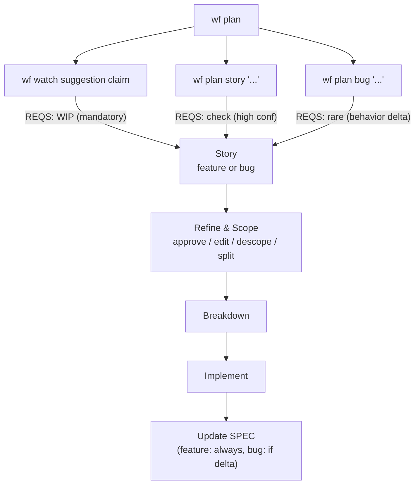
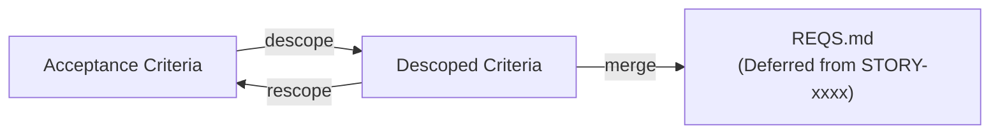
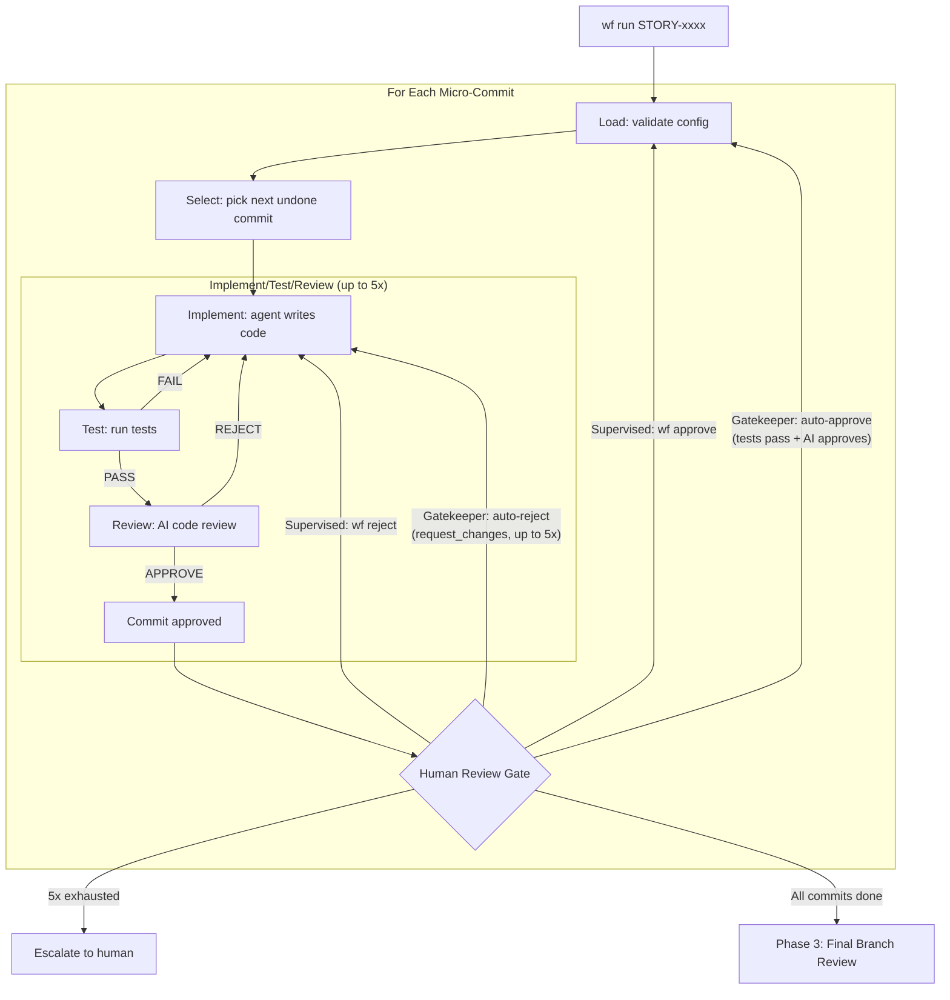
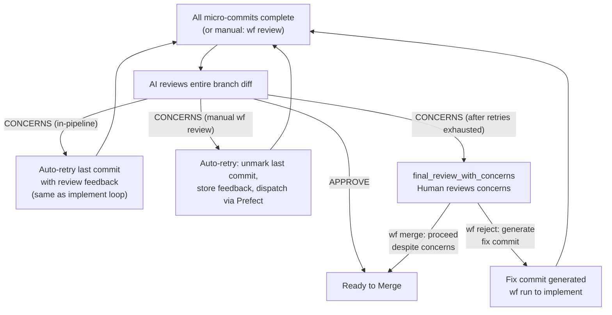
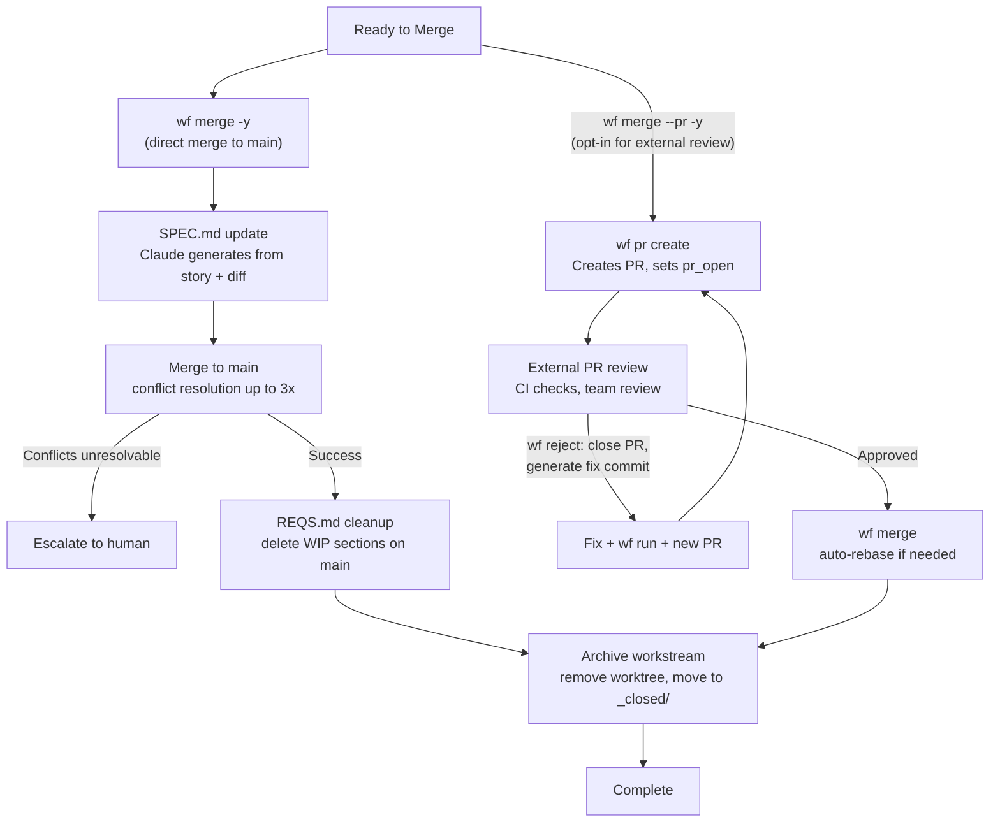
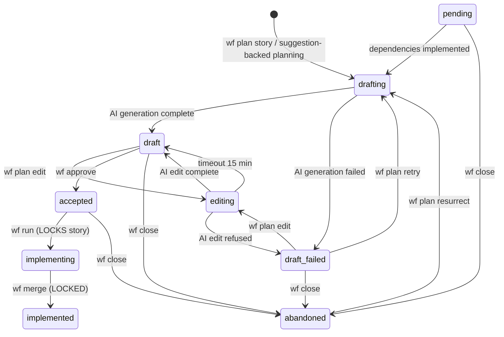
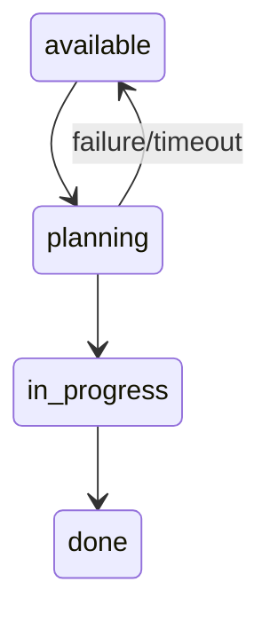
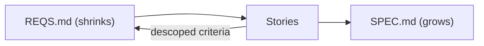
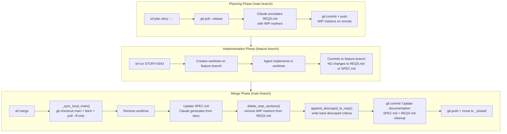
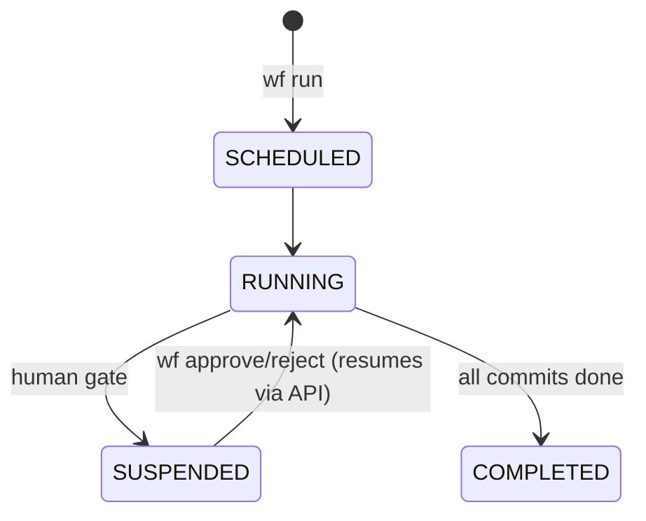

# Hashd Workflow - Complete Flow

## Architecture Overview

Hashd uses **Prefect** for workflow orchestration with these components:

| Component | Purpose |
|-----------|---------|
| **Prefect Server** | Coordinates flow runs, handles state, provides UI |
| **Worker Pool** | Executes flows (process-based, local to ops machine) |
| **Deployments** | Named flow entry points with parameters |
| **suspend_flow_run()** | Pauses flow for human input, resumes via API |

Flows run asynchronously. `wf run` submits to the worker and returns immediately.
Monitor via `wf watch` (TUI) or Prefect UI at `http://localhost:4200`.

For the canonical model of how a workstream's runtime position is described — stage, status, substage, operator verbs, and recovery from crashes — see **Workstream State Model** below.

---

## Modes

| Mode | Flag | Description |
|------|------|-------------|
| **supervised** | `--supervised` | Always pause at commits and merge |
| **gatekeeper** | `--gatekeeper` | Auto-continue commits if confident, human approves merge (default) |
| **autonomous** | `--autonomous` | Auto-continue commits and merge (unattended) |

Mode is set per-project via `wf project interview` or `config.yaml`.
Override per-run: `wf run --supervised`, `wf run --gatekeeper`, or `wf run --autonomous`

### Confidence Scoring

AI reviews include a confidence score (0.0-1.0) that influences auto-continue decisions:

| Range | Meaning |
|-------|---------|
| 0.9-1.0 | Highly confident - solid code, well-tested patterns |
| 0.7-0.9 | Confident - standard implementation, minor concerns |
| 0.5-0.7 | Moderate - some uncertainty, review recommended |
| 0.0-0.5 | Low - significant concerns, human review required |

---

## Phase 1: Planning

### Three Paths to Stories


```mermaid
flowchart TD
    A[wf plan] --> B[wf watch suggestion claim]
    A --> C["wf plan story '...'"]
    A --> D["wf plan bug '...'"]
    B -->|"REQS: WIP (mandatory)"| E[Story\nfeature or bug]
    C -->|"REQS: check (high conf)"| E
    D -->|"REQS: rare (behavior delta)"| E
    E --> R["Refine & Scope\napprove / edit / descope / split"]
    R --> F[Breakdown]
    F --> G[Implement]
    G --> H["Update SPEC\n(feature: always, bug: if delta)"]
```

### Full Flow (from REQS)

```
[Human] Start with requirements
        - Write REQS.md (dirty requirements)
        - Or have existing feature requests

[Human/AI] Discover stories
        $ wf plan                     # Two-phase: discovery + tech tree
        $ wf plan list                # View suggestions

[Human] Pick a suggestion
        $ wf watch                    # Open the plan screen
        # Press 1-9 to claim a suggestion into planning

        Creates STORY-xxxx, marks REQS as WIP
```

### Tech Tree (auto-chained after discovery)

`wf plan` runs two phases. Phase 1 (discovery) produces actionable suggestions safe to start against current `main` — the same numbered list operators already know. Phase 2 (tech tree planner) auto-chains immediately after, projecting the near-future structure: tech tree suggestions that depend on in-flight stories or actionable suggestions.

**Two distinct planning surfaces, one operator command:**

| Surface | What it produces | Operator can act? | Crosses agent boundary? |
|---|---|---|---|
| Main planner (phase 1) | Actionable Suggestions, numbered `[1]`, `[2]` | Yes — `accept` creates a Story | Yes — Suggestions become Stories that agents consume |
| Tech tree planner (phase 2) | Tech tree suggestions, displayed by title only | No — view-only inspection | No — never reaches any implementer/reviewer/breakdown agent |

The main planner stays conservative: never surfaces work that depends on in-flight stories (their code isn't on `main`; an implementer would build against a foundation that doesn't yet exist). The tech tree planner is where that projected visibility lives.

**Lifecycle:**

```text
[Human] $ wf plan
         |
         v
  Clear all suggestion content (main + tech tree)
         |
         v
  Phase 1: discovery
         |  status: "Discovering..."
         v
  Actionable suggestions populate at top of panel
         |
         v
  Phase 2: tech tree (auto-chained)
         |  status: "Computing tech tree..."
         v
  Projected dependents fill in under suggestions and in-flight stories
         |
         v
  Done
```

**Cancellation:** new `wf plan` while phase 2 in flight cancels phase 2 cleanly, clears the panel, and restarts at phase 1. Phase 2 cannot be cancelled in isolation — it's an extension of the same planning command.

**Storage:** Suggestions persist in the `suggestions` table (cleared on next `wf plan`). Tech tree suggestions live in server-side in-memory storage (also cleared on next `wf plan`). Neither survives across planning cycles; both are regenerated fresh each cycle.

**Session reuse:** the tech tree agent reuses the discovery agent's session via the existing session-resume primitive (same mechanism used by `review_resume`). Avoids reloading project context twice.

**Visualization:** see `DAS_PLAN.md > Story Dependencies, Thin Slicing, and the Tech Tree` for the full TUI rendering spec — unified tree panel, gradient dimming by level, multi-parent `*` marker, `t` toggle, level cap with `... (N more)` collapse.

**Agent boundary invariant:** tech tree output never reaches any agent. Implementer, reviewer, breakdown, planning-edit, refinement — none receive tech tree content in prompts, context, or any other input. The boundary is enforced by a test fixture; adding tech tree data to any agent input is a test failure.

### Quick Flow (skip REQS discovery)

```
[Human] Create story directly
        $ wf plan story "add logout button"              # Feature
        $ wf plan bug "fix null pointer" -f context.md   # Bug

        -f is smart: file path reads file, else uses as text

        Feature: checks REQS for overlap (high confidence)
        Bug: skips REQS annotation, conditional SPEC update
```

### Story Refinement

```
[Human] Review and accept story
        $ wf show STORY-xxxx
        $ wf approve STORY-xxxx     # draft -> accepted

[Human] Edit story if needed
        $ wf plan edit STORY-xxxx ["feedback"]

[Human] Set context (optional)
        $ wf use <workstream_id>

                              |
                              v
```

### Questions and Answers

Hashd has two distinct question/answer lifecycles with different operator UX. Both share the same storage table (`clarifications`), discriminated by which entity owns the row: `story_id` set (story-planning) or `workstream_id` set (workstream-runtime).

**Vocabulary:**
- **Clarification** / **CLQ** — generic database term, any row in the `clarifications` table.
- **Story open questions** — operator-facing term for story-scoped CLQs. Bundled emission, bundled answer.
- **Workstream CLQs** — operator-facing term for workstream-scoped CLQs. Multi-emit, bundled answer via `wf answer <workstream-id> "..."`.

**Note on shipped vs intended state.** Sections below describe the intended architecture. Items flagged `(intended; ships with PR X)` are not yet operational — see `docs/PLANNING_REDESIGN_PLAN.md` for the implementation status. Items without a flag describe current behavior.

#### Story-planning questions

Created by the **planning agent** during story drafting (or re-drafting via edit). When the planner identifies ambiguity in REQS that it can't resolve on its own, it emits questions as part of its output.

| Aspect | Detail |
|---|---|
| Created by | Planning agent (during suggestion-backed planning or `wf plan edit`) |
| Stored in | `clarifications` table, `story_id` set, `workstream_id` null |
| Emission shape | Bundle — planner emits all open questions at once in its structured output |
| Operator UX | Bundle answer — operator reads all pending story open questions for the story, submits one combined answer string covering all of them |
| Operator answers via | `wf answer STORY-XXX "Q1: ..., Q2: ..."` (TUI: `a` key on story detail) |
| Trigger on submit | All pending story open questions for the story flip to `answered` with the bundled answer text. Edit-flow auto-dispatches with the bundle as feedback. |
| Consumed by | Edit-flow's planner invocation (re-drafts the story with the bundled answers as context) |
| Loop | Planner may emit new questions if answers were incomplete. Old answered story open questions are preserved as historical context. Loop continues until the planner is satisfied or the operator gives up. |

**Why bundle.** Operator typically reads all questions together, decides them together, submits one combined answer. The planner consumes the bundle as a single feedback string. Per-question status tracking is operationally meaningless because the planner doesn't see them individually anyway.

#### Workstream-runtime questions (CLQs)

Created by the **implement-stage agent** during workstream execution. When codex/claude needs operator input mid-task to proceed (e.g., "which approach should I take for X?"), it emits one or more clarification requests and the workstream blocks.

| Aspect | Detail |
|---|---|
| Created by | Implement-stage agent (during `wf run` execution) |
| Stored in | `clarifications` table, `workstream_id` set |
| Emission shape *(intended; ships with PR B)* | Multi-emit — agent's protocol allows emitting one or many CLQs in a single turn (`clarifications_needed: [...]`) when it identifies several ambiguities up front |
| Emission shape *(today)* | Single-emit — agent emits one CLQ per turn (`clarification_needed: {...}`) and the workstream blocks |
| Operator UX | Bundle answer — operator reads every pending CLQ for the workstream, submits one combined answer string. The CLQ-NNN ids exist for storage and audit but are intentionally hidden from the operator surface. |
| Operator answers via | `wf answer <workstream-id> "..."` (TUI: `c` key on workstream detail) |
| Trigger on submit | Every pending CLQ on the workstream flips to `answered` with the bundled answer text and the next agent run auto-dispatches (start_impl from `active`, resume_impl from `awaiting_human_review`). |
| Consumed by | The implement-stage prompt context on the next workstream run picks up the answered CLQs as part of the implement prompt |
| Loop | Implement agent emits new workstream CLQs as further ambiguities surface across runs. Each CLQ persists independently in storage; operators always see them grouped by workstream. |

**Why bundle (operator side).** Even though storage tracks CLQs individually, operators answer them together most of the time — partial-state ("answered some, dispatched, then more arrived") was a regular source of confusion. The single bundle answer + auto-dispatch keeps the lifecycle one operator action wide.

#### Why the same storage, different operationally

| | Story-planning | Workstream-runtime |
|---|---|---|
| Discriminator | `story_id` set, `workstream_id` null | `workstream_id` set |
| Submit trigger | Bundle answer dispatches edit-flow | Bundle answer dispatches workstream run (start_impl or resume_impl) |
| Re-emit on next round | Planner emits replacement bundle; old answered CLQs preserved as context | Implement emits new CLQs as needed |
| Operator surface | TUI 'a' (story_detail) → bundle modal | TUI 'c' (workstream_detail) → bundle modal |
| CLI surface | `wf answer STORY-X "..."` | `wf answer <workstream-id> "..."` |

The single entry point `wf answer` routes by ID prefix (`STORY-`/`BUG-` →
story path, anything else → workstream path). The two paths share an
operator UX (bundle answer + auto-dispatch) and a failure model (dispatch
first, flip second), differing only in which agent run they kick off.

### Story Scope Management

Stories created from dense REQS paragraphs often expand into many acceptance criteria.
Three operations let you tighten scope without losing work:

**Descope** -- "not now, maybe later." Moves a criterion to a descoped list.
During implementation, agents see descoped criteria as negative requirements (DO NOT implement).
At merge time, descoped criteria are written back to REQS.md with provenance so the
requirement survives the WIP marker deletion.

```
$ wf plan descope-ac STORY-0054 5         # Move criterion #5 to descoped
$ wf plan rescope-ac STORY-0054 1         # Bring descoped #1 back to AC
$ wf show STORY-0054                      # Shows both lists
```

**Split** -- "this story is too large." There are two modes:

- Agent proposal mode asks the `plan_split` stage to propose a narrowed parent
  story plus dependent sub-stories. The proposal lands as a `breakdown_proposal`
  clarification; approve it with `wf answer STORY-xxxx "yes"` or ask for a
  revision with `wf answer STORY-xxxx "yes, but ..."` before anything is applied.
- Deterministic indices mode preserves the existing surgical workflow: selected
  acceptance criteria are extracted into one new `draft` sibling story and
  applied directly.

```bash
$ wf plan split STORY-0054
$ wf plan split STORY-0054 --feedback "split out recurring events"
$ wf plan split STORY-0054 3,5,7 -t "Referral Reward Configuration"
$ wf plan split STORY-0054 3,5,7 -t "Referral Reward Configuration" -y
# Creates STORY-0055 with criteria 3, 5, 7 removed from STORY-0054
```

Agent-created split sub-stories start in `pending` when they depend on the
parent or another sibling. When every dependency reaches `implemented`, the
server transitions each pending sub-story to `drafting` and dispatches planning
so it redrafts against the current codebase.

**Chat** -- all scope operations are also available via pair programmer chat:

```
~~~action
{"op": "descope_criterion", "index": 4}
~~~

~~~action
{"op": "split_story", "criteria": [3, 5, 7], "title": "Referral Reward Config"}
~~~
```

#### Descoped Criteria Lifecycle


```mermaid
flowchart LR
    AC["Acceptance Criteria"] -- "descope" --> DC["Descoped Criteria"]
    DC -- "rescope" --> AC
    DC -- "merge" --> REQS["REQS.md\n(Deferred from STORY-xxxx)"]
```

- Descoped criteria are stored on the story record (SQLite JSON blob).
- Every operation is reversible until merge. `rescope-ac` brings criteria back.
- At merge time, `_archive_workstream()` calls `append_descoped_to_reqs()` after
  WIP marker deletion, adding a "Deferred from STORY-xxxx" section to REQS.md.
- The deferred REQS items are picked up by the next `wf plan` discovery run.
- During implementation, descoped criteria are injected into agent prompts as
  negative requirements ("DO NOT implement").

#### TUI Scope Operations

In the Story Detail screen, acceptance criteria and descoped criteria appear in a
single list. Descoped items render at reduced opacity with a `DESCOPED:` prefix.
Keybindings change based on which type is selected:

| Selection | Key | Action |
|-----------|-----|--------|
| Active criterion | `D` | Descope (with confirmation) |
| Active criterion | `e` | Edit |
| Active criterion | `d` | Delete |
| Descoped criterion | `r` | Rescope (immediate) |

---

## Phase 2: Implementation


```mermaid
flowchart TD
    START["wf run STORY-xxxx"] --> LOAD[Load: validate config]

    subgraph EACH["For Each Micro-Commit"]
        LOAD --> SELECT[Select: pick next undone commit]
        SELECT --> IMPL

        subgraph ITR["Implement/Test/Review (up to 5x)"]
            IMPL[Implement: agent writes code] --> TEST[Test: run tests]
            TEST -->|FAIL| IMPL
            TEST -->|PASS| REVIEW[Review: AI code review]
            REVIEW -->|REJECT| IMPL
            REVIEW -->|APPROVE| DONE[Commit approved]
        end

        DONE --> GATE{Human Review Gate}
    end

    GATE -->|"Supervised: wf approve"| LOAD
    GATE -->|"Supervised: wf reject"| IMPL
    GATE -->|"Gatekeeper: auto-approve\n(tests pass + AI approves)"| LOAD
    GATE -->|"Gatekeeper: auto-reject\n(request_changes, up to 5x)"| IMPL
    GATE -->|"5x exhausted"| HITL[Escalate to human]

    GATE -->|All commits done| NEXT[Phase 3: Final Branch Review]
```

---

## Phase 3: Final Branch Review


```mermaid
flowchart TD
    TRIGGER["All micro-commits complete\n(or manual: wf review)"] --> AI[AI reviews entire branch diff]
    AI -->|APPROVE| READY[Ready to Merge]
    AI -->|"CONCERNS (in-pipeline)"| RETRY["Auto-retry last commit\nwith review feedback\n(same as implement loop)"]
    RETRY --> TRIGGER
    AI -->|"CONCERNS (manual wf review)"| AUTORETRY["Auto-retry: unmark last commit,\nstore feedback, dispatch via Prefect"]
    AUTORETRY --> TRIGGER
    AI -->|"CONCERNS (after retries exhausted)"| HUMAN[final_review_with_concerns\nHuman reviews concerns]
    HUMAN -->|"wf merge: proceed\ndespite concerns"| READY
    HUMAN -->|"wf reject: generate\nfix commit"| FIX["Fix commit generated\nwf run to implement"] --> TRIGGER
```

---

## Phase 4: Merge

**Default: direct merge to main.** Use `--pr` to opt in to forge PR workflow for external review. Supports GitHub, Bitbucket, and GitLab. The forge is auto-detected from your git remote or set explicitly via `forge:` in config.yaml.


```mermaid
flowchart TD
    READY[Ready to Merge] --> DEFAULT["wf merge -y\n(direct merge to main)"]
    DEFAULT --> SPEC[SPEC.md update\nClaude generates from story + diff]
    SPEC --> MERGE_MAIN[Merge to main\nconflict resolution up to 3x]
    MERGE_MAIN -->|Conflicts unresolvable| HITL[Escalate to human]
    MERGE_MAIN -->|Success| REQS[REQS.md cleanup\ndelete WIP sections on main]
    REQS --> ARCHIVE

    READY -->|"wf merge --pr -y\n(opt-in for external review)"| PR_CREATE["wf pr create\nCreates PR, sets pr_open"]
    PR_CREATE --> EXTERNAL[External PR review\nCI checks, team review]
    EXTERNAL -->|"wf reject: close PR,\ngenerate fix commit"| FIX[Fix + wf run + new PR] --> PR_CREATE
    EXTERNAL -->|Approved| PR_MERGE["wf merge\nauto-rebase if needed"]
    PR_MERGE --> ARCHIVE

    ARCHIVE[Archive workstream\nremove worktree, move to _closed/] --> COMPLETE[Complete]
```

### Merge Modes

| Mode | CLI | TUI | Telegram | When to use |
|------|-----|-----|----------|-------------|
| **Direct** (default) | `wf merge -y` | `[m] merge` | `/merge` | Standard workflow, AI-reviewed code |
| **PR** (opt-in) | `wf merge --pr -y` | `[P] pr` | `wf pr create` | External review needed (team, CI bots) |

The merge mode can also be set as a project default in config.yaml (`merge_mode: pr`). The `--pr` CLI flag overrides the project default for a single invocation.

The forge platform is auto-detected from the git remote URL, or set explicitly in config.yaml (e.g. `forge: github`, `forge: bitbucket`, or `forge: gitlab`).

---

## Command Reference

### Core Commands

| Command | Description |
|---------|-------------|
| `wf plan` | Discover from REQS.md, save suggestions |
| `wf plan list` | View current suggestions |
| `wf plan story "title" [-f ctx]` | Quick feature (skips REQS discovery) |
| `wf plan bug "title" [-f ctx]` | Quick bug fix (conditional SPEC update) |
| `wf plan edit STORY-xxx [feedback]` | Edit existing story |
| `wf plan clone STORY-xxx` | Clone a locked story |
| `wf plan resurrect STORY-xxx` | Resurrect abandoned story |
| `wf plan retry STORY-xxx` | Retry failed planning run |
| `wf plan descope-ac STORY-xxx N` | Move acceptance criterion N to descoped list |
| `wf plan rescope-ac STORY-xxx N` | Move descoped criterion N back to acceptance criteria |
| `wf plan split STORY-xxx [--feedback ".."]` | Request an agent breakdown proposal for a large story |
| `wf plan split STORY-xxx 3,5,7 -t "title" [-y]` | Split criteria into one new draft sibling story |
| `wf run [id] [--once\|--loop] [--gatekeeper\|--supervised\|--autonomous] [-f ".."] [-y]` | Submit workstream to Prefect (-f: guidance, -y: skip prompts) |
| `wf list` | List stories and workstreams |
| `wf show <id>` | Show story or workstream details |
| `wf approve <id>` | Accept story or approve gate |
| `wf reject [id] [feedback] [--reset]` | Reject with feedback (positional; required unless `--reset`). Use `@directive <text>` in feedback to add durable constraints (e.g. `wf reject ws-1 "fix X @directive do not modify RBAC"`) |
| `wf pr create [id]` | Create PR/MR for specified workstream |
| `wf pr feedback [id]` | View PR/MR review comments |
| `wf merge [id] [--confirm\|-y] [--pr] [--no-push] [--fix] [--ai-resolve]` | Merge to main and archive (`--confirm`/`-y` required in supervised/gatekeeper mode, `--pr` forces PR workflow) |
| `wf close [id] [--force] [--keep-branch] [--no-changes] [-r ".."]` | Abandon workstream (-r reason required with --no-changes) |
| `wf skip [id] [commit] [-m ".."]` | Mark commit as done without changes |
| `wf reset [id] [--hard]` | Reset workstream to start fresh |

### Supporting Commands

| Command | Description |
|---------|-------------|
| `wf use [id] [--clear]` | Set/show/clear current workstream |
| `wf watch [id]` | Interactive TUI - monitor execution progress |
| `wf review [id]` | Show latest saved final review |
| `wf diff [id] [--stat\|--staged\|--uncommitted] [--commit SHA] [--file path]` | Show workstream diff |
| `wf log [id] [--since ISO] [-n limit] [-r]` | Show workstream timeline |
| `wf docs [id]` | Update SPEC.md from workstream |
| `wf refresh [id]` | Refresh touched files |
| `wf conflicts [id]` | Check file conflicts |

### Question & Answer Commands

`wf answer` is the single operator surface for clarification Q&A. CLQ-NNN ids
are internal — the operator talks to entities (stories and workstreams) and
the server fans out the bundle answer across every pending CLQ on the entity.
Submitting an answer always auto-dispatches the next agent run (edit-flow for
stories, start_impl/resume_impl for workstreams) so a single operator action
moves the entity forward.

Story clarifications can also carry `breakdown_proposal` payloads from
`wf plan split STORY-xxx`. Answer `yes` to apply the parent revision and create
sub-stories transactionally, `no` to reject without changes, or any non-yes/no
feedback to request a revised proposal.

| Command | Description |
|---------|-------------|
| `wf answer` | Show help. |
| `wf answer list` | List entities with pending clarifications (stories + workstreams). |
| `wf answer show <entity>` | Show pending question text for one entity. |
| `wf answer <entity> "<text>"` | Submit a bundle answer. Flips every pending CLQ on the entity to `answered` with this text and dispatches the next agent run. |

**State requirements.** Stories must be in `draft` (no linked workstream) for
`wf answer`. Workstreams must be in `active` or `awaiting_human_review`. Other
states return a structured diagnostic that names the right next command.

**Failure semantics.** Dispatch happens before the CLQ flip. A transient
Prefect outage fails the call before any DB writes. A flip failure after a
successful dispatch surfaces a 500 instructing the operator to retry the
answer; the run itself is already in flight.

### Archive Commands

| Command | Description |
|---------|-------------|
| `wf archive work` | List archived workstreams |
| `wf archive stories` | List archived stories |
| `wf archive delete <id> --confirm` | Permanently delete |
| `wf open <id> [--force]` | Resurrect archived workstream |

### Directives Commands

| Command | Description |
|---------|-------------|
| `wf directives` | View global directives |
| `wf directives all` | View all (global + project + workstream) |
| `wf directives project` | View project only |
| `wf directives workstream <ws>` | View workstream's only |
| `wf directives edit` | Edit global in $EDITOR |
| `wf directives edit project` | Edit project in $EDITOR |
| `wf directives edit workstream <ws>` | Edit workstream's in $EDITOR |
| `wf directives ai-edit` | AI-assisted edit of global |
| `wf directives ai-edit project` | AI-assisted edit of project |
| `wf directives ai-edit workstream <ws>` | AI-assisted edit of workstream's |

### Project Commands

| Command | Description |
|---------|-------------|
| `wf project add <path> [--no-interview] [--primary name] [--active name ...\|--all-active] [--repo-skip-test name] [--repo-skip-build name] [--commit-root-dirs]` | Register a new project |
| `wf project list` | List registered projects |
| `wf project use [name] [--clear]` | Set, show, or clear the current project |
| `wf project show` | Show project configuration |
| `wf project interview` | Update project configuration interactively |
| `wf project remove <name> [-y]` | Remove a project |
| `wf project config list` | List effective project config and mark overrides in TTY output |
| `wf project config diff` | Show project overrides against inherited system/default config |
| `wf project config show <key>` | Show effective value, source, override stack, and description |
| `wf project config get <key>` | Get config value |
| `wf project config set <key> <value>` | Set config value |
| `wf project config reset <key>` | Remove one project override |
| `wf project config reset --all` | Remove all project overrides |
| `wf project describe` | Show current project description |
| `wf project describe --suggest` | AI-generate a description suggestion |

### System Config Commands

| Command | Description |
|---------|-------------|
| `wf config list` | List effective system config and mark system overrides in TTY output |
| `wf config diff` | Show system overrides against compiled defaults |
| `wf config show <key>` | Show effective value, source, override stack, and description |
| `wf config get <key>` | Get system config value |
| `wf config set <key> <value>` | Set system config value |
| `wf config reset <key>` | Remove one system override |
| `wf config reset --all` | Remove all system overrides |

### Workstream Commands

| Command | Description |
|---------|-------------|
| `wf workstream remove <id>` | Remove orphaned workstream |

### Observability Commands

| Command | Description |
|---------|-------------|
| `wf chat [id]` | Pair programmer chat with AI |
| `wf agents` | Show installed AI agents and stage assignments |
| `wf doctor` | Validate setup and diagnose issues |
| `wf restart [component] [-y]` | Restart infrastructure (Prefect, ZMQ, messengers) |
| `wf lineage <target> [--line N] [--lines N-M] [--format table\|json\|markdown]` | Trace code lineage (auto-detects file/SHA/STORY/BUG) |
| `wf lineage export <sha\|STORY-xxxx\|BUG-xxxx> [--format slsa\|in-toto]` | Export attestation (SLSA v1.0 or in-toto) for SHA or story |
| `wf lineage verify` | Validate hash chain integrity for project commits |
| `wf system-log` | View system event log |
| `wf prompts list` | List prompt templates |
| `wf prompts show <name>` | Show prompt content |
| `wf prompts edit <name>` | Edit prompt override |
| `wf prompts reset <name>` | Reset prompt to default |
| `wf prompts diff <name>` | Show diff from default |
| `wf completion [bash\|zsh\|fish]` | Generate shell completion |

---

## Release Cuts

Release cuts are dev-team operations and are intentionally not exposed through
the user-facing `wf` CLI.

1. `scripts/cut-release.sh <version>` runs from a clean hashd checkout. It requires local `main` at `origin/main`, `origin/dev` as a strict superset of `origin/main`, and no open PRs targeting `dev` unless the operator passes `--yes`.
2. The script creates an isolated candidate merge from `origin/main` plus `origin/dev`, runs `task -d server generate`, amends allowed generated artifacts, pushes an immutable annotated tag at `refs/tags/release-candidate/v<version>/<attempt>`, and dispatches `.github/workflows/release.yml` in candidate mode.
3. The workflow runs all pre-publish gates and then parks at the protected `release-publish` environment. The operator approves that environment in the GitHub UI to publish.
4. After approval, the workflow publishes hashd-code, pushes the source tag, updates `main`, and updates `dev` so `dev` contains `main`.
5. If the final dev back-merge conflicts after publish, the workflow fails loudly. The published release, source tag, and `main` stay authoritative; resolve `dev` manually by merging `origin/main` into `origin/dev`.

---

## Watch UI Keybindings

The `wf watch` TUI provides context-sensitive keybindings based on workstream status:

### Dashboard

| Key | Action |
|-----|--------|
| `1-9` | Select workstream by number |
| `a-i` | Select story by letter |
| `p` | Open plan screen |
| `m` | Change autonomy mode (supervised/gatekeeper/autonomous) |
| `/` | Command palette |
| `?` | Help |
| `q` | Quit |

### Workstream Detail View

Available on any workstream detail screen:

| Key | Action |
|-----|--------|
| `G` | Go - run workstream |
| `c` | Answer pending clarifications (bundle modal -- one answer applies to all) |
| `d` | View diff |
| `l` | View log |
| `p` | Open plan view |
| `1` | Toggle status section |
| `2` | Toggle commits section |
| `3` | Toggle timeline section |

### Diff Mode

When the diff panel is active (`d`):

| Key | Action |
|-----|--------|
| `s` | Toggle side-by-side / unified view |
| `I` | Toggle lineage view |
| `f` | Toggle fullscreen (hides left column) |
| `Enter` | Show lineage detail for selected line (lineage view) |

### Stage: awaiting_human_review

| Key | Action |
|-----|--------|
| `a` | Approve changes, continue to next micro-commit |
| `r` | Reject with feedback, iterate on current commit |
| `R` | Reset (discard changes, start fresh) |

### Stage: ready_to_merge / final_review_with_concerns

| Key | Action |
|-----|--------|
| `m` | Merge directly to main (default) |
| `P` | Create PR/MR (for external review) |
| `r` | Reject with feedback |
| `e` | Edit pending microcommit |
| `+` | Add new micro-commit to plan |

When `merge_mode: pr` is set in config.yaml, `P` (create PR) and `m` (merge PR) swap roles -- `P` appears when no PR exists, `m` appears once a PR is created.

**Note:** `final_review_with_concerns` has the same bindings as `ready_to_merge`. The difference is informational - the AI final review flagged concerns. The Details panel shows these concerns; review them before proceeding.

**Note:** `+` (add micro-commit) is also available in active and implementing states when the workstream is idle.

### Stage: merge_conflicts

| Key | Action |
|-----|--------|
| `i` | AI-resolve conflicts |
| `R` | Reset workstream |

### Stage: pr_open / pr_approved

| Key | Action |
|-----|--------|
| `r` | Reject - opens modal pre-filled with PR feedback |
| `o` | Open PR in browser |
| `a` | Merge PR |

The `[r] reject` action in PR states:
1. Fetches PR comments and pre-fills the input modal
2. User edits/confirms feedback (cannot submit empty)
3. **Closes the PR/MR** on the forge with comment
4. Clears PR metadata from workstream
5. Creates fix commit (COMMIT-xxx-FIX-NNN)
6. Use `[G] Go` to run, then `[P]` creates a fresh PR

### Plan Screen

| Key | Action |
|-----|--------|
| `s` | Create new story |
| `b` | Create new bug |
| `d` | Run discovery from REQS.md |
| `1-9` | Create story from suggestion |
| `Esc` | Back to dashboard |

### Story Detail Screen

| Key | Action |
|-----|--------|
| `A` | Approve story (Shift+A, draft -> accepted) |
| `a` | Answer open questions |
| `E` | Edit story with AI (Shift+E) |
| `e` | Edit selected acceptance criterion |
| `d` | Delete selected criterion |
| `D` | Descope selected criterion (Shift+D, moves to descoped list) |
| `r` | Rescope selected descoped criterion (moves back to AC) |
| `G` | Create workstream and run (Shift+G) |
| `C` | Open pair programmer chat (Shift+C) |
| `X` | Close/abandon story (Shift+X) |
| `v` | View full story markdown |
| `p` | Open plan screen |
| `Esc` | Back to dashboard |

### Global Keybindings (all screens)

| Key | Action |
|-----|--------|
| `?` | Show help (context-aware shortcuts) |
| `/` | Open command palette |
| `Ctrl+t` | Toggle dark/light theme |
| `Ctrl+s` | Save screenshot |
| `1-9` | Quick-select workstream (dashboard) |
| `a-i` | Quick-select story (dashboard) |
| `p` | Open plan screen |
| `q` | Back / Quit |
| `Esc` | Back to previous screen |

---

## Directives

Directives are curated standing rules that guide AI agents. They exist at three levels:

```
~/.config/wf/directives.md        # Global user preferences
{repo}/directives.md              # Project rules
workstreams/{id}/directives.md    # Workstream-specific (rare)
```

**Why `directives.md` not `AGENTS.md`?** We want hashd to control when directives are passed to agents, not have agents auto-read them. Using `directives.md` ensures agents only see these rules when we explicitly include them in prompts.

**Key principle:** Directives are documentation, not runtime state. They persist and are version-controlled.

### Example directives.md

```markdown
# Project Directives

<!--
Directives guide AI agents during implementation.
hashd passes this file to agents - they don't auto-read it.
-->

- No backward compatibility. We have zero users.
- Use sync.Once pattern for handler initialization
- Follow existing templ component patterns in internal/templates
- HTMX handlers should set HX-Trigger for related component updates
```

### Commands

```bash
# Viewing
wf directives                       # View global
wf directives all                   # View all (global + project + workstream)
wf directives project               # View project only
wf directives workstream <ws>       # View workstream's only

# Manual editing
wf directives edit                  # Edit global
wf directives edit project          # Edit project
wf directives edit workstream <ws>  # Edit workstream's

# AI-assisted editing
wf directives ai-edit               # AI edit global
wf directives ai-edit project       # AI edit project
wf directives ai-edit workstream <ws>  # AI edit workstream's
```

### Usage

Directives are automatically included in all agent-driven stages that produce or judge work:

- implementation
- merge-conflict resolution
- per-commit review and review retry
- final review
- fix generation
- add-commit planning
- planning discovery
- story refine/edit
- breakdown
- concern triage

Use `wf directives all` to view all directives at once.

### Stage-Scoped Directive Blocks

Directives can include optional stage markers when a rule should only reach a subset of agents. Unwrapped content still renders in every stage.

```markdown
<!--
This file is hashd's directives.md -- operator-authored standing guidance.

Sections wrapped in `<!-- STAGE: name1, name2 -->` / `<!-- END STAGE -->`
only render in those agent stages. Unwrapped sections render in every stage.

Valid stage names: planning, implement, fix_generation, review, final_review,
edit_flow.
-->

# Standing directives

Use msgspec for new data types.

<!-- STAGE: review, final_review -->
Be strict on test coverage for new public code paths.
<!-- END STAGE -->

<!-- STAGE: planning -->
Prefer one-commit-per-AC granularity.
<!-- END STAGE -->
```

Valid stage names are `planning`, `implement`, `fix_generation`, `review`, `final_review`, and `edit_flow`. The merge-conflict resolver uses `implement`; breakdown uses `planning`; concern triage uses `review`. Matching blocks render without the marker comments. Non-matching blocks are stripped. Malformed blocks fail open with a warning, so the content renders to every stage rather than silently disappearing. Nested stage blocks are not supported.

---

## Workstream State Model

A workstream's runtime position is described by two orthogonal fields: **stage** (where in the lifecycle) and **status** (what's happening at that stage right now). For stages with internal sequencing, a third field — **substage** — tracks position within the stage.

> **Note on current implementation**: today's code conflates stage and status into a single field (named `status` in Python, `state` in the Go server's FSM JSON). The model described below is the canonical design; the rename + additive `status` field lands as a post-v0.6.0 migration. Conceptually the system already operates this way — the docs lead the data model.
>
> **What's shipped (Brief 99 Phase 1 + Brief 114 Phase 5)**: the derived `runtime_status` field is exposed by the Go workstream serializer (`ComputeRuntimeStatus`) with a Python lib mirror at `orchestrator/lib/workstream_status.py`. Operator displays (`wf show`, dashboard, watch detail subtitle) render the `<stage> / <runtime_status>` pair. The macro-state fold for `creation_failed` / `baseline_failed` landed in Brief 114: both states were dropped from the FSM and their incoming/outgoing transitions collapsed into `provisioning` (with `provision_error` / `baseline_failures` columns populated as the failure detail). The FSM rename (Phase 1 of the migration outline) remains future work — see the migration outline at the bottom of this section.

### Stage

A **stage** is an idempotent workflow position with defined inputs and outputs.

Properties:
- **Idempotent**: re-running the stage with the same inputs produces the same outputs (or at least is safe to re-execute without introducing new state changes).
- **Defined inputs/outputs**: each stage takes a known input set and produces a known output set. Listed per-stage in the implementation.
- **Leaving the stage mutates the flow**: the transition out is the commit point. While inside, the stage can be re-run or extended; once the FSM transitions, the output is locked in.
- **Going back destroys the current stage's terminal output**: rewinding from B to A discards B's verdict/decision. Only explicit current-cycle artifacts flow back to the next agent stage; stale review history and conversation context stay available to operator surfaces, not agent prompts.

The macro FSM enumerates the stages. See **State Diagram** below for the canonical list and transitions.

#### Additive flow state

When stage A → B → A happens (e.g., implementing → review → implementing on a rejection), the second visit to A starts with:
1. Original inputs to A
2. Plus the current-cycle artifact from B (e.g., the just-completed review's actionable feedback)

The terminal output of the first A is gone (replaced by the second A's output). Historical feedback and summaries remain queryable for humans, but they do not accumulate into per-commit reviewer or implementer prompts.

### Status

A **status** is the runtime state at the workstream's current stage. Seven values:

| Status | Meaning | Computed from |
|---|---|---|
| `running` | Process attached, work in progress at current stage | `runner_pid` alive AND `last_run` incomplete |
| `blocked` | Waiting for external input (clarification, human review, conflict resolution, etc.) | `last_run.status == "blocked"` |
| `failed` | Previous run errored, retryable via re-dispatch | `last_run.status == "failed"` |
| `idle` | Stage entered, no run has executed yet | No `last_run` record for current stage |
| `cancelled` | Operator deliberately stopped the runner | `last_run.status == "cancelled"` (future) |
| `orphaned` | Runner exited without writing a terminal result, unintentionally | `runner_pid` dead AND `last_run` incomplete |
| `done` | Terminal stage reached; no further work | Stage in terminal set (`merged`, `closed`, `closed_no_changes`) |

#### Status is derived

Status is computed on read from primitive fields (`runner_pid`, last `runs` row, current stage), not stored as a column. Hard kills self-heal: pid not alive on next read → status flips to `orphaned`.

The canonical compute function lives Go-server-side (in the workstream serializer) with a Python lib mirror for local consumers. Both must agree.

#### `cancelled` vs `orphaned`

Same surface symptom (no live runner, no terminal result), different cause:
- **`orphaned`**: process died unintentionally (hard kill, prompt-render exit before `write_result`, etc.). Operator should investigate.
- **`cancelled`**: operator deliberately stopped the runner via a future `wf cancel` command. No investigation needed; just decide whether to re-dispatch.

Today there's no explicit cancel mechanism; killed runs become `orphaned`. When `wf cancel` lands, it writes `last_run.status = "cancelled"` cleanly.

### Substage (sub-FSM)

Stages with internal sequencing have their own sub-FSM. The substage field tracks position within the stage; the macro `status` describes the workstream's runtime state at that position.

Stages that have a sub-FSM today (or will when formalized):
- **`implementing`** — runner inner loop. **Formalized (Brief 123 Phase 3).** Spec at `server/internal/fsm/implementing_substages.json`; Go validator at `server/internal/fsm/implementing_substages.go` (loaded as `fsm.ImplementingSubstages`); Python mirror at `orchestrator/lib/implementing_substages.py`. Cross-language contract test at `tests/test_implementing_substages_contract.py`. See **Implementing sub-FSM** below for the transition table.
- **`merge_conflicts`** — resolution attempts: `initial → resolve_running → resolve_succeeded → retry_merge` (with `resolve_failed` as a recoverable sub-state). _Future phase._
- **`merging`** — merge gate sequence: `rebase → build → test → push → done`. _Future phase._
- **`provisioning`** — create steps: `worktree → baseline → enrichment` (when applicable). _Future phase._

#### Implementing sub-FSM

States: `preflight`, `select`, `clarification_check`, `concern_triage`, `implement`, `test`, `review`, `qa_gate`, `commit`.

Transitions:

| Trigger | From → To |
|---|---|
| `preflight_pass` | `preflight` → `select` |
| `select_pass` | `select` → `clarification_check` |
| `clarification_clean` | `clarification_check` → `concern_triage` |
| `triage_complete` | `concern_triage` → `implement` |
| `implement_pass` | `implement` → `test` |
| `test_pass` | `test` → `review` |
| `test_fail` | `test` → `implement` |
| `review_approve` | `review` → `qa_gate` |
| `review_request_changes` | `review` → `implement` |
| `qa_pass` | `qa_gate` → `commit` |
| `commit_pass` | `commit` → `select` |

Terminal triggers (exit-to-caller; control leaves the sub-FSM):

| Trigger | From | Exit reason |
|---|---|---|
| `select_complete` | `select` | all commits done |
| `clarification_blocked` | `clarification_check` | clarification needed |
| `implement_blocked` | `implement` | agent surfaced clarification or blocked work |
| `review_human_gate` | `review` | awaiting human review |
| `qa_fail` | `qa_gate` | qa gate blocked |

The validation hooks into `update_runner_stage_current` in `orchestrator/runner/locking.py`: when both the previous and the new `runner_stage` are in the spec's state set, the transition must match a registered edge. Cross-domain transitions (`preflight → breakdown`, `review → human_review`, anything involving `merge_gate` / `final_review`) are accepted unconditionally — those values are outside the implementing sub-FSM's state set.

Stages without sub-FSM (light operator-decision stages):
- `active`, `awaiting_human_review`, `ready_to_merge`, `final_review_with_concerns`, `pr_open`, `pr_approved`
- Terminal: `merged`, `closed`, `closed_no_changes`

`drafting`, `draft`, `editing`, and `accepted` are story-lifecycle stages, not workstream stages, so they are intentionally outside the workstream model here.

Sub-FSM transitions are **code-driven**, not operator-driven. Macro FSM transitions are operator-driven (or auto-fire on macro-stage completion). Both layers have validated transitions.

#### Display convention

Operator-facing displays combine the three fields:

```
implementing / running (review)        — workstream running, currently in review substage
implementing / blocked (clarification) — blocked, agent raised a clarification
implementing / failed (test)           — last run failed at test substage
merge_conflicts / running (ai-resolve) — AI resolution in progress
ready_to_merge / idle                  — approved, waiting for operator merge
merged / done                          — terminal
```

#### Timeouts

Substage timeouts have one effective settings source. Stages with an in-process primary timeout use `stages.<name>.timeout`, resolved by `defaults.yaml < system config < project config`; housekeeping derives their failsafe threshold as the effective `stages.<name>.timeout + 300s` (one housekeeping sweep interval). Runner-only substages live in `runner_stages.<name>.timeout`. Each runner-only entry is one of:

- A duration string: `"300s"`, `"10m"`, `"1h"` — see `orchestrator/lib/duration.parse_duration`.
- `"NA"` — no timeout (idle / operator-paced / pure-logic substages); housekeeping skips entirely.
- `"config"` — defers to project config (currently `ctx.profile.test_timeout`); resolved at sweep time.

**Locked values (Brief 110):**

| runner_stage | timeout | rationale |
|---|---|---|
| `preflight` | NA | pure logic, sub-second |
| `breakdown` | `stages.breakdown.timeout + 300s` | derived failsafe; default value is 600s |
| `select` | NA | pure logic |
| `clarification_check` | NA | pure logic |
| `concern_triage` | `stages.concern_triage.timeout + 300s` | derived failsafe; default value is 120s |
| `implement` | `stages.implement.timeout + 300s` | derived failsafe; default value is 1200s |
| `test` | config + 300s | `ctx.profile.test_timeout` plus failsafe margin |
| `review` | `stages.review.timeout + 300s` | derived failsafe; default value is 900s |
| `human_review` | NA | indefinite by design |
| `qa_gate` | NA | pure logic |
| `commit` | 120s | new — was unbounded; zombie risk on `git push` |
| `merge_gate` | config + 300s | `ctx.profile.test_timeout` plus failsafe margin |
| `final_review` | `stages.final_review.timeout + 300s` | derived failsafe; default value is 600s |
| `starting` / `stopped` | NA | DB write only |

**Convention.** A single function `orchestrator/workflow/timeouts.fail_substage_timeout(...)` is the source of truth for "this substage timed out." Both the in-process timeout firing path (subprocess.TimeoutExpired handlers in the runner) AND the `housekeeping` cron flow call it. The convention emits one `StageTimeout` typed event per substage entry; the housekeeping path additionally marks the latest run failed, sends the operator notification, and cancels the orphaned Prefect flow run.

**Idempotency.** The convention queries the events table for an existing `stage_timeout` event since the most recent `stage_changed` event entering the current runner_stage. If found, it returns early. The `housekeeping` cron sweeper running every 5 minutes therefore cannot generate duplicate events for a workstream whose in-process timeout already fired.

**Failsafe vs primary.** In-process timeouts are the PRIMARY mechanism — they fire from inside the runner the moment a `subprocess.TimeoutExpired` is caught and produce the same StageTimeout event the housekeeping flow would produce. Housekeeping is the FAILSAFE for cases where in-process timeouts didn't fire: process killed, OOM, runner crash, the Prefect worker died mid-run.

**Time-in-substage** is derived from the events table — the most recent `stage_changed` event for the workstream whose `stage` matches the current `runner_stage` is the entry timestamp. No `runner_stage_entered_at` schema column; the events table is the source of truth.

**Workstream `runtime_status`** reflects timeout failures naturally via `last_run.status='failed'` (set by the in-process StageError handler in the runner, or by the housekeeping convention path when the runner is dead). Brief 99 Phase 1's `runtime_status` field reads from `last_run.status`, so a timed-out workstream surfaces as `failed` to UIs without any extra plumbing.

**Story FSM stays put.** Timeout failures bubble up at the workstream level via `runtime_status`. The story's macro FSM does not transition on a workstream substage timeout; the operator decides whether to retry, reset, or abandon the workstream.

**Auto-cancel beyond the orphaned-flow-run cancellation is future work.** The housekeeping convention cancels the Prefect flow run, but does not auto-rewind the workstream's macro FSM, free the worktree, or close the workstream. The operator drives the recovery decision via `wf run --retry`, `wf reset`, or `wf close`.

### Operator Verbs

Four canonical verbs (plus a future fifth):

| Verb | Effect | When valid |
|---|---|---|
| **accept** | Forward FSM transition with current stage's output committed | Status is `blocked` or `idle` and a forward transition is defined for this stage |
| **reject** | Additive transition (typically backward or sideways) carrying feedback as input to the next stage instance | Status is `blocked` or `idle` and a reject transition is defined; not valid at running stages |
| **reset** | Destructive rewind to an earlier stage; discards work in current stage. Implies cancel-of-current if running. | Always valid (it's the universal interrupt) |
| **retry** | Re-dispatch the current stage idempotently; no feedback added, no FSM transition | Only valid at status=`failed` |
| **cancel** _(future)_ | Stop the runner without rewinding; status flips to `cancelled`, FSM stays at current stage | Only valid at status=`running` |

#### Verb rules

- **Running stages are one-way streams.** Only `reset` interrupts. `accept`, `reject`, `retry` are n/a while status=`running` — wait for the stage to halt naturally.
- **`reject` doesn't apply to drafting/editing.** Those stages exit via `accept` (forward) or `reset` (rewind), not `reject`. Operators provide refinement feedback through edit cycles, not rejection.
- **`merge_conflicts` has no `accept`.** Until conflicts are resolved (manually or via ai-resolve), there's nothing to accept. Resolution + `retry` proceeds with the merge.
- **`retry` is operator-clarity sugar for `wf run`** when status=`failed`. Same effect, different operator hint ("transient retry, don't add new context") vs `wf run -f "..."` ("retry with feedback").
- **`reset` = cancel + rewind**. Today it's the only way to stop a running flow. When `cancel` lands, the two operations separate.

#### Verb → CLI mapping

| Verb | Command | Status |
|---|---|---|
| accept | `wf accept <id>` | Future rename from `wf approve` |
| reject | `wf reject <id> [feedback]` | Existing |
| reset | `wf reset <id>` | Existing |
| retry | `wf retry <id>` | Future addition |
| cancel | `wf cancel <id>` | Future addition |

CLI surface changes (rename, additions) require explicit sign-off per `CLAUDE.md`.

### Recovery from Crashes

When a process crashes mid-stage, the workstream lands at status=`orphaned` (runner_pid dead AND last_run incomplete). This is recognized state with documented recovery:

- **`wf run <id>`** — re-dispatch in place. The runner picks up where it left off. The engine tolerates leftover staged changes and injects them as context for the next implement attempt; session resume is attempted; clean fallback exists.
- **`wf reset <id>`** — rewind to an earlier stage, discard partial work.

There is no "stuck" state — `orphaned` is recognized and recoverable. The previous concern that "the FSM gets stuck in `implementing` after abnormal exit" was a misframing: the FSM correctly preserves the phase, and `wf run` is the canonical resume.

### Why this model

The conceptual separation makes implicit invariants explicit:

- **Phase ≠ liveness**: a workstream in `implementing` may or may not have a process attached. Today operators can't tell from the status field. The two-field model surfaces this directly.
- **Recovery is uniform**: `wf run` from `orphaned`, `failed`, or `idle` all do the right thing because the engine reads stage as phase, not as "is something running."
- **Operator verbs map cleanly**: each verb has a defined effect at each (stage, status) pair. The operator interface is a closed set, not implicit code behavior.
- **Sub-FSMs formalize the runner inner loop**: the runner-stage progression is no longer a field that "happens to work" — it's a validated state machine with documented transitions.

### Migration outline (post-v0.6.0)

1. Rename current `state`/`status` field → `stage` (Go FSM JSON, Python `Workstream` dataclass, REST shapes, all callsites). _Pending — quiet-window work; biggest blast radius._
2. Add `status` derived field to workstream serializer (Go) + Python lib mirror. **Shipped (Brief 99 Phase 1).** `ComputeRuntimeStatus` lives in `server/internal/fsm/runtime_status.go`; Python mirror at `orchestrator/lib/workstream_status.py`; cross-language contract test at `tests/test_workstream_status_contract.py`.
3. Formalize sub-FSMs for `implementing`, `merge_conflicts`, `merging`, `provisioning` (one JSON per stage). **Implementing shipped (Brief 123 Phase 3.1).** Spec at `server/internal/fsm/implementing_substages.json`; Go validator + Python mirror enforce the runner inner loop's transitions at the boundary. `merge_conflicts`, `merging`, `provisioning` remain pending future phases.
4. Update TUI and CLI displays to render `(stage, status)` (and substage where applicable). **Shipped (Brief 99 Phase 1).** `wf show`, dashboard rows, and watch detail subtitle now render `<stage> / <runtime_status>` per the **Display convention** above.
5. Fold `creation_failed` and `baseline_failed` into `provisioning` sub-status. **Shipped (Brief 114).** Both macro states were dropped from `server/internal/fsm/workstream_fsm.json`; the `provision_failed`, `provision_baseline_failed`, and `retry_provision` triggers were removed (provisioning failure is now a field-only write to `provision_error` / `baseline_failures`); `override_baseline` now goes from `provisioning → active`. Migration `000018_fold_provisioning_failures` rewrites existing `creation_failed` / `baseline_failed` rows to `provisioning` so deployed databases carry over cleanly. `ComputeRuntimeStatus` reports `provisioning / failed` for both failure shapes; operator displays render that combined string.
6. CLI verb additions (`wf accept`, `wf retry`, eventually `wf cancel`) — each requires sign-off per `CLAUDE.md`.

Each step is its own brief / PR. Migration is scoped to non-shipping windows.

---

## State Diagram

Legend: [STATE] = FSM macro stage (the `stage` field per the **Workstream State Model** above). Substages (e.g. preflight, select, implement, test, review, qa_gate, commit inside `implementing`) are tracked separately and rendered alongside the macro stage in operator displays — not shown in this diagram.

```mermaid
stateDiagram-v2
    [*] --> active
    active --> implementing : wf run

    implementing --> awaiting_human_review : await_review
    implementing --> active : impl_complete (all commits done handled separately)
    implementing --> merge_conflicts : rebase_conflict

    awaiting_human_review --> active : reject (iterate)
    awaiting_human_review --> implementing : resume_impl (approve, more commits)
    awaiting_human_review --> ready_to_merge : all_commits_done

    active --> ready_to_merge : all_commits_done
    active --> merge_conflicts : rebase_conflict

    ready_to_merge --> final_review_with_concerns : final_review_concerns
    final_review_with_concerns --> ready_to_merge : final_review_approve
    final_review_with_concerns --> active : address_concerns (fix commit)

    ready_to_merge --> merging : wf merge (local)
    ready_to_merge --> pr_open : wf pr create (pr mode)
    final_review_with_concerns --> merging : wf merge
    final_review_with_concerns --> pr_open : wf pr create

    pr_open --> pr_approved : PR approved
    pr_open --> active : wf reject (closes PR, fix commit)
    pr_open --> merge_conflicts : rebase_conflict
    pr_approved --> active : changes_requested
    pr_approved --> merging : wf merge
    pr_approved --> merge_conflicts : rebase_conflict

    merging --> merged : success
    merging --> merge_conflicts : conflicts
    merging --> ready_to_merge : merge_aborted
    merging --> pr_open : push_for_pr

    merge_conflicts --> active : resolve_conflicts
    merge_conflicts --> merging : retry_merge
    merge_conflicts --> resolving : start_resolve (AI)
    merge_conflicts --> ready_to_merge : all_commits_done
    merge_conflicts --> merged : conflicts_resolved_and_merged

    resolving --> pr_open : resolve_success
    resolving --> ready_to_merge : resolve_success_no_pr
    resolving --> merge_conflicts : resolve_failed

    merged --> [*]

    note right of active : wf close from most states -> closed
    note right of closed : wf close --no-changes -> closed_no_changes
```

**Legend:** [STATE] = FSM macro stage. Substages (implement, test, review, etc.) run within `implementing` and are tracked via the substage / sub-FSM model — they're persisted (via `runner_stage`) and surfaced alongside the macro stage in operator displays. See **Workstream State Model** above.

**Terminal stages:** `merged` (archived), `closed` (wf close), `closed_no_changes` (wf close --no-changes). `closed` and `closed_no_changes` can be reopened via `wf open`; `merged` cannot.

### ready_to_merge vs final_review_with_concerns

Both states indicate all micro-commits are complete. The difference is the final branch review verdict:

| State | Final Review | Meaning |
|-------|--------------|---------|
| `ready_to_merge` | APPROVE | Green light - no concerns |
| `final_review_with_concerns` | CONCERNS | Human should review concerns before proceeding |

**Functionally identical:** Both states allow the same actions (create PR, merge, edit). The distinction is informational - `final_review_with_concerns` means the AI reviewer flagged concerns that a human should acknowledge before proceeding.

**Transitions:**
- `ready_to_merge` -> `final_review_with_concerns`: Via `final_review_concerns` trigger (final review found issues)
- `final_review_with_concerns` -> `ready_to_merge`: Via `final_review_approve` trigger (concerns addressed)
- `final_review_with_concerns` -> `active`: Via `address_concerns` trigger (generate fix commit)

**In TUI:** When in `final_review_with_concerns`, the Details panel shows the specific concerns from the final review (stored in SQLite).

---

## Story Lifecycle


```mermaid
stateDiagram-v2
    [*] --> drafting : wf plan story / suggestion-backed planning
    drafting --> draft : AI generation complete
    drafting --> draft_failed : AI generation failed
    pending --> drafting : dependencies implemented
    pending --> abandoned : wf close
    draft_failed --> drafting : wf plan retry
    draft_failed --> editing : wf plan edit
    draft_failed --> abandoned : wf close
    draft --> editing : wf plan edit
    editing --> draft : AI edit complete
    editing --> draft_failed : AI edit refused
    editing --> draft : timeout 15 min
    draft --> accepted : wf approve
    accepted --> implementing : wf run (LOCKS story)
    implementing --> implemented : wf merge (LOCKED)
    draft --> abandoned : wf close
    accepted --> abandoned : wf close
    abandoned --> drafting : wf plan resurrect
```

**Stages:**

| Stage | Description | Editable |
|-------|-------------|----------|
| `drafting` | AI generating story (in progress) | No |
| `pending` | Split sub-story waiting for parent/sibling dependencies before redraft | No |
| `draft_failed` | AI generation failed; needs operator clarification, retry, or close | Yes (via `wf plan edit`; retry with `wf plan retry`) |
| `draft` | Generated, awaiting approval | Yes |
| `editing` | AI edit in progress (auto-reverts after 15 min) | No |
| `accepted` | Ready for implementation | Yes |
| `implementing` | Workstream active | No (use clone) |
| `implemented` | Workstream merged | No |
| `abandoned` | Closed without implementation | No |

**Transitions:**

- `wf approve STORY-xxx` moves draft -> accepted
- `wf plan split STORY-xxx` can create dependent sub-stories in pending
- dependency completion moves pending -> drafting for a fresh plan against current code
- `wf plan edit STORY-xxx` moves draft -> editing -> draft
- `wf run STORY-xxx` moves accepted -> implementing (LOCKS story)
- `wf merge <ws>` moves implementing -> implemented
- `wf close <ws>` unlocks story (returns to accepted)
- `wf plan clone STORY-xxx` creates editable copy of locked story

**Editing timeout recovery:** If a story gets stuck in `editing` state (e.g., process killed, network failure), it auto-recovers to `draft` after 15 minutes. Recovery triggers on the next `wf plan edit` or TUI refresh.

---

## Suggestion Lifecycle

Suggestions are created by `wf plan` phase 1 (REQS discovery) and stored in SQLite (`suggestions` table):


```mermaid
stateDiagram-v2
    available --> planning
    planning --> in_progress
    planning --> available : failure/timeout
    in_progress --> done
```

| Stage | Description |
|-------|-------------|
| `available` | Ready to be selected |
| `planning` | Story creation in progress (15 min timeout) |
| `in_progress` | Story created, workstream active |
| `done` | Workstream completed |

In the TUI, suggestions show status indicators:
- `(planning...)` - cyan, creation in progress
- `(planning timed out)` - red, can be retried
- `(in progress)` - yellow, story exists
- `(done)` - green, completed

**Note on tech tree suggestions:** the tech tree planner (`wf plan` phase 2) produces a separate, ephemeral artifact class — "tech tree suggestions" — that does NOT enter the `suggestions` table and has no lifecycle states. They live only in server-side in-memory storage, render in the TUI tree visualization, and disappear on the next `wf plan`. They never cross the agent boundary. See `DAS_PLAN.md > Story Dependencies, Thin Slicing, and the Tech Tree` for details.

---

## Requirements Lifecycle


```mermaid
flowchart LR
    REQS["REQS.md (shrinks)"] --> Stories --> SPEC["SPEC.md (grows)"]
    Stories -- "descoped criteria" --> REQS
```

### Document Update Flow

REQS.md and SPEC.md are updated at specific points, always on main (never in feature branches).
This ensures doc changes cannot be lost during rebase conflicts.


```mermaid
flowchart TD
    subgraph PLAN["Planning Phase (main branch)"]
        P1["wf plan story '...'"] --> P2[git pull --rebase]
        P2 --> P3["Claude annotates REQS.md\nwith WIP markers"]
        P3 --> P4["git commit + push\nWIP markers on remote"]
    end

    subgraph IMPL["Implementation Phase (feature branch)"]
        I1[wf run STORY-0043] --> I2[Creates worktree on feature branch]
        I2 --> I3[Agent implements in worktree]
        I3 --> I4["Commits to feature branch\nNO changes to REQS.md or SPEC.md"]
    end

    subgraph MERGE["Merge Phase (main branch)"]
        M1[wf merge] --> M2["_sync_local_main()\ngit checkout main + fetch + pull --ff-only"]
        M2 --> M3[Remove worktree]
        M3 --> M4["Update SPEC.md\nClaude generates from story"]
        M4 --> M5["delete_reqs_sections()\nremove WIP markers from REQS.md"]
        M5 --> M5b["append_descoped_to_reqs()\nwrite back descoped criteria"]
        M5b --> M6["git commit 'Update documentation'\nSPEC.md + REQS.md cleanup"]
        M6 --> M7[git push + move to _closed/]
    end

    PLAN --> IMPL --> MERGE
```

### Critical Invariants

1. **WIP tags are added to main** during planning and pushed immediately
2. **Feature branches never touch REQS.md or SPEC.md** - all doc work happens post-merge
3. **Must sync main before doc updates** - `_sync_local_main()` ensures local main has WIP tags from remote
4. **SPEC + REQS committed together** - single "Update documentation" commit after merge
5. **Doc commit pushed to remote** - ensures other machines see the cleanup

### Failure Modes

| Symptom | Cause | Fix |
|---------|-------|-----|
| WIP tags remain after merge | `_sync_local_main()` not called | Run `wf merge` again |
| SPEC.md not updated | Archive interrupted mid-way | Run `wf merge` again |
| "No annotations found" | Local main stale (missing WIP tags) | Pull main, re-run archive |

### WIP Tag Conflicts = Scope Overlap

If `git push` fails during planning due to conflicting WIP markers, this is NOT a git problem to auto-resolve.

**What it means:** Two stories are claiming the same requirements.

```
Story A (already pushed):                Story B (trying to push):
<!-- BEGIN WIP: STORY-0042 -->           <!-- BEGIN WIP: STORY-0043 -->
| Skill Level Filtering | ... |    <--   | Skill Level Filtering | ... |
<!-- END WIP -->                         <!-- END WIP -->
```

**Required action:** Rescope one of the stories. The overlap indicates:
- Stories are too broad
- Work is being duplicated
- Requirements need to be split more granularly

The system should abort story creation and report: "STORY-B overlaps with STORY-A. Rescope before proceeding."

---

## Execution Model

### Prefect Flows

Hashd uses two Prefect flows:

| Flow | Purpose | Trigger |
|------|---------|---------|
| `workstream-flow` | Execute micro-commit loop | `wf run` |
| `planning-flow` | Create story from suggestion | Plan screen suggestion claim, `wf plan story`, or `wf plan bug` |

Flows are submitted to a **worker pool** and execute asynchronously.
Human gates use `suspend_flow_run()` to pause until input arrives via API.

### Flow Lifecycle


```mermaid
stateDiagram-v2
    [*] --> SCHEDULED : wf run
    SCHEDULED --> RUNNING
    RUNNING --> SUSPENDED : human gate
    SUSPENDED --> RUNNING : wf approve/reject (resumes via API)
    RUNNING --> COMPLETED : all commits done
```

### Task Wrappers

Each stage is wrapped with `@task` for observability and retry:

```python
@task(retries=2, retry_delay_seconds=10, name="implement")
def task_implement(ctx): ...
```

---

## Retry Limits

### Business Logic Retries

| Stage | Max Retries | On Exhaust |
|-------|-------------|------------|
| Implement/Test/Review loop | 5 | HITL |
| Final Review (`wf review`) | Same as implement loop | Auto-retry last commit with feedback |
| Merge conflict resolution | 3 | HITL |
| PR auto-rebase | 3 | HITL |

### Automatic Transient Failure Retries (Prefect)

Transient failures (API timeouts, rate limits, git push failures) are automatically retried via Prefect `@task` decorators:

| Stage | Retries | Delay | Handles |
|-------|---------|-------|---------|
| implement | 2 | 10s | Codex timeouts, API errors |
| test | 2 | 5s | Subprocess timeouts |
| review | 1 | 30s | Claude rate limits (custom condition) |
| qa_gate | 1 | 5s | Validation errors |
| commit | 2 | 5s | Git push failures |

**Note:** Review stage uses a custom retry condition - only retries on `StageError` (technical failure), NOT on `StageReviewChangesRequested` (code needs fixes).

These retries happen transparently within a single micro-commit cycle.

---

## Resume Behavior

When `wf run` detects uncommitted changes in the worktree, it checks the previous run's status to determine whether to resume or re-implement:

| Last Run Failed At | Failure Type | Action |
|-------------------|--------------|--------|
| **test** | Timeout/infra | Resume from test stage |
| **test** | Tests failed | Re-implement (code bug) |
| **review** | Timeout/infra | Resume from review stage |
| **review** | Rejected | Re-implement with feedback |
| **human_review** | Waiting | Continue waiting |

### Auto-Skip Logic

When Codex reports "already_done" (work is complete):

| Uncommitted Changes | Action |
|---------------------|--------|
| **None** | Auto-skip to next micro-commit |
| **Present** | Proceed to test/review (changes ARE the implementation) |

This prevents orphaned changes when a timeout leaves uncommitted work in the worktree.

---

## Merge Safety

### Auto-Rebase for PRs

When using `--pr` or `merge_mode: pr`, if a PR becomes conflicting (main moved ahead):

1. `wf merge` automatically attempts rebase
2. Uses `--force-with-lease` (safe force push)
3. Retries status check after push
4. Blocks for human if rebase has conflicts
5. Max 3 rebase attempts before escalating

### Review Requirements

The merge command respects the forge's review settings:

| Review Status | Behavior |
|---------------|----------|
| **APPROVED** | Merge proceeds |
| **PENDING/None** | Merge proceeds (no review required by repo) |
| **CHANGES_REQUESTED** | Blocks, returns to active state |
| **REVIEW_REQUIRED** | Blocks until required reviews are complete |

### Check Requirements

| Check Status | Behavior |
|--------------|----------|
| **success** | Merge proceeds |
| **pending** | Merge proceeds (for slow bots like CodeRabbit) |
| **failure** | Blocks until checks pass |

### Force Push Safety

- Only force-pushes to PR branches (never main)
- Uses `--force-with-lease` to prevent overwriting others' work
- Only applies to worktrees managed by the orchestrator

---

## Files

| File / Column | Location | Purpose |
|---------------|----------|---------|
| `workstreams.plan` | `hashd.db` | Micro-commit definitions (markdown) |
| `workstreams.touched_files` | `hashd.db` | Files changed in branch (newline-separated) |
| `workstreams.directives` | `hashd.db` | Workstream-specific directives (markdown) |
| `logs/` | `workstreams/<id>/` | Agent stdout/stderr logs |
| `hashd.db` | `projects/<project>/` | All workstream metadata, stories, events, runs, reviews, etc. |

---

## Modality Reference

Each interface exposes the same workflow but with different interaction patterns.
This section is the source of truth for what actions are available at each stage.

### Decision Points

| Stage | CLI | TUI | Telegram |
|-------|-----|-----|----------|
| awaiting_human_review | `wf approve` / `wf reject [".."]` | [a] Approve / [r] Reject | [Approve] [Reject] [Review] |
| ready_to_merge | `wf merge -y` | [m] Merge / [P] Create PR | [Merge] [Reject] [Review] |
| final_review_with_concerns | `wf merge -y` | [m] Merge / [P] Create PR | [Merge] [Reject] [Review] |
| pr_open | `wf reject ".."` | [r] Reject / [o] Open PR | [Open PR]* [Reject] [Review] |
| pr_approved | `wf merge` / `wf reject ".."` | [a] Merge / [o] Open PR | [Open PR]* [Merge] [Review] |

> CLI commands above reflect current command names. Per the **Workstream State Model**, `wf approve` is being renamed to `wf accept`; this table will update when the rename lands.

Default is direct merge to main. Use `wf merge --pr -y` (CLI) or `[P]` (TUI) to create a PR instead.

*"Open PR" is a URL button that opens the PR directly. Only shown when `pr_url` is set.

### Review Context

At decision points, each modality must surface the AI review findings:

| Decision Point | What to show |
|---------------|-------------|
| awaiting_human_review | Per-commit review: decision, blockers, concerns, suggestions, notes |
| final_review_with_concerns | Final branch review: full markdown with verdict and concerns |
| ready_to_merge | Final review summary (approve verdict) |
| pr_open / pr_approved | PR/MR feedback from forge (CI bots, team comments) |

### Review Scoping Rules

Per-commit stage reviews are **stable records** about the code at the moment they ran. They are never filtered by `run_id`, but their `concerns` do not carry forward into later implementer prompts. Instead, per-commit concerns form a single-shot pool for the first final review only.

The first `run_final_review()` invocation dumps active per-commit concerns into the prompt with commit provenance. After that run completes, `concerns_pool_consumed_at` is set on the workstream. Subsequent final-review iterations see an empty per-commit concern pool; previous final-review findings are the only carry-forward review context.

The rejection path (`wf reject`) and micro-commit planning path (`wf workstream add-commit`) pull the most recent final review via `parse_final_review_feedback()` (unscoped, `limit=1 ORDER BY created_at DESC`). The latest final review is always the one the user is reacting to.

`run_final_review()` tags `save_review()` and `record_agent_call()` with the real `run_id` when called from the engine. This is for bookkeeping and traceability, not for read-side filtering.

#### Two-Phase Review Context

`run_final_review()` uses different context depending on whether a prior final review exists:

1. **First final review** (no prior `final_review` record): Human decisions plus the single-shot per-commit concerns pool. This gives the reviewer cross-commit concern awareness once, without leaking stale concerns into later cycles.

2. **Subsequent final reviews** (prior v2 `final_review` exists **and** FIX commits in plan): The previous final review's findings formatted as a verification checklist, plus human rejection feedback extracted from the most recent FIX commit. Per-commit stage notes are omitted -- they cause echo/doom-loop problems where the LLM re-raises concerns that FIX commits already addressed.

Falls back to human decisions when: no prior final review, prior is v1 (no structured fields), no FIX commits in the plan (e.g. manual `wf review` re-run), or the checklist would be empty. The per-commit concerns pool does not refill after `concerns_pool_consumed_at` is set.

The verification checklist (loaded from `prompts/review_verification_section.md`) instructs the LLM to verify each item against the diff, mark resolved items, and only re-raise what is demonstrably unfixed.

### Per-stage artifact passing

Different surfaces have different audiences and different needs:

- **Agent surfaces** (reviewer/implementer prompts in the per-commit loop): ephemeral, fresh per cycle. The reviewer sees only the current diff plus story/AC context. The implementer sees only the just-completed review's feedback. Prior cycles are not carried in the prompt -- each cycle is an independent evaluation.
- **Operator surfaces** (TUI detail, `wf show`, CLI summaries, review history inspection): cumulative across attempts. Humans need to see the workstream's history; agents don't.
- **Concern lifecycle**: concerns flagged in per-commit reviews persist at workstream level until the first final review, then drop. Concerns do not flow to next per-commit implementers.
- **Operator guidance** (`wf reject <id> "<text>"`): the operator's free-text guidance for a specific reject is passed to the next implementer attempt via the human-guidance section. Per-cycle, not persistent across the workstream.
- **FIX-commit oscillation check** (in `stage_concern_triage`): the explicit exception that uses cross-cycle historical context. It detects "going in circles" on FIX commits by comparing current rejection feedback against prior FIX feedback in the workstream's history. Special-purpose; not the default flow.

Principle: artifacts visible to agents are ephemeral and current; artifacts visible to humans are cumulative.

### Reject Behavior

| State | Feedback | Effect |
|-------|----------|--------|
| awaiting_human_review | Typed feedback (optional) | Iterate on current commit |
| final_review_with_concerns | Typed feedback (required) | Generate fix commit |
| ready_to_merge | Typed feedback (required) | Generate fix commit |
| pr_open | Pre-filled from PR comments | Close PR, generate fix commit |
| pr_approved | Pre-filled from PR comments | Close PR, generate fix commit |

### Adding a New Modality

When adding a new interface (web, WhatsApp, etc.):
1. Implement the decision point matrix above
2. Surface review context at every human gate
3. Default to direct merge; offer PR as opt-in action
4. Add a column to the tables in this section
