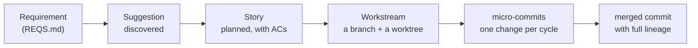
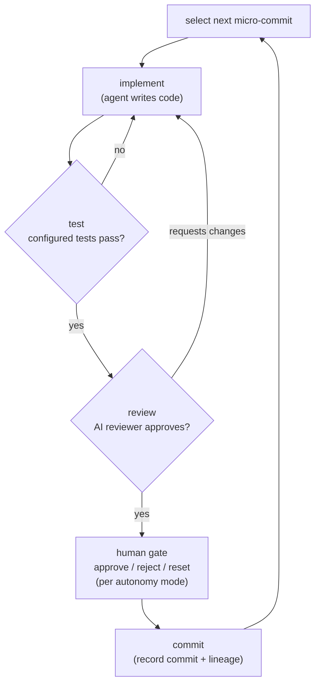
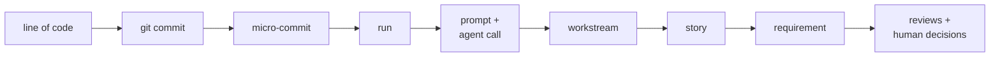

# How hashd works

This page explains the *system* — the mental model, the entities, the gates, and
the provenance chain — as concepts and rationale, before any commands. For the
end-to-end command walkthrough see [walkthrough.md](walkthrough.md); for the
canonical state machines and transition tables see **[WF.md](../WF.md)**; for
every term used here, see [glossary.md](glossary.md).

## The problem hashd solves

AI coding agents are fast but unaccountable. They generate code without recording
why, re-discover the codebase on every run, and make decisions you cannot trace
later. The bottleneck in shipping AI-written code is not typing speed — it is
**trust**: knowing a change does what was asked, that it was reviewed, that a human
signed off where it mattered, and that you can reconstruct the whole decision chain
months later.

Spec-driven development tools (GitHub Spec Kit, AWS Kiro, and others) address the
front half of this: turn a spec into a plan, turn a plan into code. They stop at
*generating* code. hashd governs the *whole path* from a requirement to a merged,
attested commit — the implement -> test -> review -> human-approval -> merge loop,
the gates between those steps, and the durable audit trail that records every one
of them. Generation-only spec tools stop at code; hashd governs the path to a
merged, attested commit.

## The mental model

Work flows through four entities, each with a validated state machine:

- A **Suggestion** is a discovered planning candidate. Discovery reads your
  requirements and proposes work you could start now.
- Claiming a Suggestion creates a **Story**: a feature or bug with a problem
  statement and **acceptance criteria** (the testable conditions for "done"). The
  Story is the source of truth for *what* the change should do.
- Running an accepted Story creates a **Workstream**: one git branch in one
  isolated worktree. The Workstream holds the **plan** — an ordered list of
  **micro-commits**, the smallest planned units of work.
- Each micro-commit runs the governed loop and lands as one git commit. When all
  micro-commits are done, the branch gets a holistic final review and a merge gate,
  then merges.

REQS.md and SPEC.md are living project artifacts. Operators can inspect them with
`hashd project reqs` and `hashd project spec`, and can make guarded manual edits with
`hashd project reqs edit` or `hashd project spec edit`. Those commands go through
hashd-server; a remote CLI client does not need the repository mounted locally,
and successful edits are committed by the server in the configured repo.

The key insight: these are not just labels on a kanban board. Each entity is an
FSM. State only changes through a *validated transition* that persists atomically
and emits an event. You always know what stage a piece of work is in and what
transitions are legal next — and so does every interface.

## The governed loop

Inside a Workstream, every micro-commit runs the same loop, and every arrow in it
is a **gate**:

When all micro-commits are done, two more gates run at the branch level:

- **Final review** — a holistic review of the entire branch diff, not just the
  last commit. It can approve (`ready_to_merge`), flag human-worthy concerns
  (`final_review_with_concerns`), or, on rejection, generate a FIX micro-commit.
- **Merge gate** — runs the merge-gate test command, checks for conflicts against
  fresh `main`, and runs a `gitleaks` secrets scan. Secret findings block the
  merge.

Bounded retries, not infinite loops: the implement/test/review cycle is capped
(default 5 attempts) before it escalates to a human. A red test that was
previously green routes through a tiered escalation (a judge, then a partial
re-breakdown, then a human) rather than blindly re-prompting "fix it." See
**[WF.md > Test-Conflict Escalation](../WF.md)**.

### Who decides whether a gate stops for a human

The project's **autonomy mode** governs gate behavior:

| Mode | Per-commit gate | Merge gate |
|------|-----------------|------------|
| `supervised` | human approves each commit | human approves merge |
| `gatekeeper` (default) | auto-continue if AI review confidence clears the threshold | human approves merge |
| `autonomous` | auto-continue when confident | auto-merge when thresholds are met |

All three modes still **block to a human on failures**. Autonomy decides how much
*clean* work flows through unattended; it never suppresses an escalation. This is
why "autonomous" is safe: it changes the merge gate, not the failure handling.

## The dual-write event log

Every state change is written **twice** — this is the dual-write contract, and it
is the backbone of both real-time observability and the durable audit trail:

- Published to the **event bus** for instant push to connected subscribers — the TUI, the
  Telegram bot, and web/SSE consumers update live.
- Logged to the **SQLite events table** as a durable record, so a subscriber that
  was offline when an event fired can catch up.

the bus is ephemeral; SQLite is the durable source of truth. If the bus is down, the event
is still in SQLite. If SQLite somehow failed, the bus already delivered. Publishing is
non-blocking and fire-and-forget — a slow or absent subscriber never stalls a state
transition. The TUI is event-driven (no polling fallback): if the bus is down it
shows an error state rather than masking the failure with degraded polling.

Two choke points cover all state changes: the FSM `transition()` functions, and
the `notify_*()` user-facing notifications. Both route through a single `emit()`
that performs the dual write. Side effects that *must* happen as part of a
transition (cleanup, cascades, derived writes) live inside the Go FSM transition
handler — not in a subscriber — so there is no window where the transition is
committed but the side effect has not run.

## The provenance chain

Because hashd owns the whole pipeline, it does not have to *infer* why a line of
code exists — it *recorded* the answer as the code was produced. Every commit
traces back through:

This is the sharpest thing hashd does that a generation-only tool cannot. Capture
tools that hook the commit event see the agent session but lack the upstream
context (why was the agent invoked?) and the downstream context (what did the
reviewer think? did a human approve?). hashd defines that chain by construction.

The chain is queryable (`hashd lineage`), exportable as standard attestations
(`hashd lineage export --format slsa|in-toto`), and tamper-evident: commit records
are linked by a SHA-256 hash chain that `hashd lineage verify` validates. This is the
audit/provenance story in full — see [provenance.md](provenance.md) and
**[docs/LINEAGE.md](LINEAGE.md)**.

## What hashd does *not* claim

Honesty matters here, because the value proposition depends on it:

- **Spec-driven is the intended path, not an enforced one.** hashd's flow assumes
  you start from a requirement, but a project can skip `REQS.md` and create Stories
  directly with `hashd plan story` / `hashd plan bug`. Discovery is a convenience, not a
  gate.
- **Single-operator today.** The audit/governance story is real, but the shipped
  ops model is one operator per project. There is no multi-user coordination, RBAC,
  SSO, or team-approval gate. A multi-user team server is in development, not
  shipped — see the README's "What's coming."
- **hashd is not CI and not a forge.** It can run local gates and observe forge
  checks, but external CI and PR review remain external.

The "enterprise-grade" framing rides entirely on the **auditability and
provenance** above — the FSM-validated transitions, the durable event log, the AI
review records, the agent transcripts, and the verifiable lineage chain. That is
the half generation-only tools lack, and it is what makes AI-generated code
trustworthy enough to ship.

## Where to go next

- [walkthrough.md](walkthrough.md) — take one feature start-to-finish.
- [watch.md](watch.md) — the watch TUI: the three views and the keys that move between them.
- [provenance.md](provenance.md) — the audit/lineage story in depth.
- [glossary.md](glossary.md) — every term defined.
- **[WF.md](../WF.md)** — the canonical state machines, transitions, and command reference.
- **PRD.md** — the full living product specification.
