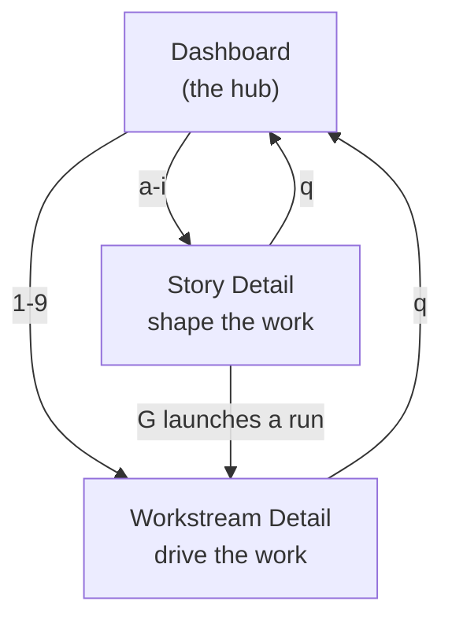

# The watch TUI

`hashd watch` opens hashd's terminal UI — a live cockpit for planning, running, and
merging work. It is a *viewer*: it connects to the running hashd services and
reflects their state; it never starts or restarts them (if the services are down,
`hashd restart` brings them back). Every view updates in real time over the event
stream, so you watch progress rather than re-querying.

This page is the working map — the three views, when to use each, and the keys you
reach for most. For the exhaustive, state-by-state keybinding tables see
**[WF.md > Watch UI Keybindings](../WF.md)**; for the terms used here, see
[glossary.md](glossary.md).

## Three views

The TUI is a hub and spoke: one Dashboard, two detail views.

`q` moves you back one level — from a detail view to the Dashboard, and from the
Dashboard it quits. (`Esc` steps back too, but the footer always shows `q`.)

## Dashboard — the hub

The home screen. It lists the project's active Stories and Workstreams, each tagged
with its `<stage> / <runtime_status>`, so at a glance you see what is running,
blocked, or waiting on you. Use it to triage: scan for anything `blocked` or
`changes_required`, then drill in.

| Key | Action |
|-----|--------|
| `1`–`9` | open a **Workstream Detail** |
| `a`–`i` | open a **Story Detail** |
| `p` | open the **Plan** screen |
| `m` | change **autonomy mode** |
| `j` | switch project |
| `C` · `R` · `/` · `?` | chat · edit REQS · command palette · help |
| `q` | quit |

## Story Detail — shape the work

Open a Story (`a`–`i`) when you are working on *what* a change should do, before it
becomes code — grooming a Story, or intervening while it is being planned.

| Key | Action |
|-----|--------|
| `A` | **approve** the story (`draft → accepted`) so it can run |
| `E` | AI-edit the story |
| `e` · `d` · `D` · `r` | edit · delete · descope · rescope an acceptance criterion |
| `a` | answer the planner's pending questions |
| `G` | **Go** — create a Workstream and start the run |
| `R` · `X` | retry · close the story |
| `v` | view the full story |

Once you press `G`, the work moves to Workstream Detail.

## Workstream Detail — drive the work

Open a Workstream (`1`–`9`) to monitor and steer one in-flight branch through
implementation, review, and merge. The footer is **state-aware** — it offers exactly
the verbs that are legal at the current stage, so you are never shown an impossible
action.

| Key | Action |
|-----|--------|
| `G` · `!` | run the workstream (or retry) · run anyway |
| `A` · `r` | **approve** · **reject** at the human review gate |
| `R` · `N` | reset (redo from baseline) · replan |
| `a` | answer a clarification the agent raised |
| `d` `l` `L` `v` `t` | diff · log · transcript · review · timeline |
| `m` · `P` | **merge** · create a PR at `ready_to_merge` |
| `i` | AI-resolve merge conflicts |
| `+` `e` `X` | add commit · edit · close |

> **Approve is `A` (capital).** Lowercase `a` answers a clarification — they are
> different keys, in both Story and Workstream Detail.

### Diff and Plan sub-surfaces

- **Diff** (`d` from a Workstream): `s` side-by-side, `f` fullscreen, `I` the
  **Lineage** view — trace a selected line back through the provenance chain (see
  [provenance.md](provenance.md)) — and `h` / `space` to select hunks.
- **Plan** (`p` from the Dashboard): `d` discover suggestions from `REQS.md`,
  `1`–`9` to pick a suggestion and turn it into a Story, `s` new story, `b` new bug,
  `t` tech tree.

## A typical journey

1. `hashd watch` → land on the **Dashboard**.
2. `p` → run discovery, pick a suggestion (`1`–`9`) to start a Story.
3. `a`–`i` → open **Story Detail**, review the acceptance criteria, `A` to accept,
   `G` to launch.
4. The view becomes **Workstream Detail**; watch implement → test → review run.
5. At the human gate, `A` to approve (or `r` / `R` / `N`).
6. At `ready_to_merge`, `m` to merge — or `P` for a PR.
7. `q` back to the **Dashboard** for the next piece of work.

The footer always shows the keys that are live right now, and this page covers the
common path. For the complete, state-by-state tables, see
**[WF.md > Watch UI Keybindings](../WF.md)**.
